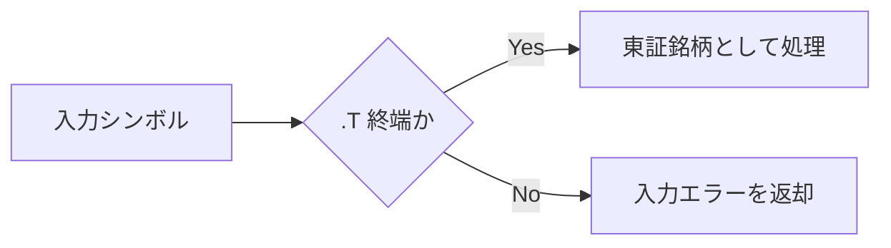
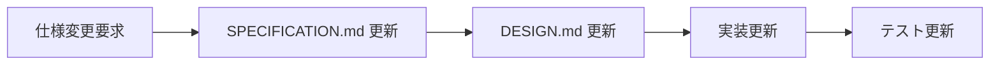
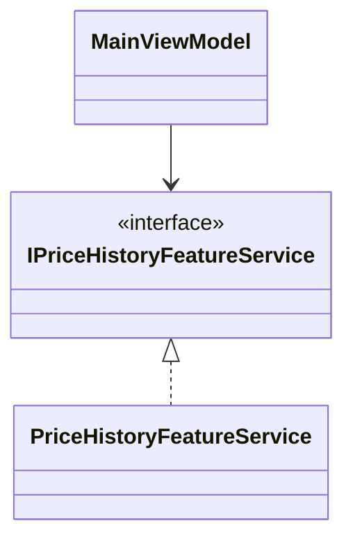
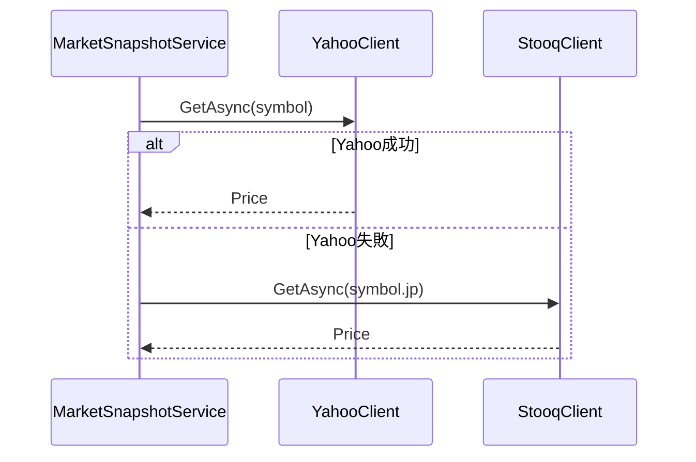
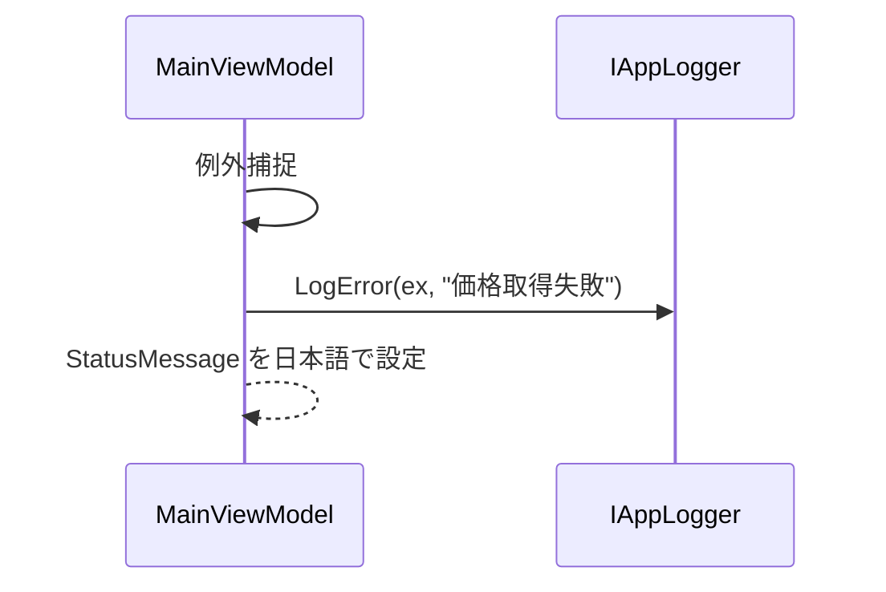
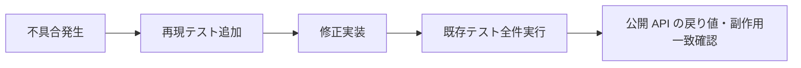
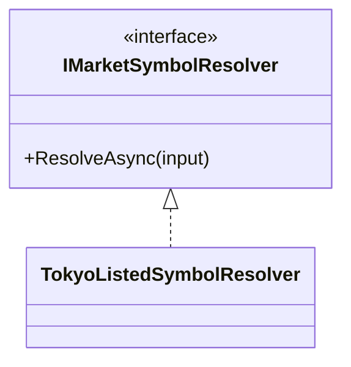

# Tokyo Market Technical 向け Copilot 指示

このファイルは Tokyo Market Technical 固有のルールを定義します。

再利用可能な C# / WPF 共通ガイダンスは [.github/instructions/common-csharp-wpf.instructions.md](.github/instructions/common-csharp-wpf.instructions.md) に分離しています。

## 1. スコープ
- 本アプリケーションは日本株専用とし、東証 `.T` シンボル以外を新規機能で受け付けないこと。
- 仕様変更が明示されない限り、為替機能と非日本市場機能の追加を禁止すること。
- ユーザー入力は `xxxx.T` 形式、または東証プライム・スタンダード・グロースの上場企業名へ必ず解決すること。

## 2. 正本管理
- [SPECIFICATION.md](../docs/SPECIFICATION.md)、[DESIGN.md](../docs/DESIGN.md)、実装は同一変更で同時更新すること。
- 要件判断は [SPECIFICATION.md](../docs/SPECIFICATION.md) を唯一の正本とすること。
- 設計判断は [DESIGN.md](../docs/DESIGN.md) を唯一の正本とすること。
- 振る舞い変更時は、コードのみ先行変更を禁止し、ドキュメントを同時に更新すること。
- ウォーターフォール運用は [docs/COPILOT_WATERFALL_WORKFLOW.md](../docs/COPILOT_WATERFALL_WORKFLOW.md)、[templates/DESIGN_FROM_SPEC_TEMPLATE.md](../templates/DESIGN_FROM_SPEC_TEMPLATE.md)、[templates/IMPLEMENTATION_FROM_DESIGN_TEMPLATE.md](../templates/IMPLEMENTATION_FROM_DESIGN_TEMPLATE.md) に一致させること。

## 3. アーキテクチャ
- `Composition`、`Shared`、`Features` の feature-sliced 構造を維持し、root 直下へ新規レイヤーを追加しないこと。
- 複数機能で再利用する責務のみ `Shared` に配置し、単機能専用コードを `Shared` に置かないこと。
- メイン画面のオーケストレーションは `Features/Dashboard/ViewModels/MainViewModel` に集約すること。
- `Composition` には依存関係の配線と起動設定のみを置き、業務ロジックを実装しないこと。
- 設計は必ず SOLID 原則に則ること。1 クラスに UI 制御・業務計算・永続化を混在させないこと。

## 4. データソースと永続化
- 日本株の株価およびローソク足データは Yahoo Finance を主取得元として実装すること。
- Stooq は Yahoo Finance 失敗時のフォールバックとしてのみ呼び出すこと。
- 東証プライム、スタンダード、グロース銘柄名の解決は JPX 上場企業データを使用すること。
- SQLite の履歴テーブルは `symbol`、`stock_price`、`recorded_at` 以外を追加しないこと（仕様変更時を除く）。
- 依存関係変更がライセンスへ影響する場合は、[THIRD_PARTY_LICENSES.md](../docs/THIRD_PARTY_LICENSES.md) と README の参照更新を同一変更で行うこと。

## 5. ログとエラー
- ログは Serilog を使用し、ファイル出力先を `logs/app-.log` から変更しないこと。
- ユーザー向けエラーメッセージは日本語固定とし、英語文言の新規追加を禁止すること。
- 市場データ関連の共通エラーメッセージは shared 側へ集約し、画面ごとの重複定義を禁止すること。

## 6. テストと品質ゲート
- テストフレームワークは xUnit を標準とし、新規テストを他フレームワークで追加しないこと。
- 機能オーケストレーション、フォールバック、リポジトリ、シンボル解決ロジックを変更した場合は、該当単体テストを同一変更で追加すること。
- XAML リソース、テンプレート、マージ済みディクショナリを変更した場合は、ResourceDictionary 読み込みまたは Window の STA 構築回帰テストを必ず更新すること。
- `MarketMonitorTest` のカバレッジ閾値を下回る変更を禁止すること。
- リファクタリング時は、既存テスト全件成功を確認し、公開 API の戻り値・副作用が変わっていないことを確認すること。
- 一度エラーを出したら、再現ユニットテストを追加し、同一原因の再発を防止すること。
- 本番コード変更時は、反射ベーステストより interface と注入可能依存を使ったテストシームを優先すること。
- エラー 0 件かつ警告 0 件を常時維持し、警告を残したまま変更を完了扱いにしないこと。
- Information レベル診断も新規に増やさず、理想的には 0 件を維持すること。

## 7. プロジェクト規約
- コメントは日本語で記述すること。
- 責務変更時は public XML コメントを同一変更で更新すること。
- 仕様変更がない限り、既存の命名規約とフォルダ規約を変更しないこと。
- ソースコードまたは設計を説明する場合は、mermaid 図とソースコード例を必ず同時に示すこと。

## 8. ルール具体例（図 + C#）

### 8.1 スコープ制約（日本株専用）



```csharp
public static bool IsTokyoSymbol(string symbol)
{
	return !string.IsNullOrWhiteSpace(symbol)
		&& symbol.EndsWith(".T", StringComparison.OrdinalIgnoreCase);
}
```

### 8.2 正本管理（仕様・設計・実装の同時更新）



```csharp
// この機能変更は SPECIFICATION / DESIGN / 実装 / テストを同一 PR で更新する。
public sealed record ChangeSetPolicy(bool SpecificationUpdated, bool DesignUpdated, bool CodeUpdated, bool TestsUpdated)
{
	public bool IsValid() => SpecificationUpdated && DesignUpdated && CodeUpdated && TestsUpdated;
}
```

### 8.3 アーキテクチャ + SOLID



```csharp
public sealed class MainViewModel
{
	private readonly IPriceHistoryFeatureService _priceHistory;

	public MainViewModel(IPriceHistoryFeatureService priceHistory)
	{
		_priceHistory = priceHistory;
	}
}
```

### 8.4 データソース（Yahoo 主 / Stooq フォールバック）



```csharp
public async Task<decimal> LoadPriceAsync(string symbol, CancellationToken cancellationToken)
{
	try
	{
		return await _yahooClient.GetAsync(symbol, cancellationToken);
	}
	catch
	{
		return await _stooqClient.GetAsync(symbol.Replace(".T", ".jp", StringComparison.OrdinalIgnoreCase), cancellationToken);
	}
}
```

### 8.5 ログとエラー（日本語固定）



```csharp
catch (Exception ex)
{
	_logger.LogError(ex, "価格取得に失敗しました。Operation=LoadSnapshot");
	StatusMessage = "株価の取得に失敗しました。時間をおいて再実行してください。";
}
```

### 8.6 テストと品質ゲート（非デグレード + 再発防止）



```csharp
[Fact]
public async Task LoadAsync_Throws_WhenSymbolIsInvalid()
{
	var service = new MarketSnapshotService(new FailingYahooClient(), new FakeStooqClient(), new FakeLogger());
	await Assert.ThrowsAsync<ArgumentException>(() => service.LoadAsync("IBM", CancellationToken.None));
}
```

### 8.7 プロジェクト規約（説明時の図 + コード必須）



```csharp
public interface IMarketSymbolResolver
{
	Task<ResolvedSymbol> ResolveAsync(string input, CancellationToken cancellationToken);
}
```

## 9. UI・UX ガイドライン（HIG 準拠）

### 9.1 基本方針
- UI は「最小操作で目的達成できること」を最優先とし、主要操作は 3 ステップ以内で完了できる導線を設計すること。
- 重要操作（表示、保存、削除、適用）は常に視認可能な位置に固定し、スクロール先へ隠さないこと。
- 初見利用者でも迷わないよう、専門用語のみで説明せず、操作語（例: 追加、削除、開始、停止）を併記すること。

### 9.2 ヒューマンインタフェースガイドライン（HIG）
- 本プロジェクトの画面設計は、Windows デスクトップ向け Human Interface Guidelines の原則（明瞭性、一貫性、即時フィードバック、誤操作防止）に従うこと。
- 1 画面内で同一意味の UI 要素は同一ラベル、同一色、同一挙動に統一すること。
- 破壊的操作（全消去、削除、置換）は通常操作と視覚的に分離し、意図しない実行を防ぐこと。
- 操作結果は 1 秒以内に画面で確認できるフィードバック（ステータス文言、件数表示、選択状態変化）を返すこと。
- ユーザーの文脈を保持するため、銘柄、足種別、表示期間、選択状態は可能な限り復元すること。

### 9.3 情報設計
- 主情報（価格チャート）と補助情報（通知、比較、説明）は視線移動を最小化する配置にすること。
- 長文説明は常時展開せず、Expander などで折りたたみ可能にし、必要時に参照できる形で提供すること。
- 凡例、ガイド、状態表示は「何が起きているか」と「次に何をすべきか」を同時に示すこと。

### 9.4 視認性とアクセシビリティ
- 色だけで意味を伝えず、線種、ラベル、説明文を併用して識別可能にすること。
- 同時表示する系列色は色相を十分に離し、移動平均線と分析ラインの色域を重複させないこと。
- 文字サイズ、余白、コントラストは可読性を優先し、淡色背景に淡色文字の組み合わせを禁止すること。
- キーボード操作（Tab 移動、Enter 実行、Esc 中断）を妨げる実装を禁止すること。

### 9.5 操作ガイダンス
- 学習コストの高い操作は、画面内に 3 ステップ以内のクイックガイドを常設すること。
- 手動描画や条件切替など状態依存の操作は、現在の段階（例: 手順 1/2）を明示すること。
- エラー時は原因だけでなく、利用者が取るべき次アクションを日本語で提示すること。
