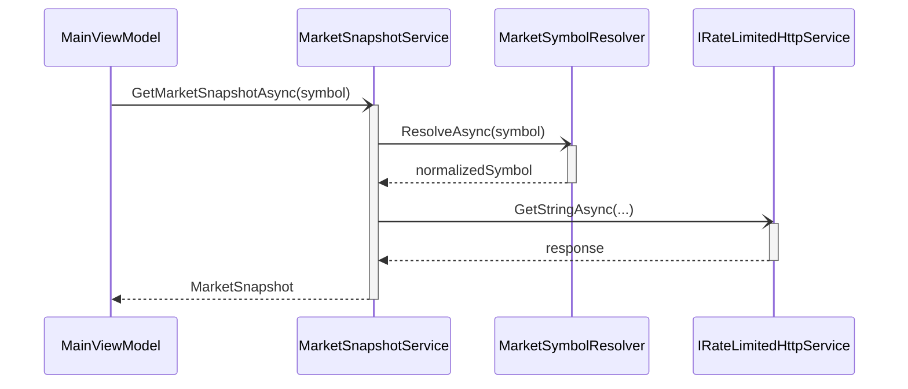
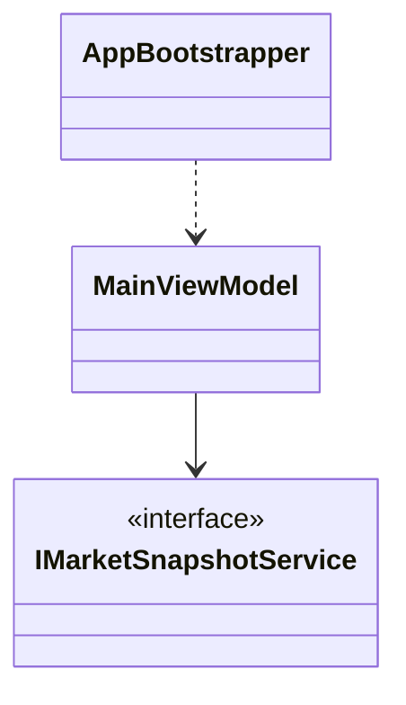

# C# / WPF 設計ルール

このファイルは、本プロジェクトの設計説明および Markdown ドキュメント更新時に守るルールを定義する。

## 1. 正本管理
- 要件判断は SPECIFICATION を唯一の正本とすること。
- 設計判断は DESIGN を唯一の正本とすること。
- 振る舞い変更時は、仕様・設計・実装・テストを同一変更で更新すること。

## 2. 設計説明の基本
- 設計変更説明では、変更対象がどの SOLID 原則を満たすかを最低 1 文ずつ記載すること。
- 設計背景では、なぜその構造にしたのか、メリット、デメリット、代替案との差分を記載すること。
- リバースエンジニアリングで図を起こす場合は、現在の実装名、依存方向、同期性に一致させること。

## 3. 図とコード例の提示ルール
- ソースコード変更を伴う説明では、対象処理の最小コード例を必ず提示すること。
- 設計説明では、mermaid 図を必ず提示すること。
- 図とコード例は、同じ責務を説明する対応ペアとして提示すること。

### 3.1 提示テンプレート
- 図: `mermaid` の `classDiagram` か `sequenceDiagram` を 1 つ以上記載。
- コード: C# の実装またはテストを 10 行以上で記載。
- 説明: 図の要素名とコード上の型・メソッド名を対応づけて 3 行以内で記載。

## 4. Mermaid 記法規約
- `sequenceDiagram` では、同期呼び出しを `->>`、`Task` を返す非同期呼び出しを `-)`、戻り値を `-->>` で記述すること。
- `sequenceDiagram` では、メソッド呼び出し範囲が分かるように `activate` / `deactivate` を記述すること。
- `sequenceDiagram` では、呼び出しの入れ子がある場合、内側の呼び出し対象にも activation を記述してネスト構造を表現すること。
- `classDiagram` では、実装を `<|..`、constructor 注入や field 保持による関連を `-->`、メソッド内だけの依存や factory 解決を `..>` で記述すること。
- 親が子の寿命を所有する場合だけ `*--` を使い、所有しない全体-部分関係は `o--` を使うこと。
- 図の矢印は簡略化で流用せず、現在の実装上の所有関係、注入関係、同期性に一致させること。

## 5. 設計文書の品質
- 図中のメソッド名は、実装に存在するメソッド名へ合わせること。
- interface と実装が存在する場合、クラス図では interface 名と実装名を区別すること。
- sequenceDiagram の参加者名は、実装上の層境界が見える粒度で命名すること。

## 6. 設計例

### 6.1 入れ子を持つ非同期シーケンス



```csharp
public async Task<MarketSnapshotModel> GetMarketSnapshotAsync(string symbol, CancellationToken cancellationToken)
{
	var normalizedSymbol = await _symbolResolver.ResolveAsync(symbol, cancellationToken);
	var stockPrice = await GetStockPriceAsync(normalizedSymbol, cancellationToken);

	return new MarketSnapshotModel
	{
		Symbol = normalizedSymbol,
		StockPrice = stockPrice,
		StockUpdatedAt = DateTimeOffset.Now
	};
}
```

### 6.2 関連と依存の区別



```csharp
public sealed class MainViewModel
{
	private readonly IMarketSnapshotService _marketSnapshotService;

	public MainViewModel(IMarketSnapshotService marketSnapshotService)
	{
		_marketSnapshotService = marketSnapshotService;
	}
}

internal static class AppBootstrapper
{
	internal static MainViewModel CreateMainViewModel()
	{
		return RootServiceProvider.Value.GetRequiredService<MainViewModel>();
	}
}
```