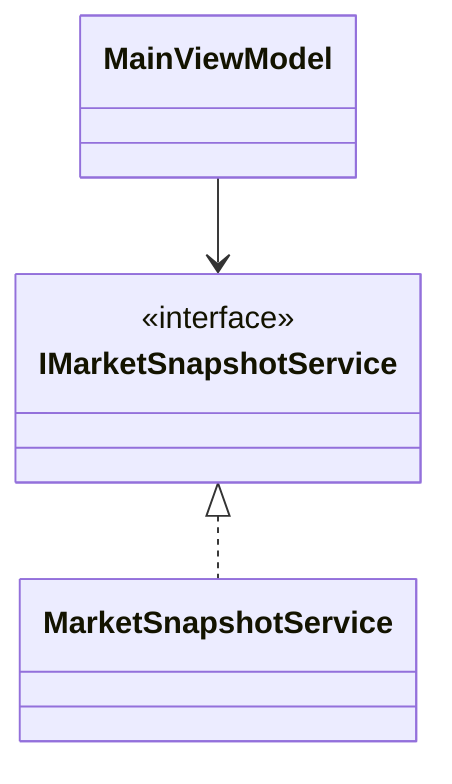
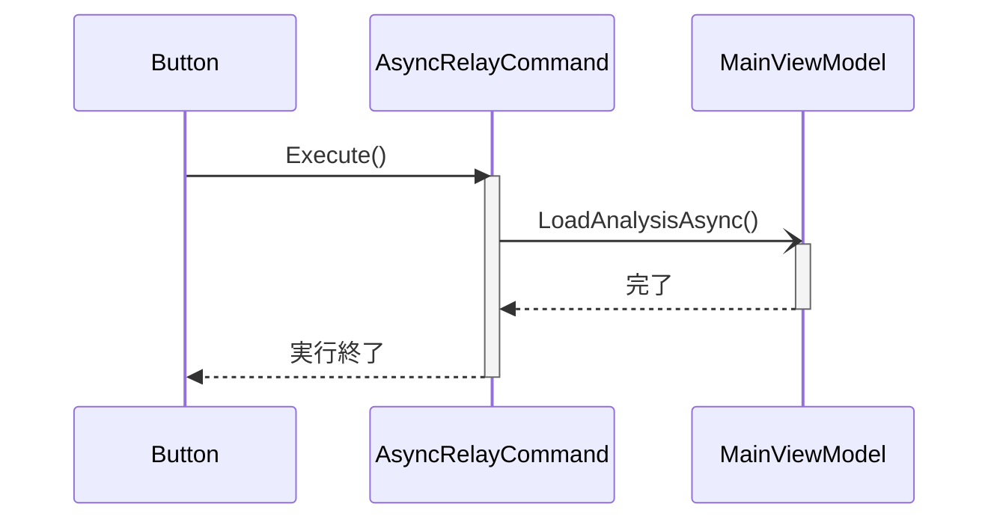

# C# / WPF 実装ルール

このファイルは、本プロジェクトの C# / WPF 実装時に守るルールを定義する。

## 1. コーディング標準

### 1.1 基本原則
- 1 変更で 1 責務を守り、メソッドは 50 行以内、1 メソッド内の分岐ネストは 3 段以内で実装すること。
- 同一ロジックが 2 回以上出現したら、共通 private メソッドまたはサービスへ抽出すること。
- 新規クラス追加時は「入力」「出力」「副作用」を XML コメントまたはクラス先頭コメントで明記すること。

### 1.2 命名規則
- 型、メンバー、名前空間は PascalCase を使用すること。
- ローカル変数、引数、private フィールドは camelCase を使用し、private フィールドは必ず `_` 接頭辞を付けること。
- bool プロパティは `Is/Has/Can` で開始すること。
- 略語は 3 文字以内かつ業界標準（API、DTO、URL など）のみ許可すること。

### 1.3 コードスタイル
- インデントは 4 スペース固定、タブ禁止。
- 1 行は 120 文字以内。超える場合は引数単位で改行すること。
- `var` は右辺から型が明確な場合のみ使用し、曖昧な場合は明示型を使用すること。
- `using` は未使用を残さないこと。

### 1.4 ファイル構成
- 1 ファイル 1 クラスを原則とし、例外は DTO のみ 2 型まで許容する。
- フォルダは責務単位で配置し、`Views` にサービスロジックを置かないこと。

## 2. 設計とアーキテクチャ

### 2.1 SOLID 準拠
- 設計は必ず SOLID 原則に則ること。
- 1 クラスに UI 制御・業務計算・DB 操作の 2 つ以上が混在する実装を禁止する。

### 2.2 WPF / MVVM
- View の code-behind に業務ロジックを記述しないこと。許可するのはイベント橋渡しと表示制御のみ。
- 画面状態は ViewModel の公開プロパティで表現し、XAML は Binding で参照すること。
- UI 更新が必要な状態は `INotifyPropertyChanged` で通知すること。

### 2.3 依存性
- 外部 I/O（HTTP、DB、ファイル、時刻、乱数）は interface 経由で注入すること。
- テストで差し替える依存は constructor injection を必須とすること。

## 3. エラーハンドリングとログ
- `catch (Exception)` を使う場合は、境界層（UI 起点、外部 I/O 起点）のみで使用し、再スロー方針をコメントで明示すること。
- ユーザー向けエラー文言は原因分類ごとに固定メッセージ化し、表示文言を都度生成しないこと。
- ログは「操作名」「入力キー」「失敗理由」「例外型」を 1 行で出力すること。

## 4. テストと品質ゲート

### 4.1 基本
- 本番コードを変更した場合は、同一変更で単体テストを追加または更新すること。
- テストは正常系・異常系・フォールバック系を最低 1 件ずつ含めること。

### 4.2 非デグレード確認
- リファクタリングでは、変更前に失敗していない既存テストが変更後も全件成功することを確認すること。
- 変更前後で同一入力に対する公開 API の戻り値と副作用（保存件数、通知有無、ログ分類）が一致することを確認すること。

### 4.3 エラー再発防止
- 一度エラーを出したら、必ず再現テスト（最小入力）をユニットテストとして追加すること。
- 修正は「再現テストが修正前に失敗し、修正後に成功する」ことを確認して完了とすること。

### 4.4 警告ゼロ維持
- ビルド、テスト、静的解析の結果はエラー 0 件かつ警告 0 件を維持すること。
- Analyzer とコードスタイル診断は通常ビルドで有効な前提とし、警告は修正してから完了とすること。

## 5. ドキュメント連動
- 責務変更時は、実装・テスト・ドキュメント（SPECIFICATION / DESIGN / README）を同一変更で更新すること。

## 6. 実装例

### 6.1 MVVM 分離



```csharp
public sealed class MainViewModel
{
	private readonly IMarketSnapshotService _snapshotService;

	public MainViewModel(IMarketSnapshotService snapshotService)
	{
		_snapshotService = snapshotService;
	}
}
```

### 6.2 非同期コマンド



```csharp
public async void Execute(object? parameter)
{
	if (!CanExecute(parameter))
	{
		return;
	}

	_isExecuting = true;
	RaiseCanExecuteChanged();
	try
	{
		await _executeAsync();
	}
	finally
	{
		_isExecuting = false;
		RaiseCanExecuteChanged();
	}
}
```