# C# / WPF 共通ルール

このファイルの全ルールは、実装時に「何をするか」「何を禁止するか」「どう確認するか」を明示するための運用規約です。

## 1. コーディング標準

### 1.1 基本原則
- 1 変更で 1 責務を守り、メソッドは 50 行以内、1 メソッド内の分岐ネストは 3 段以内で実装すること。
- 同一ロジックが 2 回以上出現したら、共通 private メソッドまたはサービスへ抽出すること。
- 新規クラス追加時は「入力」「出力」「副作用」を XML コメントまたはクラス先頭コメントで明記すること。

### 1.2 命名規則
- 型、メンバー、名前空間は PascalCase を使用すること。
- ローカル変数、引数、private フィールドは camelCase を使用し、private フィールドは必ず `_` 接頭辞を付けること。
- bool プロパティは `Is/Has/Can` で開始すること。
- 略語は 3 文字以内かつ業界標準（API、DTO、URL など）のみ許可すること。

### 1.3 コードスタイル
- インデントは 4 スペース固定、タブ禁止。
- 1 行は 120 文字以内。超える場合は引数単位で改行すること。
- `var` は右辺から型が明確な場合のみ使用し、曖昧な場合は明示型を使用すること。
- `using` は未使用を残さないこと。

### 1.4 ファイル構成
- 1 ファイル 1 クラスを原則とし、例外は DTO のみ 2 型まで許容する。
- フォルダは責務単位で配置し、`Views` にサービスロジックを置かないこと。

## 2. 設計とアーキテクチャ

### 2.1 SOLID 準拠（必須）
- 設計は必ず SOLID 原則に則ること。
- PR または設計変更説明には、変更対象がどの原則を満たすかを最低 1 文ずつ記載すること。
- 1 クラスに UI 制御・業務計算・DB 操作の 2 つ以上が混在する実装を禁止する。

### 2.2 WPF / MVVM
- View の code-behind に業務ロジックを記述しないこと。許可するのはイベント橋渡しと表示制御のみ。
- 画面状態は ViewModel の公開プロパティで表現し、XAML は Binding で参照すること。
- UI 更新が必要な状態は `INotifyPropertyChanged` で通知すること。

### 2.3 依存性
- 外部 I/O（HTTP、DB、ファイル、時刻、乱数）は interface 経由で注入すること。
- テストで差し替える依存は constructor injection を必須とすること。

## 3. エラーハンドリングとログ
- `catch (Exception)` を使う場合は、境界層（UI 起点、外部 I/O 起点）のみで使用し、再スロー方針をコメントで明示すること。
- ユーザー向けエラー文言は原因分類ごとに固定メッセージ化し、表示文言を都度生成しないこと。
- ログは「操作名」「入力キー」「失敗理由」「例外型」を 1 行で出力すること。

## 4. テストと品質ゲート

### 4.1 基本
- 本番コードを変更した場合は、同一変更で単体テストを追加または更新すること。
- テストは正常系・異常系・フォールバック系を最低 1 件ずつ含めること。

### 4.2 リファクタリング時の非デグレード確認（必須）
- リファクタリングでは、変更前に失敗していない既存テストが変更後も全件成功することを確認すること。
- 変更前後で同一入力に対する公開 API の戻り値と副作用（保存件数、通知有無、ログ分類）が一致することを確認すること。
- 上記確認ができない変更はマージ禁止。

### 4.3 エラー再発防止（必須）
- 一度エラーを出したら、必ず再現テスト（最小入力）をユニットテストとして追加すること。
- 修正は「再現テストが修正前に失敗し、修正後に成功する」ことを確認して完了とする。
- 同一原因の再発を防ぐため、再現テスト名に障害条件を含めること（例: `LoadAsync_Throws_WhenSymbolIsEmpty`）。

### 4.4 警告ゼロ維持（必須）
- ビルド、テスト、静的解析の結果はエラー 0 件かつ警告 0 件を維持すること。
- Analyzer とコードスタイル診断は通常ビルドで有効な前提とし、警告は修正してから完了とすること。
- Information レベル診断も理想的には 0 件を維持し、新規発生を放置しないこと。

## 5. ドキュメント
- public API には XML コメントで `summary` と主要引数の意味を必ず記述すること。
- 責務変更時は、実装・テスト・ドキュメント（SPECIFICATION / DESIGN / README）を同一変更で更新すること。

## 6. 設計図とコード例の提示ルール（必須）
- ソースコード変更を伴う説明では、対象処理の最小コード例を必ず提示すること。
- 設計説明では、mermaid 図（classDiagram または sequenceDiagram）を必ず提示すること。
- 図とコード例は、同じ責務を説明する対応ペアとして提示すること。

### 6.1 提示テンプレート
- 図: `mermaid` の `classDiagram` か `sequenceDiagram` を 1 つ以上記載。
- コード: C# の実装またはテストを 10 行以上で記載。
- 説明: 図の要素名とコード上の型・メソッド名を対応づけて 3 行以内で記載。

## 7. 依存関係とライセンス
- NuGet 依存は追加理由を 1 行で記録し、未使用依存は同一変更で削除すること。
- ライセンス影響がある依存追加・更新では、`THIRD_PARTY_LICENSES.md` と README の参照を同時更新すること。

## 8. 具体例集（全ルール対応）

以下の例は、各ルールを実装へ落とし込む最小パターンを示す。すべて「図 + C#」の対応ペアで確認すること。

### 8.1 SOLID: 単一責務原則（SRP）

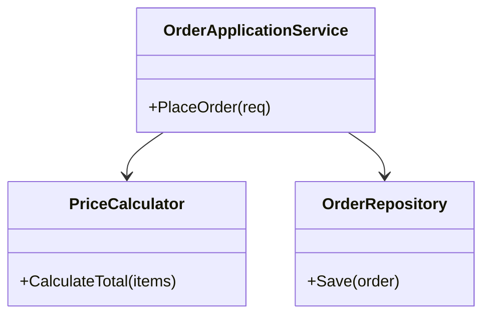

```csharp
public sealed class OrderApplicationService
{
	private readonly PriceCalculator _calculator;
	private readonly IOrderRepository _repository;

	public OrderApplicationService(PriceCalculator calculator, IOrderRepository repository)
	{
		_calculator = calculator;
		_repository = repository;
	}

	public Order PlaceOrder(IReadOnlyList<OrderLine> lines)
	{
		var total = _calculator.CalculateTotal(lines);
		var order = new Order(Guid.NewGuid(), lines, total);
		_repository.Save(order);
		return order;
	}
}
```

### 8.2 SOLID: 開放閉鎖原則（OCP）

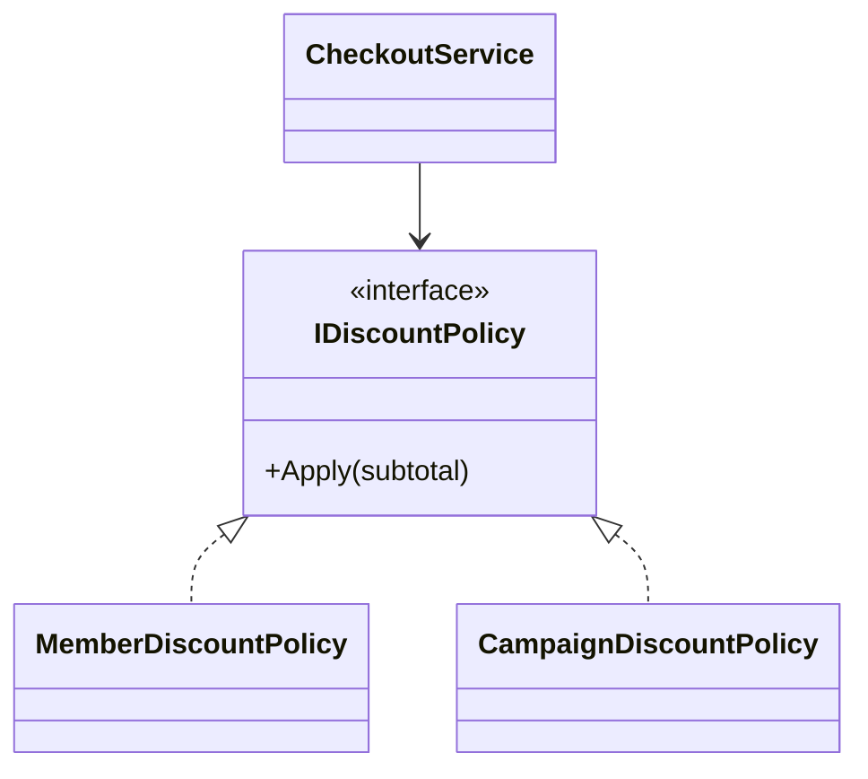

```csharp
public interface IDiscountPolicy
{
	decimal Apply(decimal subtotal);
}

public sealed class CheckoutService
{
	private readonly IEnumerable<IDiscountPolicy> _policies;

	public CheckoutService(IEnumerable<IDiscountPolicy> policies) => _policies = policies;

	public decimal Calculate(decimal subtotal)
	{
		return _policies.Aggregate(subtotal, (current, policy) => policy.Apply(current));
	}
}
```

### 8.3 SOLID: リスコフ置換原則（LSP）

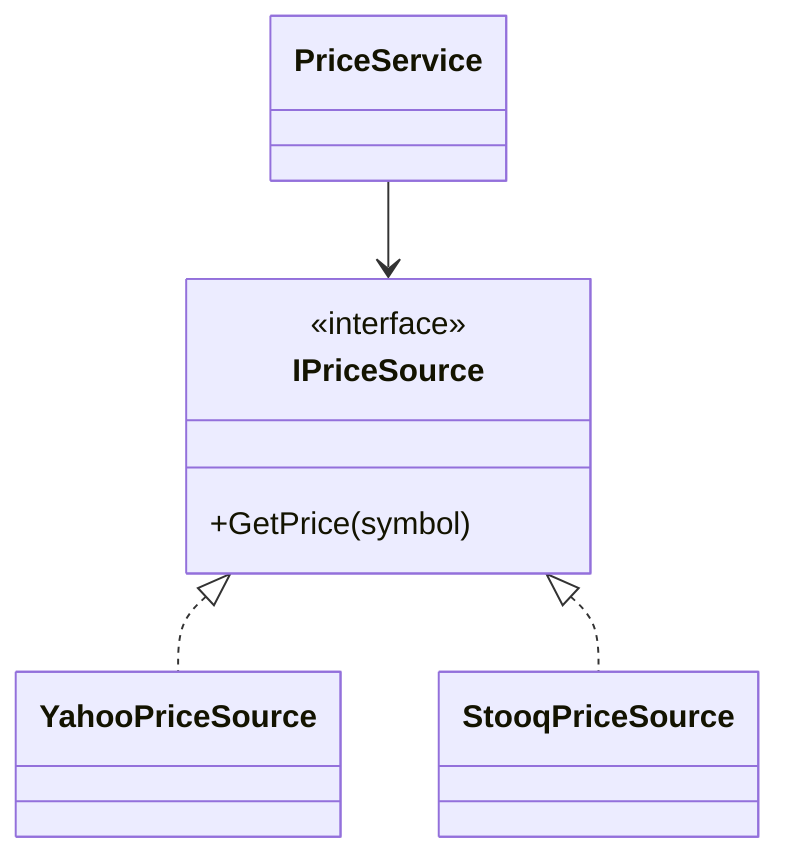

```csharp
public interface IPriceSource
{
	Task<decimal> GetPriceAsync(string symbol, CancellationToken cancellationToken);
}

public sealed class PriceService
{
	private readonly IPriceSource _source;

	public PriceService(IPriceSource source) => _source = source;

	public Task<decimal> LoadAsync(string symbol, CancellationToken cancellationToken)
	{
		return _source.GetPriceAsync(symbol, cancellationToken);
	}
}
```

### 8.4 SOLID: インターフェース分離原則（ISP）

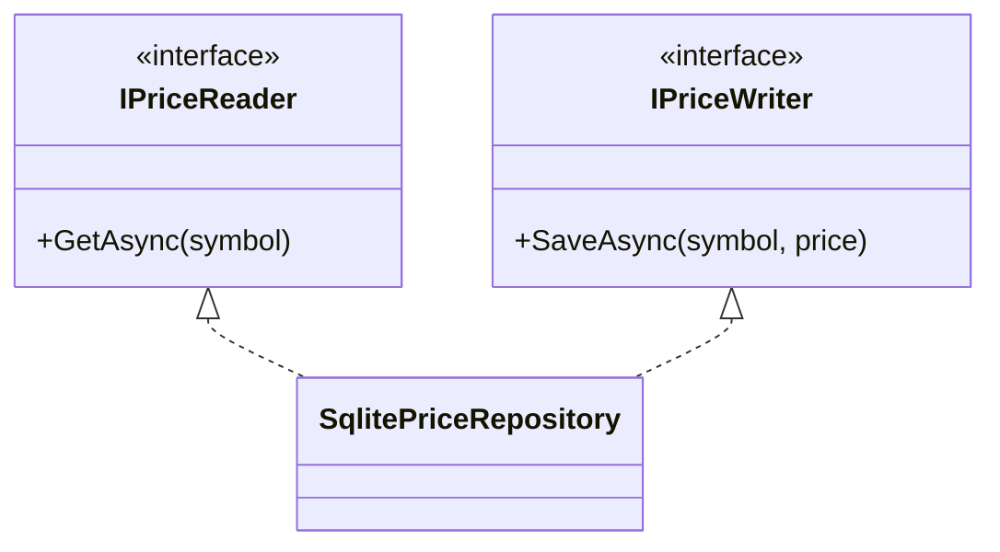

```csharp
public interface IPriceReader
{
	Task<decimal?> GetAsync(string symbol, CancellationToken cancellationToken);
}

public interface IPriceWriter
{
	Task SaveAsync(string symbol, decimal price, CancellationToken cancellationToken);
}
```

### 8.5 SOLID: 依存性逆転原則（DIP）

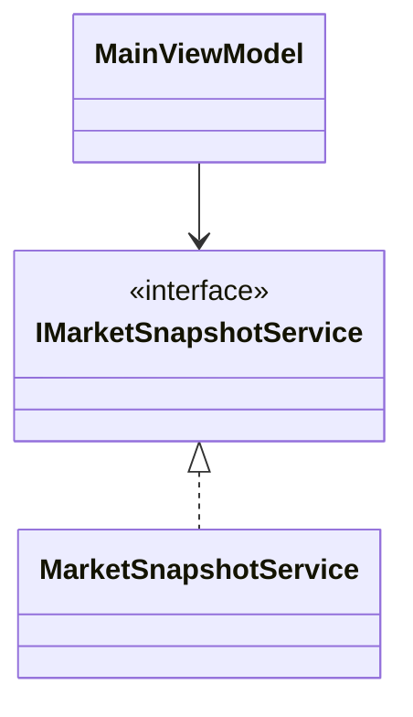

```csharp
public sealed class MainViewModel
{
	private readonly IMarketSnapshotService _snapshotService;

	public MainViewModel(IMarketSnapshotService snapshotService)
	{
		_snapshotService = snapshotService;
	}
}
```

### 8.6 コーディング標準・命名・スタイル

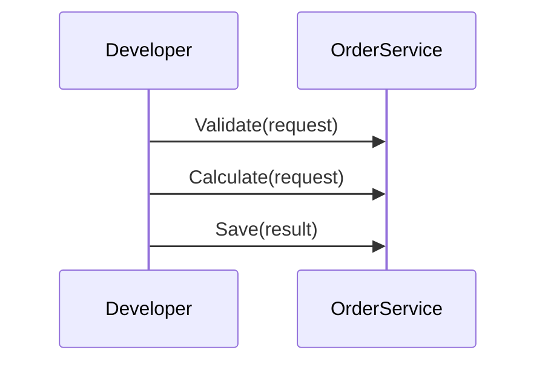

```csharp
public sealed class OrderService
{
	public OrderResult Execute(OrderRequest request)
	{
		ValidateRequest(request);
		var amount = CalculateAmount(request);
		return new OrderResult(amount, true);
	}

	private static void ValidateRequest(OrderRequest request)
	{
		if (request.Quantity <= 0)
		{
			throw new ArgumentOutOfRangeException(nameof(request.Quantity));
		}
	}

	private static decimal CalculateAmount(OrderRequest request) => request.Price * request.Quantity;
}
```

### 8.7 WPF / MVVM 分離

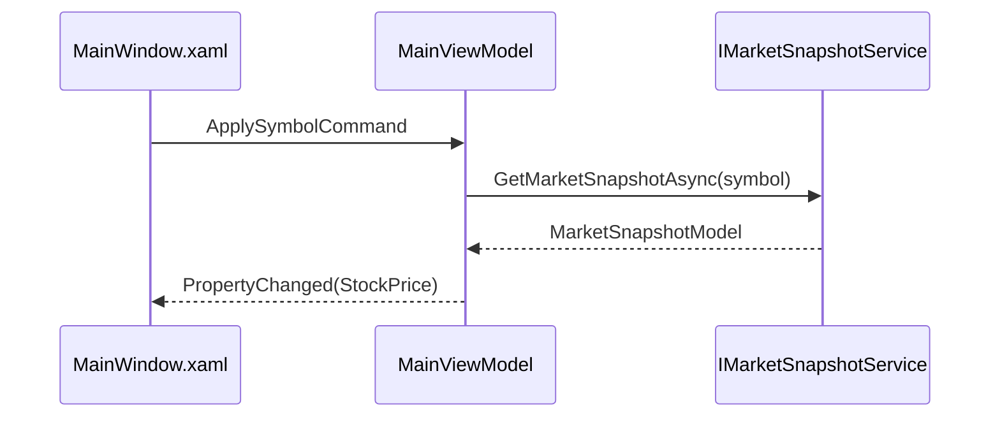

```csharp
public sealed class MainViewModel : ObservableObject
{
	private readonly IMarketSnapshotService _service;
	private decimal _stockPrice;

	public MainViewModel(IMarketSnapshotService service) => _service = service;

	public decimal StockPrice
	{
		get => _stockPrice;
		private set => SetProperty(ref _stockPrice, value);
	}

	public async Task ApplyAsync(string symbol)
	{
		var snapshot = await _service.GetMarketSnapshotAsync(symbol, CancellationToken.None);
		StockPrice = snapshot.StockPrice;
	}
}
```

### 8.8 エラーハンドリングとログ

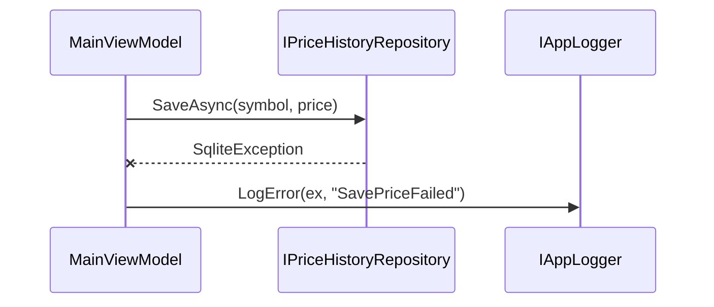

```csharp
try
{
	await _repository.SaveAsync(symbol, price, CancellationToken.None);
}
catch (Exception ex)
{
	_logger.LogError(ex, $"SavePriceFailed: Symbol={symbol}, Price={price}");
	StatusMessage = "価格履歴の保存に失敗しました。";
}
```

### 8.9 テスト・非デグレード・再発防止

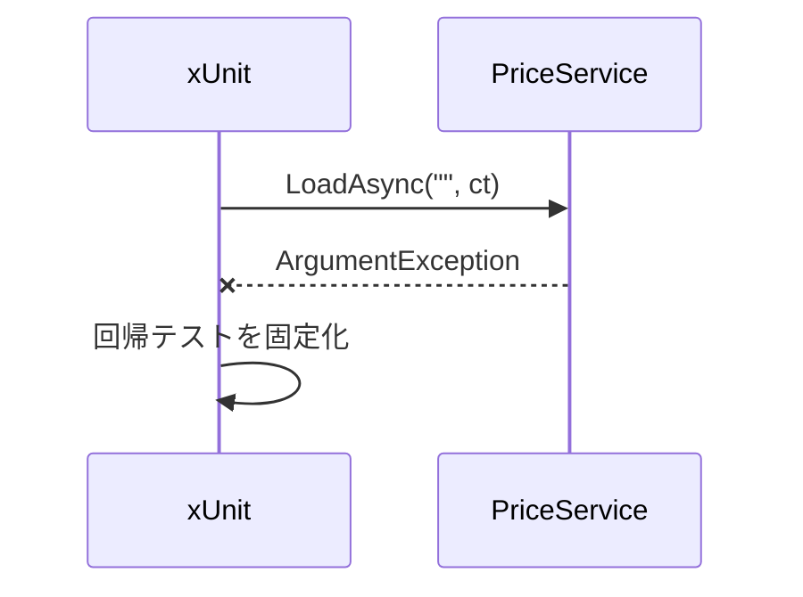

```csharp
public sealed class PriceServiceTest
{
	[Fact]
	public async Task LoadAsync_Throws_WhenSymbolIsEmpty()
	{
		var service = new PriceService(new FakePriceSource());
		await Assert.ThrowsAsync<ArgumentException>(() => service.LoadAsync(string.Empty, CancellationToken.None));
	}
}
```

### 8.10 ドキュメント更新

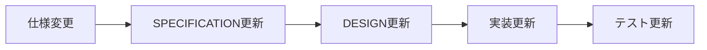

```csharp
/// <summary>
/// 指定銘柄の現在値を取得する。
/// </summary>
/// <param name="symbol">東証 .T シンボル。</param>
/// <returns>取得結果。</returns>
public Task<MarketSnapshotModel> GetMarketSnapshotAsync(string symbol, CancellationToken cancellationToken);
```

### 8.11 依存関係とライセンス更新

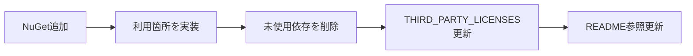

```csharp
// 依存追加理由: JPX 公式 CSV の文字コード変換に必要。
// ライセンス反映: THIRD_PARTY_LICENSES.md と README の参照を同一変更で更新済み。
public sealed class JpxCsvDecoder
{
	public string Decode(byte[] bytes) => Encoding.GetEncoding("shift_jis").GetString(bytes);
}
```