# MarketMonitor 設計書

## 1. 概要
MarketMonitorは、個人投資家向けのデスクトップ型マーケットモニタリングツールです。リアルタイムまたは定期的に為替レートや株価を取得し、表示・保存・通知することで、投資判断を支援します。

本設計書では、最終成果物の全体設計（提供機能、入力、出力）、および各Phaseごとの詳細設計をまとめます。

---

## 2. 全体設計

### 2.1 提供機能
- 為替レートの取得と監視
  - USD/JPYを中心とした為替情報取得
- 株価の取得と監視
  - 米国株および日本株の取得
- データのログ出力
  - 実行ログ／エラーログをファイルへ出力
- WPFによるGUI表示（フェーズ2以降）
  - 現在値表示、更新ボタン、自動更新
- ローカル保存と履歴管理（フェーズ3）
  - SQLiteによる価格履歴保存
- テクニカル指標の可視化（フェーズ4）
  - 移動平均線、MACDなど
- 通知機能（フェーズ4）
  - 価格到達時のデスクトップ通知

### 2.2 入力
- ユーザー入力
  - 銘柄選択
  - 更新トリガー（手動/自動）
  - 通知設定
- 外部API入力
  - Alpha Vantage等のマーケットデータAPI
- 設定値
  - APIキー
  - 更新間隔
  - 監視対象シンボル

### 2.3 出力
- 表示出力
  - メイン画面に現在値、グラフ、ステータス
- ログ出力
  - INFOおよびERRORレベルのログファイル
- 保存データ
  - SQLiteに履歴データを保存
- 通知出力
  - Windowsデスクトップ通知

### 2.4 システム構成
- `MarketMonitor`（WPFアプリ、本線）
  - UI層（Views）
  - ViewModel層
  - Model / Service層
- `MarketMonitor.ConsolePoC`（コンソールPoC）
  - 現在のデータ取得・ログ出力の検証用
- `MarketMonitor.ConsolePoCTest`（テストプロジェクト）
  - xUnitによるユニットテスト

### 2.5 ロギング設計
- ログレベルは`INFO`と`ERROR`に限定。
- ログ出力はファイルに保存し、日別ローテーションを想定。
- `INFO`ログ: 正常取得、UI更新、データ保存などの主要操作。
- `ERROR`ログ: APIエラー、JSON解析エラー、例外発生時のエラー。
- ログには発生箇所、例外メッセージ、関連データ、APIレスポンスを含める。
- ログ設計はPhase1でPoCとして実装し、Phase2以降も共通利用する。

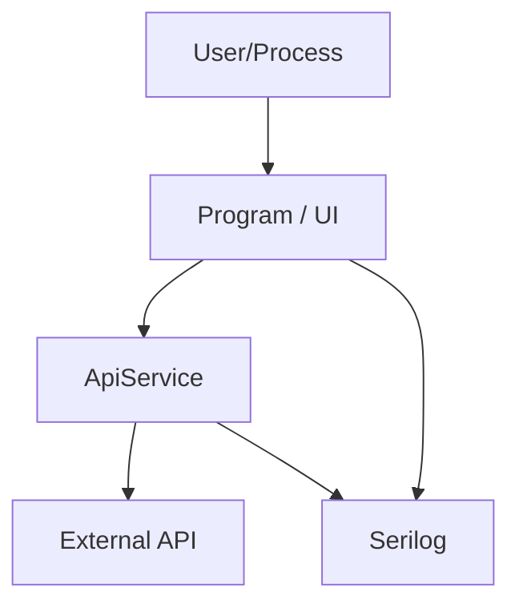

### 2.6 アーキテクチャ方針
- MVVMパターンを採用
- 依存性注入を想定
- API呼び出しロジックはサービスクラスに集約
- ログはSerilogを使用し、ファイル出力を行う
- フェーズごとに段階的に機能追加

### 2.5.1 UML設計
設計書にはUML図を含め、システム構成や主要な処理フローを視覚的に表現します。以下は設計書内に含める例です。

- シーケンス図では同期メッセージと非同期メッセージを区別し、ログ出力を含めずに処理の流れを明確にする。
- クラス図では関連線と依存線を明確に区別し、多重度を必ず記載する（多重度1は省略可）。
- 図は必要最小限の要素に絞り、ラベルと線の見やすさを優先する。

#### コンポーネント図
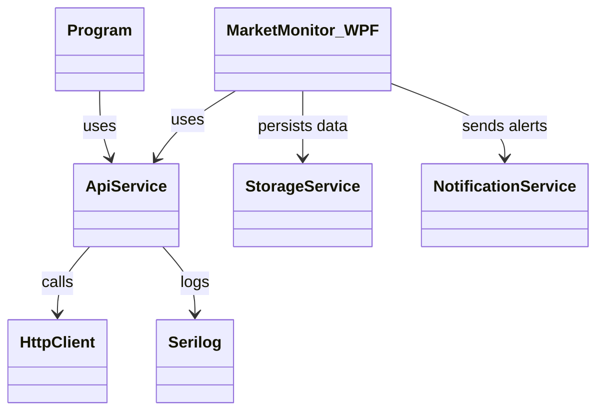

#### Phase別コンポーネント対応
以下の表は、コンポーネント図のどの箇所を各Phaseで編集/追加するかを示します。これにより、Phase別の開発範囲が図のどの要素に対応するかが一目でわかります。

| Phase | 対象コンポーネント | 対応する全体設計 |
| --- | --- | --- |
| Phase 1 | Program, ApiService, HttpClient, Serilog | 2.1 提供機能（為替/株価取得、ログ出力）、2.2 入力（APIキー/シンボル）、2.3 出力（ログファイル）、2.4 システム構成（Console PoC）、2.5 アーキテクチャ方針 |
| Phase 2 | MarketMonitor_WPF, ApiService | 2.1 提供機能（UI表示、更新操作）、2.2 入力（ユーザー操作）、2.3 出力（UI表示）、2.4 システム構成（WPF本線）、2.5 アーキテクチャ方針 |
| Phase 3 | StorageService, MarketMonitor_WPF | 2.1 提供機能（データ保存、可視化）、2.2 入力（取得データ/日付範囲）、2.3 出力（保存結果、チャート）、2.4 システム構成（ストレージ機能）、2.5 アーキテクチャ方針 |
| Phase 4 | AnalyticsService, NotificationService, MarketMonitor_WPF | 2.1 提供機能（分析、通知）、2.2 入力（価格履歴、閾値）、2.3 出力（指標描画、通知）、2.4 システム構成（分析/通知サービス）、2.5 アーキテクチャ方針 |

#### Phase対応図
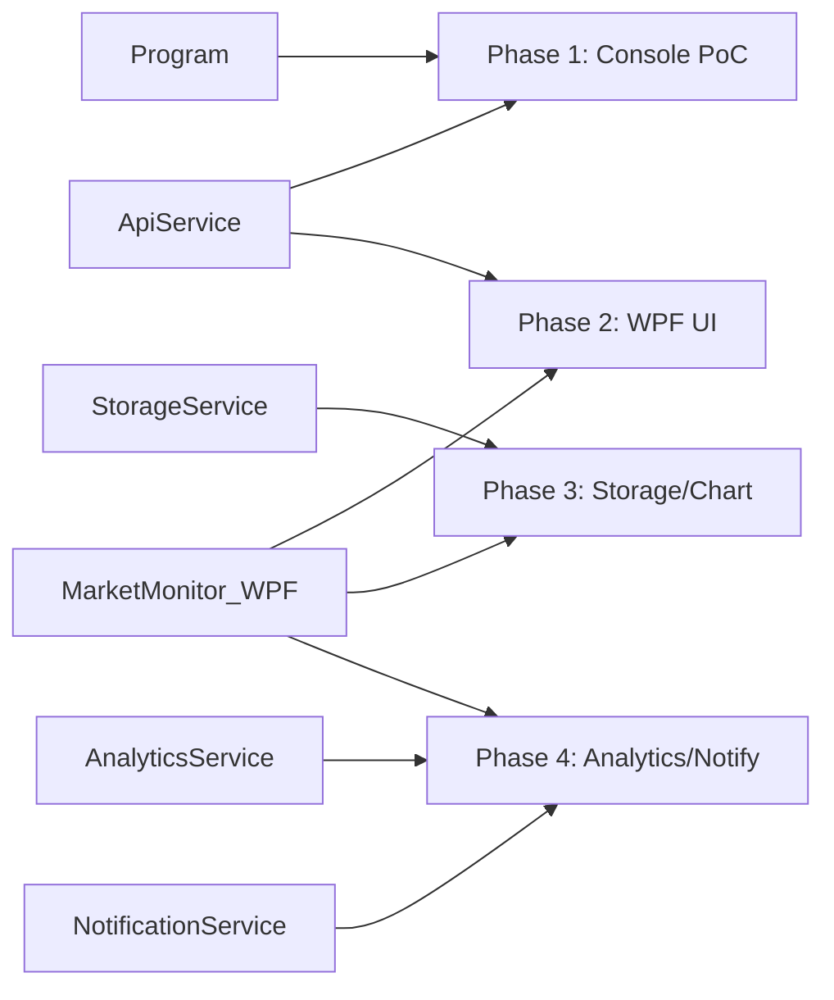

#### シーケンス図
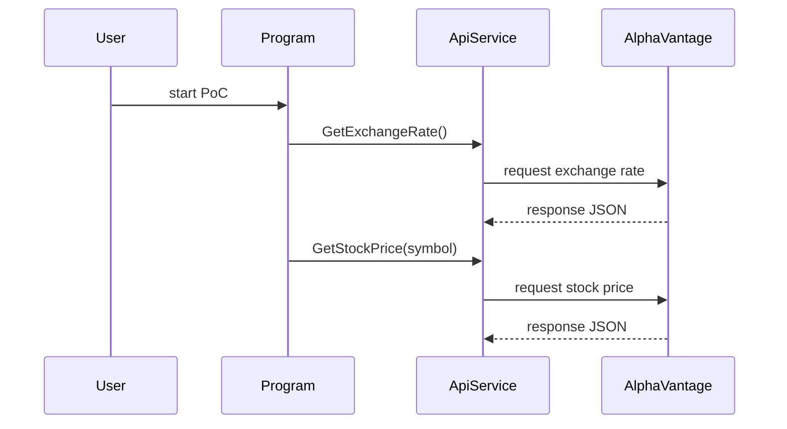

#### クラス図
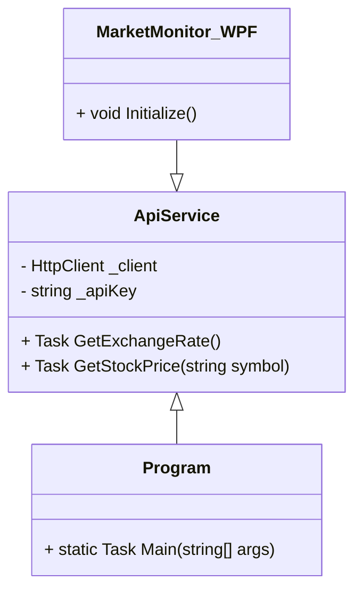

---

## 3. Phase別詳細設計

### Phase 1: データ取得の基盤構築（PoC）
#### 3.1 目的
- データ取得の実装を先行し、外部API連携とJSON処理の妥当性を確認する。

#### 3.1.1 対象となる全体設計
- 2.1 提供機能: 為替レート取得、株価取得、ログ出力
- 2.2 入力: APIキー、銘柄シンボル
- 2.3 出力: ログファイル
- 2.4 システム構成: Console PoCプロジェクト
- 2.5 アーキテクチャ方針: サービスクラス集約、例外処理、ログ出力

#### 3.1.2 関連コンポーネント
- Program: アプリ起動と全体制御
- ApiService: API呼び出しとJSONパース
- HttpClient: 外部API接続
- Serilog: ログ出力

#### 3.1.3 Phase 1の可視化フロー
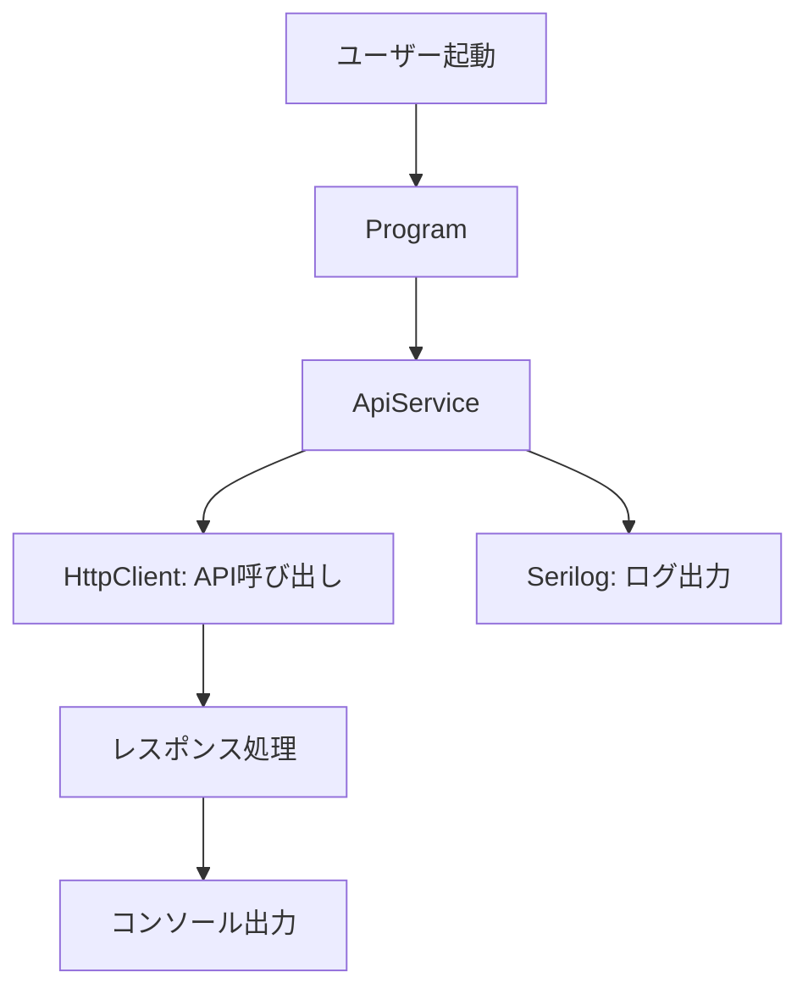

### Phase 2: WPF UIの実装
#### 3.2 目的
- WPFによるGUIを実装し、ユーザーがデータを視覚的に確認できるようにする。

#### 3.2.1 対象となる全体設計
- 2.1 提供機能: WPF GUI表示、現在値表示、更新ボタン、自動更新
- 2.2 入力: ユーザー操作（銘柄選択、更新トリガー）
- 2.3 出力: UI表示
- 2.4 システム構成: WPFアプリ本線
- 2.5 アーキテクチャ方針: MVVMパターン、データバインディング

#### 3.2.2 関連コンポーネント
- MarketMonitor_WPF: メインアプリ
- ApiService: データ取得
- ViewModels: UIロジック
- Views: XAML UI

#### 3.2.3 Phase 2の可視化フロー
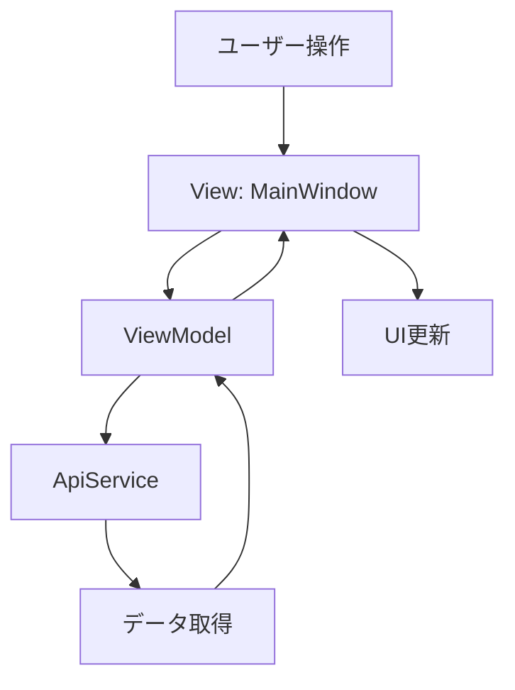

### Phase 3: データ保存と可視化
#### 3.3 目的
- 取得データをローカルに保存し、履歴チャートを表示する。

#### 3.3.1 対象となる全体設計
- 2.1 提供機能: SQLite保存、履歴管理、チャート表示
- 2.2 入力: 日付範囲、取得データ
- 2.3 出力: 保存結果、チャート
- 2.4 システム構成: StorageService
- 2.5 アーキテクチャ方針: リポジトリパターン

#### 3.3.2 関連コンポーネント
- StorageService: データ保存
- MarketMonitor_WPF: UI拡張
- SQLite: データベース

#### 3.3.3 Phase 3の可視化フロー
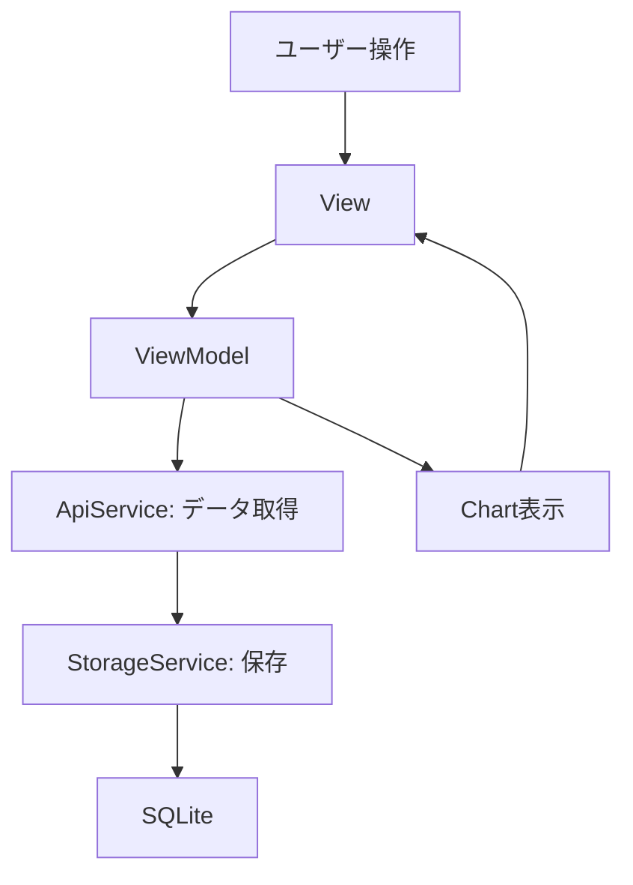

### Phase 4: 分析と通知機能
#### 3.4 目的
- テクニカル指標を計算し、価格到達時に通知する。

#### 3.4.1 対象となる全体設計
- 2.1 提供機能: テクニカル指標、通知
- 2.2 入力: 価格履歴、通知設定
- 2.3 出力: 指標描画、デスクトップ通知
- 2.4 システム構成: AnalyticsService、NotificationService
- 2.5 アーキテクチャ方針: イベント駆動

#### 3.4.2 関連コンポーネント
- AnalyticsService: 指標計算
- NotificationService: 通知送信
- MarketMonitor_WPF: UI拡張

#### 3.4.3 Phase 4の可視化フロー
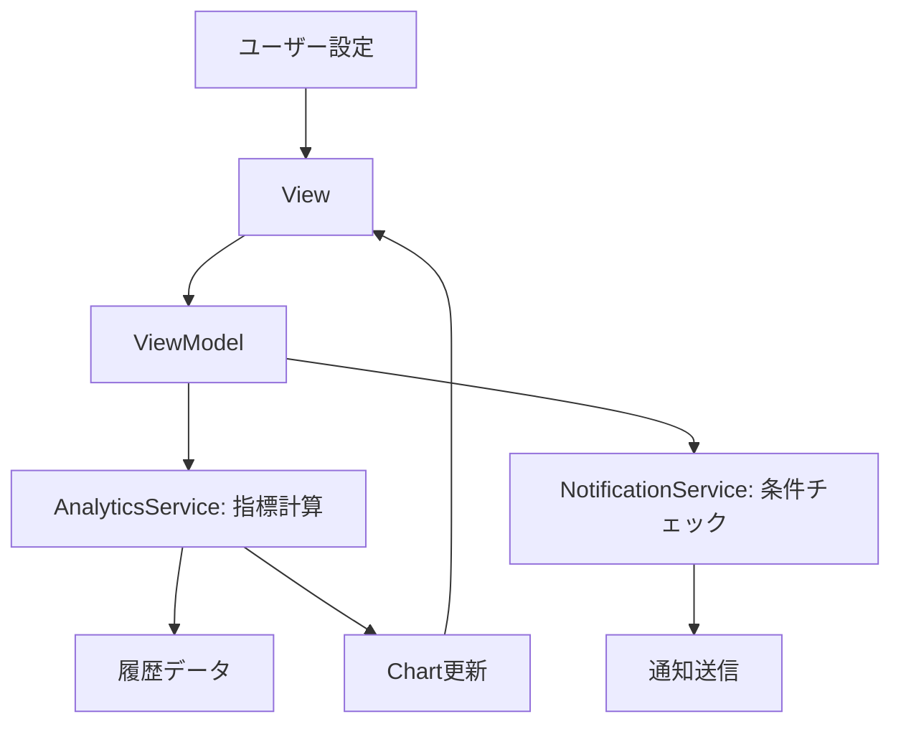

---

## 4. ログ設計

### 4.1 ログの目的
- アプリケーションの動作状況を記録し、デバッグ、監視、トラブルシューティングを支援する。
- ログはファイル出力とし、長期保存と分析を可能にする。

### 4.2 ログレベル
- **INFO**: 正常な操作の記録（データ取得成功、UI更新、データ保存）。
- **ERROR**: エラーの記録（APIエラー、JSON解析失敗、例外発生）。
- ログレベルは最低限に抑え、必要な情報のみを出力。

### 4.3 ログ出力形式
- 出力先: ファイル（日別ローテーション）。
- フォーマット: タイムスタンプ、ログレベル、メッセージ、発生箇所。
- 例: `[2023-10-01 12:00:00] INFO: Exchange rate retrieved successfully for USD/JPY.`

### 4.4 ログの内容
- **INFOログの内容**:
  - データ取得結果（為替レート、株価）。
  - UI操作（更新ボタン押下、自動更新実行）。
  - データ保存完了。
- **ERRORログの内容**:
  - API呼び出し失敗（HTTPステータスコード、レスポンス内容）。
  - JSON解析エラー（例外メッセージ、対象データ）。
  - 予期せぬ例外（スタックトレース、関連データ）。

### 4.5 ログの実装
- 使用ライブラリ: Serilog。
- 設定: appsettings.jsonまたはコード内で設定。
- ログファイル: logs/app-{Date}.log。

### 4.6 ログの可視化
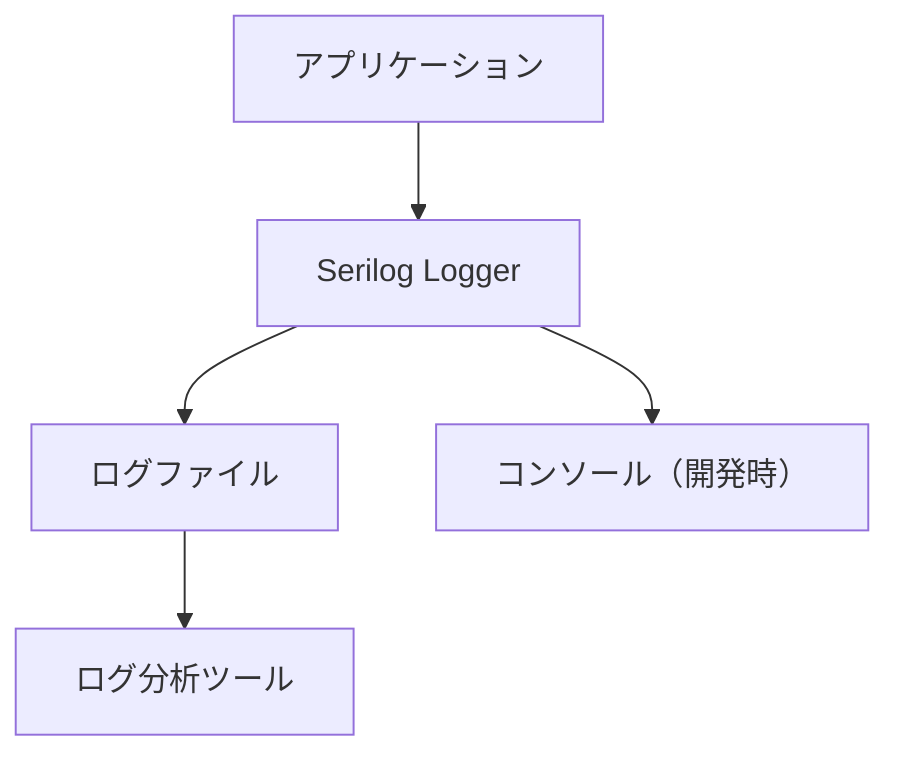

### 4.7 ログのセキュリティとプライバシー
- ログにAPIキーや個人情報を含めない。
- ログファイルは適切に保護し、必要に応じて暗号化。
    A --> H[HttpClient]
    H --> X[AlphaVantage API]
    X --> H
    H --> A
    A --> P
    A --> S[Serilog]
```

#### 3.2 対象機能
- 為替レート取得
- 株価取得
- ログ出力（INFO/ERROR）

#### 3.3 主要コンポーネント
- `ApiService`
  - `GetExchangeRate()`
  - `GetStockPrice(symbol)`
- `Program`
  - `Main()`
  - `HttpClient`初期化
  - `Serilog`設定

#### 3.4 入力/出力
- 入力
  - `ALPHA_VANTAGE_API_KEY` 環境変数または `demo`
  - 銘柄シンボル（例: `IBM`, `9984.T`）
- 出力
  - `log.txt` / 日付ローリングファイル
  - `INFO`：取得成功、`ERROR`：取得失敗、例外情報

#### 3.5 設計方針
- API応答中のnull値を考慮し、デフォルト値を設定
- 日本株判定はシンボル末尾の `.T` で判定
- 例外時はスタックトレースとレスポンスをログに出力
- テストは別プロジェクトで実装し、クラス単位のテスト名を付与

#### 3.6 進捗
- `MarketMonitor.ConsolePoC` プロジェクトでPhase1は実装済
- `MarketMonitor.ConsolePoCTest` に単体テストを追加済

---

### Phase 2: GUIプロトタイプ（デスクトップ化）
#### 3.7 目的
- WPFで基本的なUIを構築し、ユーザー操作によるデータ取得を実現する。

#### 3.7.1 対象となる全体設計
- 2.1 提供機能: UIによる現在値表示と自動/手動更新
- 2.2 入力: ユーザー操作、銘柄選択
- 2.3 出力: UI表示、ログファイル
- 2.4 システム構成: WPF本線プロジェクト
- 2.5 アーキテクチャ方針: MVVM、データバインディング、ViewModel分離

#### 3.7.2 関連コンポーネント
- MarketMonitor_WPF: メイン画面とViewModel連携
- ApiService: データ取得ロジックの共通化

#### 3.7.3 Phase 2の可視化フロー
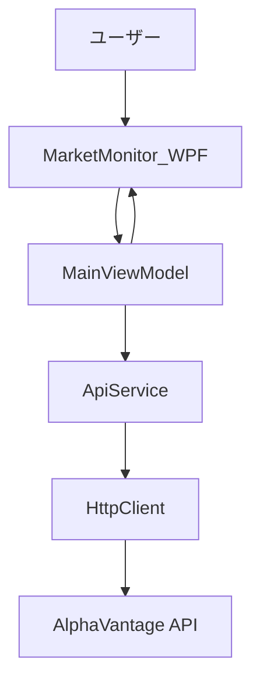

#### 3.8 対象機能
- メインウィンドウの表示
- 手動更新ボタン
- タイマーによる自動更新
- 為替/株価の現在値表示

#### 3.9 主要コンポーネント
- `MainWindow.xaml` / `MainWindow.xaml.cs`
- `ViewModels/MainViewModel`
- `Models/MarketDataModel`
- `Services/ApiService`（Phase1の共通化）

#### 3.10 入力/出力
- 入力
  - ユーザー操作（更新、銘柄選択）
- 出力
  - UI上の現在値表示
  - ログファイルへの出力

#### 3.11 設計方針
- UIロジックはViewModelに集約
- データバインディングを活用
- コードビハインドは最小限に抑制

---

### Phase 3: データの蓄積と視覚化
#### 3.12 目的
- 過去データを保存し、チャート表示を実現する。

#### 3.12.1 対象となる全体設計
- 2.1 提供機能: データ蓄積と可視化
- 2.2 入力: 取得データ、日付範囲
- 2.3 出力: データ保存、チャート表示
- 2.4 システム構成: WPF本線にストレージ/チャート機能を追加
- 2.5 アーキテクチャ方針: リポジトリパターン、UI/DB分離

#### 3.12.2 関連コンポーネント
- StorageService: データ保存・読み出し
- MarketMonitor_WPF: チャート表示と履歴表示

#### 3.12.3 Phase 3の可視化フロー
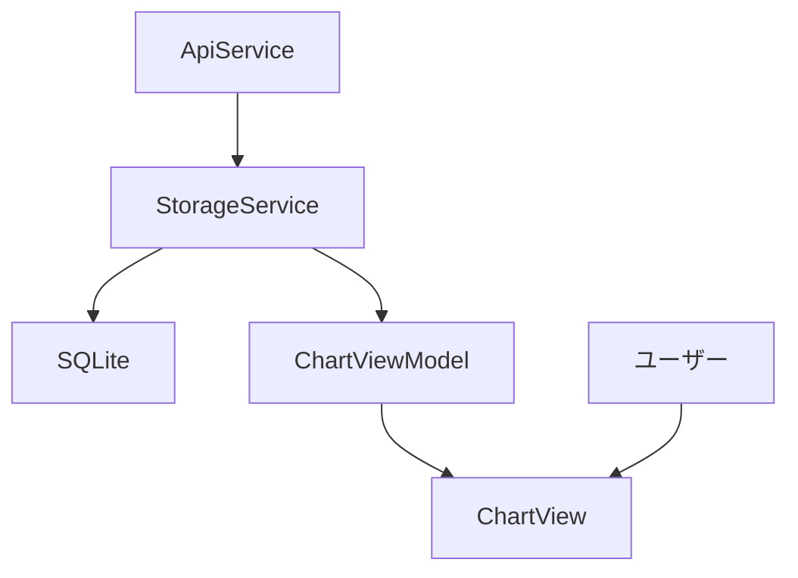

#### 3.13 対象機能
- SQLiteによるローカルDB保存
- 折れ線グラフ表示
- 過去価格データの閲覧

#### 3.14 主要コンポーネント
- `Data/MarketHistoryRepository`
- `Models/PriceHistoryEntry`
- `Services/StorageService`
- `Views/ChartView`
- `ViewModels/ChartViewModel`

#### 3.15 入力/出力
- 入力
  - 取得したマーケットデータ
  - 日付範囲選択
- 出力
  - SQLite保存結果
  - グラフ表示

#### 3.16 設計方針
- リポジトリパターンでデータアクセスを分離
- UIとDBアクセスを分離
- チャートはLiveCharts2などのライブラリを採用

---

### Phase 4: 高度な分析・通知機能
#### 3.17 目的
- 分析系機能と通知機能を追加し、実用性を高める。

#### 3.17.1 対象となる全体設計
- 2.1 提供機能: テクニカル指標、通知機能
- 2.2 入力: 価格履歴データ、閾値/通知条件
- 2.3 出力: チャート描画、通知ポップアップ
- 2.4 システム構成: WPF本線の分析/通知サービス追加
- 2.5 アーキテクチャ方針: サービス分離、テスト可能な通知実装

#### 3.17.2 関連コンポーネント
- AnalyticsService: 指標計算ロジック
- NotificationService: 通知発行
- MarketMonitor_WPF: 指標表示と通知トリガー

#### 3.17.3 Phase 4の可視化フロー
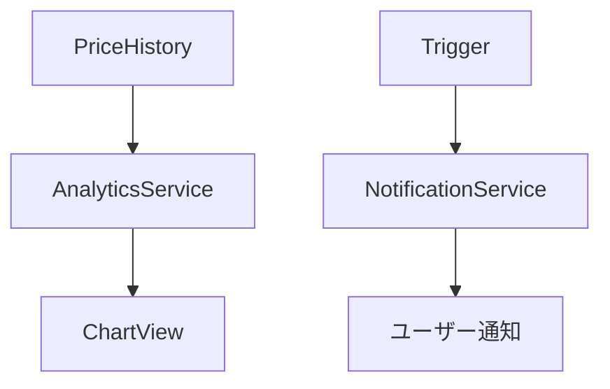

#### 3.18 対象機能
- 移動平均線（MA）表示
- MACDなどのテクニカル指標
- 価格到達通知
- セクター別比較

#### 3.19 主要コンポーネント
- `Services/AnalyticsService`
- `Models/TechnicalIndicatorResult`
- `Services/NotificationService`
- `ViewModels/IndicatorViewModel`

#### 3.20 入力/出力
- 入力
  - 価格履歴データ
  - 閾値・通知条件
- 出力
  - チャートへの指標描画
  - 通知ポップアップ

#### 3.21 設計方針
- 分析ロジックはサービス化してテスト可能にする
- 通知はUIとは分離し、テストしやすいインターフェースで実装
- 計算ロジックはユニットテストで網羅

---

## 4. テスト設計
- テストプロジェクトは `[対応するプロジェクト名]Test` とする。
- テストファイルは `[対応するクラス名]Test.cs` とする。
- コメントは日本語で記載し、テスト対象と期待値を明記。
- 主要サービスのロジックはユニットテストでカバーする。
- API呼び出しやJSONパースはモック化/分離可能に設計する。

## 5. 今後の拡張方針
- APIキー管理を設定ファイル/シークレット管理に移行
- 日本株の取得に対応するデータソース追加
- WPF UIの多言語化とアクセシビリティ対応
- リアルタイムストリーミング対応の検討
