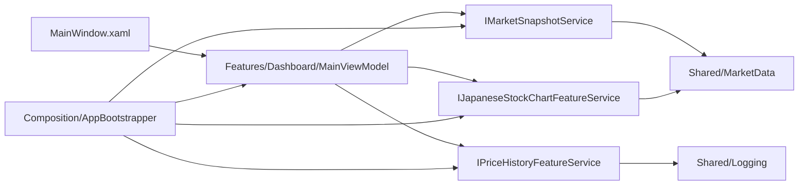

# MarketMonitor 設計書

## 1. 文書目的
本書は、[SPECIFICATION.md](SPECIFICATION.md) に定義された日本株専用仕様を、実装可能な責務分割とコンポーネント設計へ変換した設計書である。

実装生成時は [templates/IMPLEMENTATION_FROM_DESIGN_TEMPLATE.md](templates/IMPLEMENTATION_FROM_DESIGN_TEMPLATE.md) を使用して、本書だけを入力にする。

本書は次の条件を満たすことを目的とする。

- 仕様書のみを入力としても、GitHub Copilot により同等の設計を再生成できること。
- 本設計書のみを入力としても、GitHub Copilot により同等の実装を再生成できること。
- 仕様書、設計書、実装の責務境界と命名が一致していること。

---

## 2. 設計方針

### 2.1 対象範囲
- 東証プライム銘柄の入力解決
- 日本株の現在値取得
- 日本株のローソク足取得
- 履歴保存と履歴表示
- ステータス表示とログ出力

### 2.2 対象外
- 為替レートの取得・表示・保存
- 米国株など東証以外の市場データ取得
- 売買注文、通知、テクニカル指標の追加描画

### 2.3 アーキテクチャ原則
- 機能ごとに縦割り Feature を設ける。
- 複数機能で共有する責務のみ Shared 配下へ置く。
- UI は Features/Dashboard/ViewModels/MainViewModel を唯一の画面統合入口とする。
- Composition は依存関係の組み立てだけを担当する。
- 旧構成の root-level Services、Models、Infrastructure、ViewModels は新構成移行完了後にビルド対象から除外する。
- ViewModel から WPF 固有クラスを直接参照させず、必要な UI 依存は Shared/Infrastructure の抽象へ閉じ込める。

---

## 3. システム構成

### 3.1 フォルダ構成
| 区分 | 配置 | 主責務 |
| --- | --- | --- |
| Composition | Composition | 依存関係の組み立て、起動時初期化 |
| Shared/Infrastructure | Shared/Infrastructure | ObservableObject、Command、UI タイマー抽象など UI 共通基盤 |
| Shared/Logging | Shared/Logging | ログ抽象、Serilog 実装 |
| Shared/MarketData | Shared/MarketData | HTTP、キャッシュ、銘柄解決、JPX 参照、共通エラーメッセージ |
| Features/MarketSnapshot | Features/MarketSnapshot | 日本株現在値取得 |
| Features/PriceHistory | Features/PriceHistory | 履歴保存、履歴読込 |
| Features/JapaneseStockChart | Features/JapaneseStockChart | ローソク足取得、描画データ生成 |
| Features/Dashboard | Features/Dashboard | 画面統合 ViewModel |
| View | MainWindow.xaml | バインディング宣言と画面レイアウト |

### 3.2 依存方向
- View → Features/Dashboard
- Features/Dashboard → Feature 入口インターフェース
- Feature → Shared
- Shared は Feature を参照しない
- Composition のみ concrete 実装を new する

---

## 4. Feature 設計

### 4.1 FR-01 入力解決
#### 4.1.1 責務
- ユーザー入力を東証プライム銘柄の .T シンボルへ正規化する。
- 別名入力を既知シンボルへ変換する。
- JPX 一覧を用いた銘柄名解決を行う。
- 東証プライム外の入力を利用者向けエラーへ変換する。

#### 4.1.2 設計要素
| 種別 | 実装 |
| --- | --- |
| 共通サービス | Shared/MarketData/MarketSymbolResolver |
| 共通サービス | Shared/MarketData/TokyoPrimeSymbolResolver |
| 共通抽象 | Shared/MarketData/ITokyoPrimeSymbolResolver |
| 共通補助 | Shared/MarketData/ApiErrorMessages |

#### 4.1.3 インターフェース契約
- 入力: string symbol, CancellationToken
- 出力: string normalizedSymbol
- 例外: InvalidOperationException

#### 4.1.4 異常系契約
- JPX 取得失敗時は解決失敗として扱う。
- 解決結果が .T に到達しない場合は利用者向け入力エラーを返す。

### 4.2 FR-02 現在値取得
#### 4.2.1 責務
- 日本株の現在値を取得する。
- Yahoo Finance を主取得元とし、Stooq を最終フォールバックとする。
- 株価キャッシュを利用する。
- 現在値取得結果を MarketSnapshot として返す。

#### 4.2.2 設計要素
| 種別 | 実装 |
| --- | --- |
| Feature 入口 | Features/MarketSnapshot/Services/IMarketSnapshotService |
| Feature 実装 | Features/MarketSnapshot/Services/MarketSnapshotService |
| DTO | Features/MarketSnapshot/Models/MarketSnapshot |
| 共通依存 | Shared/MarketData/RateLimitedHttpService |
| 共通抽象 | Shared/MarketData/IRateLimitedHttpService |
| 共通依存 | Shared/MarketData/MarketDataCache |
| 共通依存 | Shared/MarketData/MarketSymbolResolver |

#### 4.2.3 DTO 契約
| DTO | 項目 |
| --- | --- |
| MarketSnapshot | Symbol, CompanyName, StockPrice, StockUpdatedAt |

#### 4.2.4 例外契約
- Yahoo Finance 失敗時は Stooq へフォールバックする。
- 最終的に取得不能な場合は InvalidOperationException を送出する。

### 4.3 FR-05, FR-06 履歴管理
#### 4.3.1 責務
- スナップショットを SQLite に保存する。
- 直近履歴を読込んで内部処理へ渡す。
- 旧スキーマから新スキーマへ移行する。

#### 4.3.2 設計要素
| 種別 | 実装 |
| --- | --- |
| Feature 入口 | Features/PriceHistory/Services/IPriceHistoryFeatureService |
| Feature 実装 | Features/PriceHistory/Services/PriceHistoryFeatureService |
| Repository | Features/PriceHistory/Services/IPriceHistoryRepository |
| Repository 実装 | Features/PriceHistory/Services/SqlitePriceHistoryRepository |
| DTO | Features/PriceHistory/Models/PriceHistoryEntry |
| DTO | Features/PriceHistory/Models/PriceHistoryBar |
| DTO | Features/PriceHistory/Models/PriceHistoryViewData |
| 補助 | Features/PriceHistory/Services/PriceHistoryBarBuilder |

#### 4.3.3 永続化契約
- テーブル名: price_history
- カラム: id, symbol, stock_price, recorded_at
- 旧 schema に exchange_rate が含まれる場合は、新テーブルへコピー後に置換する。

### 4.4 FR-07, FR-08 日本株チャート
#### 4.4.1 責務
- 日本株ローソク足を取得する。
- 足種別と表示期間を反映して表示用データを返す。
- ローソク足描画用の正規化計算を行う。
- 価格チャート上に重ねるチャート指標の定義と描画データを返す。
- ローソク足領域の株価軸ラベルに必要な価格レンジを返す。

#### 4.4.2 設計要素
| 種別 | 実装 |
| --- | --- |
| Feature 入口 | Features/JapaneseStockChart/Services/IJapaneseStockChartFeatureService |
| Feature 実装 | Features/JapaneseStockChart/Services/JapaneseStockChartFeatureService |
| 取得サービス | Features/JapaneseStockChart/Services/IJapaneseCandleService |
| 取得実装 | Features/JapaneseStockChart/Services/JapaneseCandleService |
| 描画実装 | Features/JapaneseStockChart/Services/CandlestickRenderService |
| DTO | Features/JapaneseStockChart/Models/JapaneseCandleEntry |
| DTO | Features/JapaneseStockChart/Models/CandlestickRenderItem |
| DTO | Features/JapaneseStockChart/Models/ChartIndicatorPlacement |
| DTO | Features/JapaneseStockChart/Models/ChartIndicatorDefinition |
| DTO | Features/JapaneseStockChart/Models/ChartIndicatorRenderSeries |
| DTO | Features/JapaneseStockChart/Models/CandlestickChartRenderData |
| DTO | Features/JapaneseStockChart/Models/JapaneseStockChartViewData |

#### 4.4.3 外部 IF 契約
- Yahoo Finance: 現在値と同じ銘柄コードを使用する。
- Stooq: .T を .jp へ変換して利用する。

### 4.5 FR-03, FR-04, FR-09 画面統合
#### 4.5.1 責務
- 手動更新と自動更新を制御する。
- 現在値、履歴、ローソク足を一括更新する。
- 画面表示用プロパティとコマンドを公開する。
- ステータスメッセージと自動更新状態を管理する。

#### 4.5.2 設計要素
| 種別 | 実装 |
| --- | --- |
| ViewModel | Features/Dashboard/ViewModels/MainViewModel |
| 共通基盤 | Shared/Infrastructure/ObservableObject |
| 共通基盤 | Shared/Infrastructure/RelayCommand |
| 共通基盤 | Shared/Infrastructure/AsyncRelayCommand |
| 共通基盤 | Shared/Infrastructure/IUiDispatcherTimer, Shared/Infrastructure/WpfDispatcherTimerAdapter |

#### 4.5.3 画面プロパティ契約
- Symbol
- AutoUpdateIntervalSeconds
- AutoUpdateStateDisplay
- CompanyDisplay
- StockPriceDisplay
- StockUpdatedAtDisplay
- StatusMessage
- PriceHistoryItems
- JapaneseCandlesticks
- JapaneseChartIndicatorOptions
- VisibleJapaneseChartIndicators
- JapaneseCandlestickYAxisTitle
- JapaneseCandlestickXAxisTitle
- JapaneseCandlestickMinPriceLabel
- JapaneseCandlestickMidPriceLabel
- JapaneseCandlestickMaxPriceLabel
- HasVisibleJapaneseChartIndicators
- JapaneseCandlestickCanvasWidth
- 足種別と表示期間の選択状態プロパティ

### 4.6 FR-10 ログ出力
#### 4.6.1 責務
- ファイルログを日次ローテーションで出力する。
- 機能横断ログを抽象化する。

#### 4.6.2 設計要素
| 種別 | 実装 |
| --- | --- |
| Composition | Composition/AppLoggingConfigurator |
| 抽象 | Shared/Logging/IAppLogger |
| 実装 | Shared/Logging/SerilogAppLogger |

---

## 5. 画面設計

### 5.1 MainWindow
- 上段: タイトル、説明文
- 条件入力領域: 銘柄入力、自動更新秒数、更新ボタン、自動更新切替ボタン
- 左ペイン: チャート、縦軸株価ラベル、間引きした横軸日付ラベル、日足/週足、表示期間切替、チャート指標表示切替
- 右ペイン: 銘柄名、株価、更新時刻。GridSplitter により幅を調整可能
- 下段: ステータス

### 5.2 表示ルール
- 為替表示領域は持たない。
- 銘柄入力欄の例示は日本株入力例のみを表示する。
- チャート領域は常時表示し、データ 0 件時は空コレクションを表示する。
- 横軸ラベルは表示件数に応じて間引いて可読性を優先する。
- 各足にマウスオーバーした場合は日付、始値、終値、高値、安値のツールチップを表示する。
- 指標切替 UI は ItemsControl 上の個別 CheckBox で構成し、将来の出来高や MACD も同じ枠組みに追加できるようにする。
- 現在の価格チャートオーバーレイ指標は MA5、MA25、MA75 とする。
- オフにした指標は描画対象と凡例の双方から除外する。

---

## 6. Composition 設計

### 6.1 AppBootstrapper
- logger, httpService, cache, tokyoPrimeSymbolResolver, marketSymbolResolver を生成する。
- MarketSnapshotService、PriceHistoryFeatureService、JapaneseStockChartFeatureService を組み立てる。
- MainViewModel を生成して MainWindow へ渡す。

### 6.2 App.xaml.cs
- 起動時に AppLoggingConfigurator を実行する。
- AppBootstrapper から MainWindow を生成して表示する。

---

## 7. テスト設計

### 7.1 単体テスト対象
| 要求 ID | テスト対象 |
| --- | --- |
| FR-01 | MarketSymbolResolver, TokyoPrimeSymbolResolver |
| FR-02 | MarketSnapshotService |
| FR-03, FR-04, FR-09 | Features/Dashboard/ViewModels/MainViewModel |
| FR-05, FR-06 | SqlitePriceHistoryRepository, PriceHistoryFeatureService |
| FR-07, FR-08 | JapaneseCandleService, JapaneseStockChartFeatureService |

### 7.2 テスト観点
- 4 桁コードの .T 補完
- 東証プライム外入力の拒否
- Yahoo Finance JSON の現在値解析
- Stooq CSV の現在値解析
- 手動更新時の画面反映
- 自動更新間隔の下限補正
- 履歴保存とバー生成
- 旧 DB スキーマの移行
- ローソク足の期間切替と色指定

---

## 8. 整合維持ルール
- 仕様変更時は、仕様書の要求 ID 単位で設計書の該当節を更新する。
- 設計変更時は、対応する実装クラス、インターフェース、テストを同一変更で更新する。
- 実装に新しい public 型を追加する場合は、設計書へ対応責務を追加する。
- 実装から public 型を削除する場合は、設計書と仕様書のトレーサビリティ表からも削除する。

---

## 9. 実装マッピング
| 要求 ID | 実装 |
| --- | --- |
| FR-01 | Shared/MarketData/MarketSymbolResolver, Shared/MarketData/TokyoPrimeSymbolResolver |
| FR-02 | Features/MarketSnapshot/Services/MarketSnapshotService |
| FR-03 | Features/Dashboard/ViewModels/MainViewModel.RefreshAsync |
| FR-04 | Features/Dashboard/ViewModels/MainViewModel.ToggleAutoUpdate |
| FR-05 | Features/PriceHistory/Services/SqlitePriceHistoryRepository.SaveAsync |
| FR-06 | Features/PriceHistory/Services/PriceHistoryFeatureService.RecordAndLoadAsync |
| FR-07 | Features/JapaneseStockChart/Services/JapaneseCandleService |
| FR-08 | Features/Dashboard/ViewModels/MainViewModel.ChangeCandlesAsync, ChangeCandlePeriodAsync |
| FR-09 | Features/Dashboard/ViewModels/MainViewModel.StatusMessage |
| FR-10 | Composition/AppLoggingConfigurator, Shared/Logging/SerilogAppLogger |

以上により、本設計書は [SPECIFICATION.md](SPECIFICATION.md) から再生成可能であり、かつ実装を一意に導ける粒度を維持する。