# Tokyo Market Technical 設計書

## 1. 文書目的
本書は、[SPECIFICATION.md](SPECIFICATION.md) に定義された日本株専用仕様を、実装可能な責務分割とコンポーネント設計へ変換した設計書である。

実装生成時は [templates/IMPLEMENTATION_FROM_DESIGN_TEMPLATE.md](../templates/IMPLEMENTATION_FROM_DESIGN_TEMPLATE.md) を使用して、本書だけを入力にする。

本書は次の条件を満たすことを目的とする。

- 仕様書のみを入力としても、GitHub Copilot により同等の設計を再生成できること。
- 本設計書のみを入力としても、GitHub Copilot により同等の実装を再生成できること。
- 仕様書、設計書、実装の責務境界と命名が一致していること。

---

## 2. 設計方針

### 2.1 対象範囲
- 東証プライム、スタンダード、グロース銘柄の入力解決
- 日本株の現在値取得
- 日本株のローソク足取得
- 銘柄分析表示
- 履歴保存と履歴表示
- チャート指標表示
- 価格通知
- セクター比較表示
- ステータス表示とログ出力

### 2.4 Phase 5 分析ライン方針
- Phase 5 では、ローソク足チャート上へ複数の分析ラインを描画する裁量分析支援を追加する。
- 分析ラインは、取得済みローソク足データへ重ねる軽量な表示レイヤーとして扱う。
- 初期表示では、表示中ローソク足からトレンドライン、支持線、抵抗線を自動生成する。
- 自動生成結果は、既存ラインへ追加するコマンドを提供する。
- 追加時は候補線を別ウィンドウで選択できるようにし、選択済み候補のみを反映する。
- 必要時のみ、始点と終点の 2 点指定による手動追加を許可する。
- 分析ラインは銘柄、足種別、表示期間ごとに SQLite へ永続化する。
- 画面上には線色と説明文を含む凡例カードを表示し、利用者が意味を即時判断できるようにする。
- 分析ラインの配色はトレンドライン（紫系）、支持線（青緑系）、抵抗線（赤系）で統一し、移動平均線（MA 系）と色域を分離する。
- 手動描画 UI は「開始ボタン、2 点クリック、ドラッグ調整」の 3 ステップを常時ガイド表示し、初見操作を補助する。

### 2.2 対象外
- 為替レートの取得・表示・保存
- 米国株など東証以外の市場データ取得
- 売買注文

### 2.3 アーキテクチャ原則
- 機能ごとに縦割り Feature を設ける。
- 複数機能で共有する責務のみ Shared 配下へ置く。
- UI は Features/Dashboard/ViewModels/MainViewModel を唯一の画面統合入口とする。
- Composition は依存関係の組み立てだけを担当する。
- 旧構成の root-level Services、Models、Infrastructure、ViewModels は新構成移行完了後にビルド対象から除外する。
- ViewModel から WPF 固有クラスを直接参照させず、必要な UI 依存は Shared/Infrastructure の抽象へ閉じ込める。

### 2.6 品質ゲート方針
- `Directory.Build.props` を正本として Roslyn Analyzer、コードスタイル診断、通常ビルド検証を常時有効にする。
- コンパイラ警告、Analyzer 警告、コードスタイル警告はすべてビルド失敗として扱い、エラー 0 件かつ警告 0 件を維持する。
- Information レベル診断は残置しない方針とし、必要な場合のみ抑止理由をコードまたは設定へ明示する。
- 実装変更後の確認では、少なくとも `dotnet build` と影響範囲テストで品質ゲート未達がないことを検証する。

### 2.5 本プロジェクトのアーキテクト

本プロジェクトは、画面統合を `MainViewModel` に集約し、機能実装を `Features`、共通基盤を `Shared`、配線を `Composition` に分割する feature-sliced アーキテクチャを採用する。

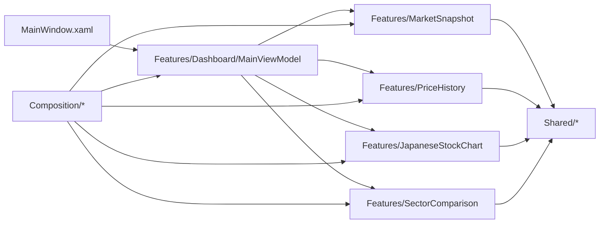

アーキテクト方針は次の 3 点を必須とする。

- 依存方向は `View -> Dashboard -> Feature -> Shared` の一方向のみとし、逆参照を禁止する。
- `Composition` は DI と起動設定だけを担当し、業務ロジックを持たない。
- 横断関心事（ログ、HTTP、キャッシュ、通知、共通エラー文言）は `Shared` へ集約し、各 Feature に重複実装しない。

### 2.7 設計背景

本プロジェクトでは、東証銘柄入力、現在値取得、ローソク足表示、分析ライン、通知、履歴保存を 1 画面で連動させる必要がある。そのため、単純な code-behind 中心の構成ではなく、責務を明確に分離できる構成を採用する。

設計上の第一目的は、画面変更、外部 API 変更、永続化変更、分析ロジック変更が相互に波及しにくい構造を維持することである。

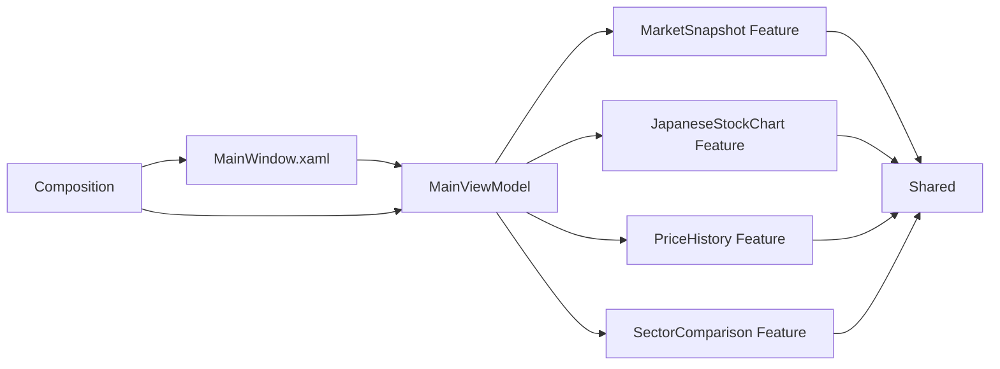

```csharp
services.AddSingleton<IMarketSnapshotService, MarketSnapshotService>();
services.AddSingleton<IPriceHistoryFeatureService, PriceHistoryFeatureService>();
services.AddSingleton<IJapaneseStockChartFeatureService, JapaneseStockChartFeatureService>();
services.AddSingleton<ISectorComparisonFeatureService, SectorComparisonFeatureService>();
services.AddTransient<MainViewModel>();
services.AddTransient<MainWindow>(serviceProvider =>
    new MainWindow(serviceProvider.GetRequiredService<IMainWindowViewModel>()));
```

上図とコードが示す通り、View は表示、MainViewModel は画面統合、各 Feature は機能責務、Shared は横断関心事、Composition は配線に限定する。これにより、SOLID の単一責務原則と依存性逆転原則を満たしやすくする。

#### 2.7.1 MVVM 採用理由
- WPF の Binding と Command を自然に活用しやすい。
- 画面状態を ViewModel へ集約し、XAML を表示定義へ寄せられる。
- ViewModel 単体テストを行いやすい。

#### 2.7.2 MainViewModel を画面統合入口とする理由
- 現在値、履歴、チャート、通知、比較表示を 1 画面の操作として一貫制御する必要がある。
- 初期表示、再読込、足種別切替などの処理順を 1 か所で管理できる。
- 画面全体の状態整合性を保ちやすい。

#### 2.7.3 Feature 分割と Shared 集約の理由
- API 通信、SQLite、通知、分析計算は変更理由が異なるため分離する。
- 複数機能から利用する HTTP、ログ、共通エラー文言は Shared に集約して重複実装を防ぐ。
- 機能単位でテスト範囲と影響範囲を限定しやすくする。

#### 2.7.4 code-behind 最小化の理由
- WPF 固有のイベント引数、座標計算、Window 操作だけを View 側へ閉じ込める。
- 業務ロジックを ViewModel や Service へ寄せ、UI テスト依存を減らす。

#### 2.7.5 DI 採用理由
- 実装生成と利用箇所を分離し、Fake や Stub への差し替えを容易にする。
- 起動時構成を Composition に集約し、依存関係の見通しを確保する。

#### 2.7.6 設計のメリット
| 項目 | 内容 |
| --- | --- |
| 保守性 | 変更理由ごとにクラスやフォルダが分かれ、影響範囲を追いやすい |
| テスト容易性 | ViewModel と Service を個別に差し替えて検証しやすい |
| 再利用性 | Shared の共通基盤を複数 Feature で使い回せる |
| 可読性 | View、ViewModel、Feature、Shared の責務が比較的明確 |

#### 2.7.7 設計のデメリット
| 項目 | 内容 |
| --- | --- |
| 学習コスト | DataContext、Binding、DI、Feature 分割の理解が必要 |
| ファイル数 | 単純なサンプルより型数とフォルダ数が増える |
| 肥大化リスク | 画面統合を MainViewModel に集約するため、責務管理を怠ると肥大化しやすい |
| 追跡難度 | 初学者には、処理の入口と実行箇所が複数ファイルへ分散して見える |

### 2.8 Mermaid 記法規約

本書の Mermaid 図は、現在の実装をリバースエンジニアリングした結果に基づいて、関係種別と同期性を区別して表現する。

| 区分 | 記法 | 用途 |
| --- | --- | --- |
| 同期呼び出し | `->>` | 通常メソッド、同期 API、状態変更 |
| 非同期呼び出し | `-)` | `Task` を返す処理、`await` を伴う処理 |
| 戻り値 | `-->>` | 呼び出し結果の返却 |
| ライフライン | `activate` / `deactivate` | どの参加者が処理中かを表す |
| 実装 | `<|..` | interface を class が実装する関係 |
| 関連 | `-->` | constructor 注入や field 保持による長寿命参照 |
| 依存 | `..>` | メソッド内利用、factory 解決、生成のみを行う参照 |
| 集約 | `o--` | 部品を参照するが寿命を完全所有しない関係 |
| コンポジション | `*--` | 親が子要素の寿命を所有する関係 |

図の矢印は簡略化のために流用せず、実装上の所有関係、注入関係、`async`/`await` の有無に合わせて選択する。sequenceDiagram ではメソッド呼び出し範囲が分かるように `activate` / `deactivate` を記述し、入れ子呼び出しでは内側の参加者にも activation を付けてネスト構造を表現する。

---

## 3. システム構成

### 3.1 フォルダ構成
| 区分 | 配置 | 主責務 |
| --- | --- | --- |
| Composition | Composition | 依存関係の組み立て、起動時初期化 |
| Shared/Infrastructure | Shared/Infrastructure | ObservableObject、Command、UI タイマー抽象など UI 共通基盤 |
| Shared/Logging | Shared/Logging | ログ抽象、Serilog 実装 |
| Shared/MarketData | Shared/MarketData | HTTP、キャッシュ、銘柄解決、JPX 参照、共通エラーメッセージ |
| Features/MarketSnapshot | Features/MarketSnapshot | 日本株現在値取得 |
| Features/PriceHistory | Features/PriceHistory | 履歴保存、履歴読込 |
| Features/JapaneseStockChart | Features/JapaneseStockChart | ローソク足取得、描画データ生成 |
| Features/SectorComparison | Features/SectorComparison | 同一セクター比較表示 |
| Features/Dashboard | Features/Dashboard | 画面統合 ViewModel |
| View | MainWindow.xaml | バインディング宣言と画面レイアウト |

### 3.2 依存方向
- View → Features/Dashboard
- Features/Dashboard → Feature 入口インターフェース
- Feature → Shared
- Shared は Feature を参照しない
- Composition のみ concrete 実装を DI コンテナへ登録し、画面起動時に解決する

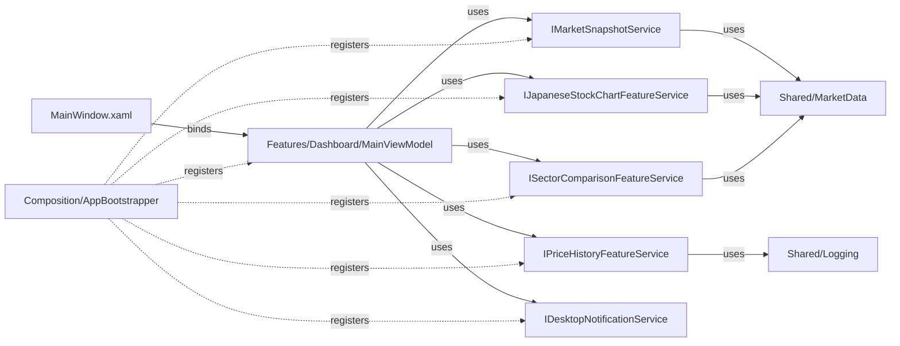

---

## 4. Feature 設計

### 4.1 FR-01 入力解決
#### 4.1.1 責務
- ユーザー入力を東証対象銘柄の .T シンボルへ正規化する。
- 別名入力を既知シンボルへ変換する。
- JPX 一覧を用いた銘柄名解決を行う。
- 東証対象外の入力を利用者向けエラーへ変換する。

#### 4.1.2 設計要素
| 種別 | 実装 |
| --- | --- |
| 共通サービス | Shared/MarketData/MarketSymbolResolver |
| 共通サービス | Shared/MarketData/TokyoListedSymbolResolver |
| 共通抽象 | Shared/MarketData/ITokyoListedSymbolResolver |
| 共通ポリシー | Shared/MarketData/ITokyoMarketSegmentPolicy, Shared/MarketData/TokyoMainMarketSegmentPolicy, Shared/MarketData/ConfigurableTokyoMarketSegmentPolicy |
| 共通設定 | Shared/MarketData/ITokyoMarketSegmentSettingsProvider, Shared/MarketData/JsonTokyoMarketSegmentSettingsProvider |
| 共通補助 | Shared/MarketData/ApiErrorMessages, Shared/MarketData/ApiErrorClassifier |

#### 4.1.3 インターフェース契約
- 入力: string symbol, CancellationToken
- 出力: string normalizedSymbol
- 例外: InvalidOperationException

#### 4.1.4 異常系契約
- JPX 取得失敗時は解決失敗として扱う。
- 解決結果が .T に到達しない場合は利用者向け入力エラーを返す。

#### 4.1.5 クラス図
本図は、入力解決機能を構成する主要クラス間の関連を表す。
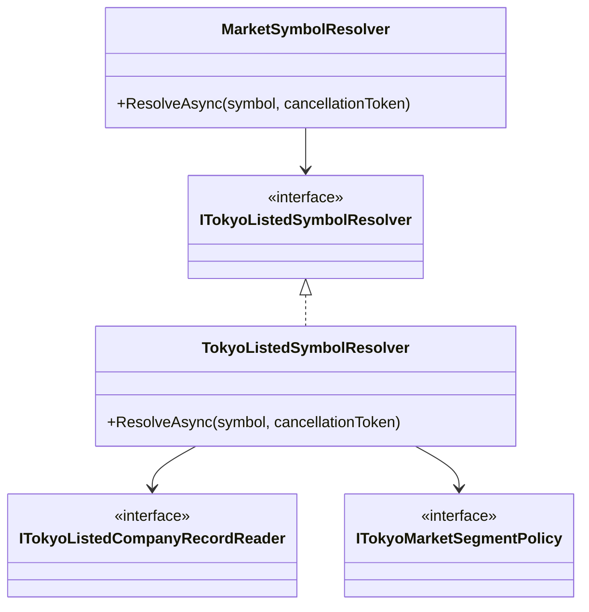

#### 4.1.6 シーケンス図
本図は、入力文字列を東証シンボルへ正規化する代表的な処理シーケンスを表す。
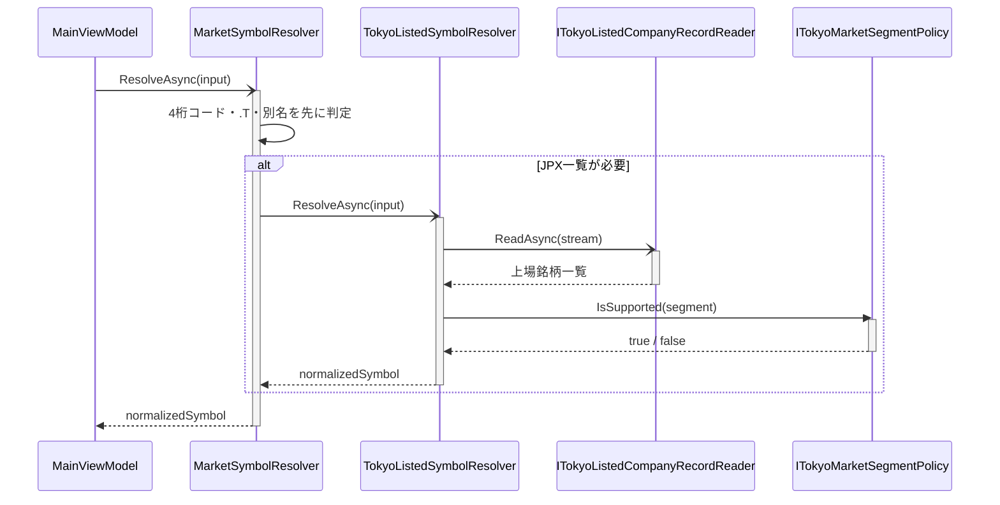

### 4.2 FR-02 現在値取得
#### 4.2.1 責務
- 日本株の現在値を取得する。
- Yahoo Finance を主取得元とし、Stooq を最終フォールバックとする。
- 株価キャッシュを利用する。
- 現在値取得結果を MarketSnapshot として返す。

#### 4.2.2 設計要素
| 種別 | 実装 |
| --- | --- |
| Feature 入口 | Features/MarketSnapshot/Services/IMarketSnapshotService |
| Feature 実装 | Features/MarketSnapshot/Services/MarketSnapshotService |
| DTO | Features/MarketSnapshot/Models/MarketSnapshot |
| 共通依存 | Shared/MarketData/RateLimitedHttpService |
| 共通抽象 | Shared/MarketData/IRateLimitedHttpService |
| 共通依存 | Shared/MarketData/MarketDataCache |
| 共通依存 | Shared/MarketData/MarketSymbolResolver |

#### 4.2.3 DTO 契約
| DTO | 項目 |
| --- | --- |
| MarketSnapshot | Symbol, CompanyName, StockPrice, StockUpdatedAt |

#### 4.2.4 例外契約
- Yahoo Finance 失敗時は Stooq へフォールバックする。
- 最終的に取得不能な場合は InvalidOperationException を送出する。

#### 4.2.5 クラス図
本図は、現在値取得機能を構成する主要クラス間の関連を表す。
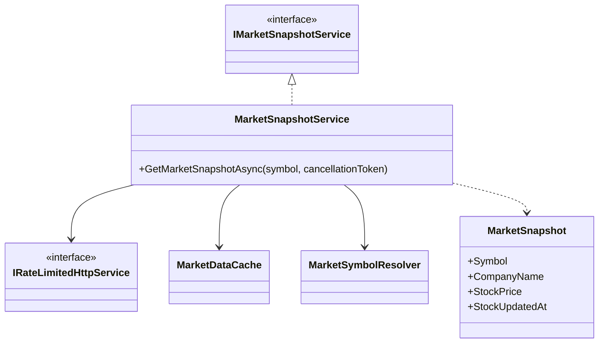

#### 4.2.6 シーケンス図
本図は、現在値取得時の Yahoo 優先、キャッシュ利用、Stooq フォールバックを含む処理シーケンスを表す。
```mermaid
sequenceDiagram
    participant VM as MainViewModel
    participant Service as MarketSnapshotService
    participant Resolver as MarketSymbolResolver
    participant Http as IRateLimitedHttpService
    participant Cache as MarketDataCache

    VM-)Service: GetMarketSnapshotAsync(symbol)
    activate Service
    Service-)Resolver: ResolveAsync(symbol)
    activate Resolver
    Resolver-->>Service: normalizedSymbol
    deactivate Resolver
    Service-)Http: Yahoo Finance 取得
    activate Http
    alt Yahoo成功
        Http-->>Service: quote JSON
        deactivate Http
        Service->>Cache: 現在値を保存
        activate Cache
        Cache-->>Service: 保存完了
        deactivate Cache
        Service-->>VM: MarketSnapshot
    else レート制限
        deactivate Http
        Service->>Cache: キャッシュ照会
        activate Cache
        alt キャッシュあり
            Cache-->>Service: cached price
            deactivate Cache
            Service-->>VM: MarketSnapshot
        else キャッシュなし
            deactivate Cache
            Service-)Http: Stooq 取得
            activate Http
            Http-->>Service: CSV
            deactivate Http
            Service-->>VM: MarketSnapshot
        end
    else Yahoo失敗
        deactivate Http
        Service-)Http: Stooq 取得
        activate Http
        Http-->>Service: CSV
        deactivate Http
        Service-->>VM: MarketSnapshot
    end
    deactivate Service
```

### 4.3 FR-05, FR-06 履歴管理
#### 4.3.1 責務
- スナップショットを SQLite に保存する。
- 直近履歴を読込んで内部処理へ渡す。
- 旧スキーマから新スキーマへ移行する。

#### 4.3.2 設計要素
| 種別 | 実装 |
| --- | --- |
| Feature 入口 | Features/PriceHistory/Services/IPriceHistoryFeatureService |
| Feature 実装 | Features/PriceHistory/Services/PriceHistoryFeatureService |
| Repository | Features/PriceHistory/Services/IPriceHistoryRepository |
| Repository 実装 | Features/PriceHistory/Services/SqlitePriceHistoryRepository |
| DTO | Features/PriceHistory/Models/PriceHistoryEntry |
| DTO | Features/PriceHistory/Models/PriceHistoryBar |
| DTO | Features/PriceHistory/Models/PriceHistoryViewData |
| 補助 | Features/PriceHistory/Services/PriceHistoryBarBuilder |

#### 4.3.3 永続化契約
- テーブル名: price_history
- カラム: id, symbol, stock_price, recorded_at
- 旧 schema に exchange_rate が含まれる場合は、新テーブルへコピー後に置換する。

#### 4.3.4 クラス図
本図は、履歴保存と履歴読込機能を構成する主要クラス間の関連を表す。
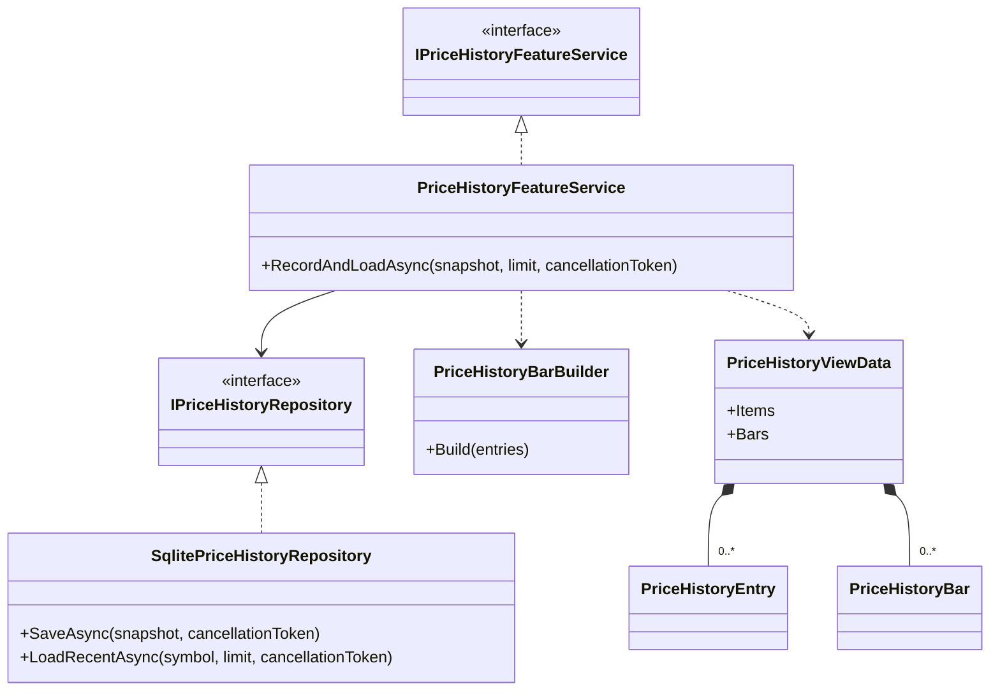

#### 4.3.5 シーケンス図
本図は、スナップショット保存後に直近履歴を再読込して表示用データを組み立てる処理シーケンスを表す。
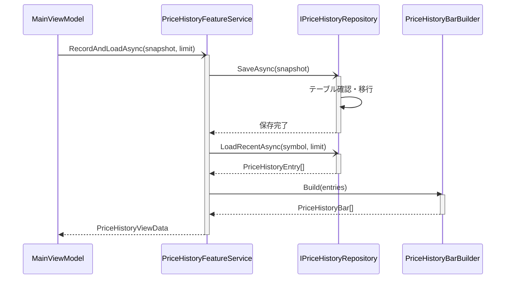

### 4.4 FR-07, FR-08 日本株チャート
#### 4.4.1 責務
- 日本株ローソク足を取得する。
- 足種別と表示期間を反映して表示用データを返す。
- ローソク足描画用の正規化計算を行う。
- 価格チャート上に重ねるチャート指標の定義と描画データを返す。
- 下段指標パネル用の出来高、MACD 系、RSI 描画データを返す。
- ローソク足領域の株価軸ラベルに必要な価格レンジを返す。

#### 4.4.2 設計要素
| 種別 | 実装 |
| --- | --- |
| Feature 入口 | Features/JapaneseStockChart/Services/IJapaneseStockChartFeatureService |
| Feature 実装 | Features/JapaneseStockChart/Services/JapaneseStockChartFeatureService |
| 取得サービス | Features/JapaneseStockChart/Services/IJapaneseCandleService |
| 取得実装 | Features/JapaneseStockChart/Services/JapaneseCandleService |
| 描画実装 | Features/JapaneseStockChart/Services/CandlestickRenderService |
| 永続化抽象 | Features/JapaneseStockChart/Services/IChartAnalysisLineRepository |
| 永続化実装 | Features/JapaneseStockChart/Services/SqliteChartAnalysisLineRepository |
| 補助サービス | Features/JapaneseStockChart/Services/IChartAnalysisLineService |
| 補助実装 | Features/JapaneseStockChart/Services/ChartAnalysisLineService |
| DTO | Features/JapaneseStockChart/Models/JapaneseCandleEntry |
| DTO | Features/JapaneseStockChart/Models/CandlestickRenderItem |
| DTO | Features/JapaneseStockChart/Models/ChartAnalysisLine |
| DTO | Features/JapaneseStockChart/Models/ChartAnalysisLineRenderItem |
| DTO | Features/JapaneseStockChart/Models/ChartAnalysisLineType |
| DTO | Features/JapaneseStockChart/Models/ChartIndicatorPlacement |
| DTO | Features/JapaneseStockChart/Models/ChartIndicatorDefinition |
| DTO | Features/JapaneseStockChart/Models/ChartIndicatorRenderSeries |
| DTO | Features/JapaneseStockChart/Models/CandlestickChartRenderData |
| DTO | Features/JapaneseStockChart/Models/JapaneseStockChartViewData |

#### 4.4.3 外部 IF 契約
- Yahoo Finance: 現在値と同じ銘柄コードを使用する。
- Stooq: .T を .jp へ変換して利用する。

#### 4.4.4 クラス図
本図は、日本株チャート機能を構成する取得系クラスと描画 DTO、分析ライン補助サービスの関連を表す。
```mermaid
classDiagram
    class IJapaneseStockChartFeatureService {
        <<interface>>
    }
    class JapaneseStockChartFeatureService {
        +LoadAsync(symbol, timeframe, period, limit, cancellationToken)
    }
    class IJapaneseCandleService {
        <<interface>>
    }
    class JapaneseCandleService {
        +GetJapaneseCandlesAsync(symbol, timeframe, limit, cancellationToken)
    }
    class IAutoChartAnalysisLineService {
        <<interface>>
    }
    class IChartAnalysisLineRepository {
        <<interface>>
    }
    class IChartAnalysisLineService {
        <<interface>>
    }
    class IAppLogger {
        <<interface>>
    }
    class CandlestickRenderService {
        +BuildViewData(candles, timeframe, period)
    }
    class SqliteChartAnalysisLineRepository {
        +GetAsync(symbol, timeframe, displayPeriod, cancellationToken)
        +SaveAsync(symbol, timeframe, displayPeriod, lines, cancellationToken)
    }
    class ChartAnalysisLineService {
        +CreateLine(lineType, startXRatio, startYRatio, endXRatio, endYRatio)
        +CreateRenderItems(lines, canvasWidth, canvasHeight, selectedLineId)
        +FindNearestLineId(lines, xRatio, yRatio, hitToleranceRatio)
        +MoveLine(line, deltaXRatio, deltaYRatio)
    }
    class CandlestickRenderItem
    class ChartAnalysisLine
    class ChartAnalysisLineType
    class ChartAnalysisLineRenderItem
    class ChartIndicatorDefinition
    class ChartIndicatorRenderSeries
    class IndicatorPanelRenderData
    class JapaneseStockChartViewData {
        +Candlesticks
        +IndicatorDefinitions
        +OverlayIndicatorSeries
        +IndicatorPanels
    }

    IJapaneseStockChartFeatureService <|.. JapaneseStockChartFeatureService
    JapaneseStockChartFeatureService --> IJapaneseCandleService
    JapaneseStockChartFeatureService --> IAutoChartAnalysisLineService
    JapaneseStockChartFeatureService --> IAppLogger
    IJapaneseCandleService <|.. JapaneseCandleService
    JapaneseStockChartFeatureService ..> CandlestickRenderService
    JapaneseStockChartFeatureService ..> JapaneseStockChartViewData
    IChartAnalysisLineRepository <|.. SqliteChartAnalysisLineRepository
    IChartAnalysisLineService <|.. ChartAnalysisLineService
    SqliteChartAnalysisLineRepository ..> ChartAnalysisLine
    ChartAnalysisLineService ..> ChartAnalysisLine
    ChartAnalysisLineService ..> ChartAnalysisLineType
    ChartAnalysisLineService ..> ChartAnalysisLineRenderItem
    JapaneseStockChartViewData *-- "0..*" CandlestickRenderItem
    JapaneseStockChartViewData *-- "0..*" ChartIndicatorDefinition
    JapaneseStockChartViewData *-- "0..*" ChartIndicatorRenderSeries
    JapaneseStockChartViewData *-- "0..*" IndicatorPanelRenderData
```

#### 4.4.5 シーケンス図
本図は、ローソク足取得から描画用 ViewData 生成までの代表的な処理シーケンスを表す。
```mermaid
sequenceDiagram
    participant VM as MainViewModel
    participant Feature as JapaneseStockChartFeatureService
    participant Candle as IJapaneseCandleService
    participant Render as CandlestickRenderService
    participant Http as IRateLimitedHttpService

    VM-)Feature: LoadAsync(symbol, timeframe, period, limit)
    activate Feature
    Feature-)Candle: GetCandlesAsync(symbol, timeframe, limit)
    activate Candle
    Candle-)Http: Yahoo Finance 取得
    activate Http
    alt Yahoo成功
        Http-->>Candle: OHLC JSON
        deactivate Http
    else Yahoo失敗または制限
        deactivate Http
        Candle-)Http: Stooq 取得
        activate Http
        Http-->>Candle: CSV
        deactivate Http
    end
    Candle-->>Feature: JapaneseCandleEntry[]
    deactivate Candle
    Feature->>Render: BuildViewData(candles, timeframe, period)
    activate Render
    Render-->>Feature: JapaneseStockChartViewData
    deactivate Render
    Feature-->>VM: JapaneseStockChartViewData
    deactivate Feature
```

#### 4.4.6 分析ライン操作シーケンス
本図は、分析ライン描画開始後に 2 点クリックでラインを追加し、選択ドラッグと再読込復元へ反映する処理シーケンスを表す。
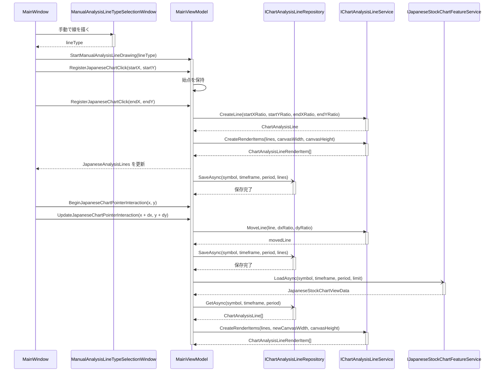

### 4.5 FR-03, FR-09 画面統合
#### 4.5.1 責務
- 銘柄入力に応じた分析表示を実行する。
- 現在値、履歴、ローソク足を一括読込する。
- 価格通知条件を管理する。
- セクター比較表示を更新する。
- 分析ライン描画モードと分析ライン表示状態を管理する。
- 手動描画線種選択ウィンドウ、選択状態、ドラッグ移動、永続化読込を管理する。
- 画面表示用プロパティとコマンドを公開する。
- ステータスメッセージを管理する。

#### 4.5.2 設計要素
| 種別 | 実装 |
| --- | --- |
| ViewModel | Features/Dashboard/ViewModels/MainViewModel |
| 画面サービス | Features/Dashboard/Services/IChartIndicatorSelectionService, Features/Dashboard/Services/ChartIndicatorSelectionService |
| 共通基盤 | Shared/Infrastructure/ObservableObject |
| 共通基盤 | Shared/Infrastructure/RelayCommand |
| 共通基盤 | Shared/Infrastructure/AsyncRelayCommand |
| Composition 補助 | Composition/WindowStartupPlacementService |

#### 4.5.3 画面プロパティ契約
- Symbol
- CompanyDisplay
- StockPriceDisplay
- StockUpdatedAtDisplay
- MarketSegmentDisplay
- StatusMessage
- PriceHistoryItems
- JapaneseCandlesticks
- JapaneseChartIndicatorOptions
- VisibleJapaneseOverlayIndicators
- JapaneseAnalysisLines
- JapaneseAnalysisLineTypeOptions
- VisibleJapaneseSecondaryIndicators
- JapaneseCandlestickYAxisTitle
- JapaneseCandlestickXAxisTitle
- JapaneseCandlestickMinPriceLabel
- JapaneseCandlestickMidPriceLabel
- JapaneseCandlestickMaxPriceLabel
- SecondaryIndicatorMinLabel
- SecondaryIndicatorMidLabel
- SecondaryIndicatorMaxLabel
- HasVisibleJapaneseChartIndicators
- JapaneseCandlestickCanvasWidth
- AlertThresholdText
- IsPriceAlertEnabled
- SectorDisplay
- SectorComparisonItems
- HasSectorComparisonItems
- IsAnalysisLineDrawingEnabled
- HasSelectedJapaneseAnalysisLine
- SelectedJapaneseAnalysisLineType
- AnalysisLineActionText
- AnalysisLineStatusText
- 足種別と表示期間の選択状態プロパティ

#### 4.5.4 クラス図
本図は、画面統合機能における MainViewModel と各機能サービスの関連を表す。
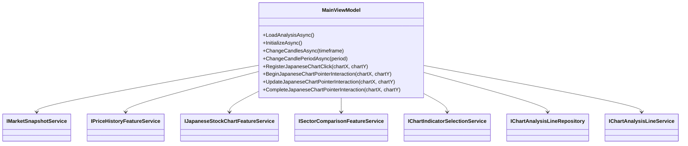

#### 4.5.5 シーケンス図
本図は、分析表示実行時に MainViewModel が各機能サービスを呼び出して画面状態を更新する処理シーケンスを表す。
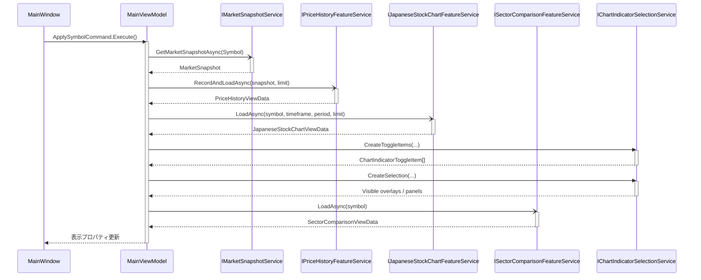

### 4.6 FR-11 価格到達通知
#### 4.6.1 責務
- 通知閾値と有効状態を管理する。
- 現在値更新時に閾値跨ぎを判定する。
- Windows デスクトップ通知を表示する。

#### 4.6.2 設計要素
| 種別 | 実装 |
| --- | --- |
| 抽象 | Shared/Infrastructure/IDesktopNotificationService |
| 実装 | Shared/Infrastructure/WindowsDesktopNotificationService |

#### 4.6.3 クラス図
本図は、価格到達通知機能における ViewModel と通知サービスの関連を表す。
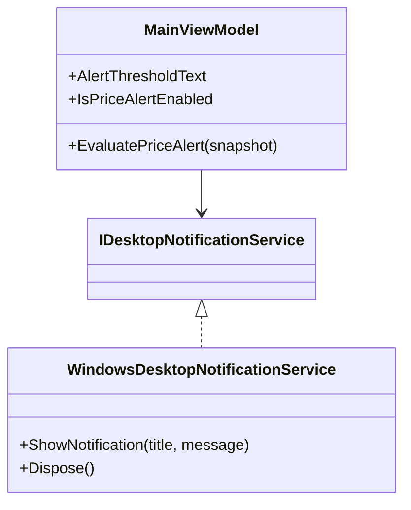

#### 4.6.4 シーケンス図
本図は、価格更新後に閾値跨ぎを判定して通知を出す処理シーケンスを表す。
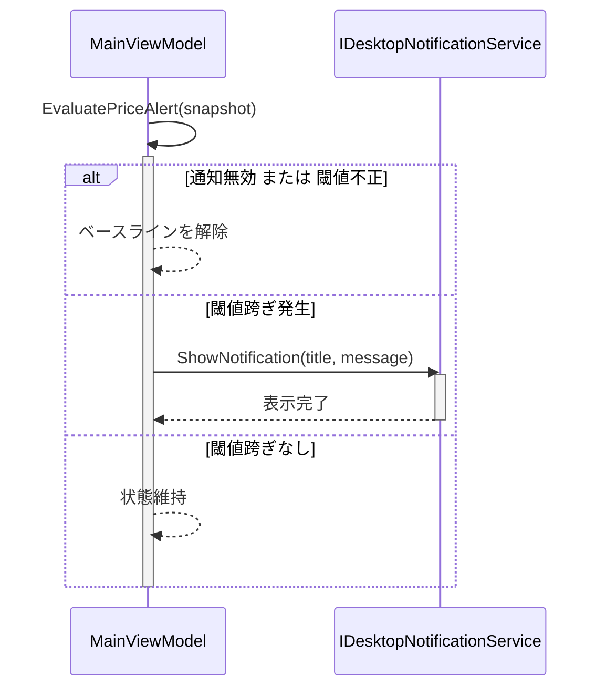

### 4.7 FR-12 セクター比較表示
#### 4.7.1 責務
- JPX 一覧から業種名を解決する。
- 同一セクター比較対象を取得する。
- 比較対象の現在値を読み込んで表示用 DTO を返す。
- 比較対象ごとの市場区分を表示用 DTO へ含める。

#### 4.7.2 設計要素
| 種別 | 実装 |
| --- | --- |
| Feature 入口 | Features/SectorComparison/Services/ISectorComparisonFeatureService |
| Feature 実装 | Features/SectorComparison/Services/SectorComparisonFeatureService |
| DTO | Features/SectorComparison/Models/SectorComparisonViewData |
| DTO | Features/SectorComparison/Models/SectorComparisonPeerItem |
| 共通依存 | Shared/MarketData/MarketSymbolResolver |
| 参照先 | Features/MarketSnapshot/Services/IMarketSnapshotService |

#### 4.7.3 クラス図
本図は、セクター比較機能を構成する主要クラスと比較結果 DTO の関連を表す。
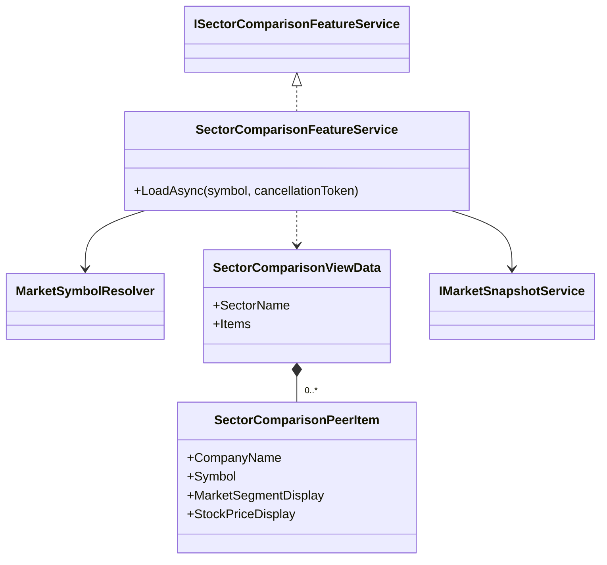

#### 4.7.4 シーケンス図
本図は、同一セクター候補の解決と各銘柄の現在値取得を順に行う処理シーケンスを表す。
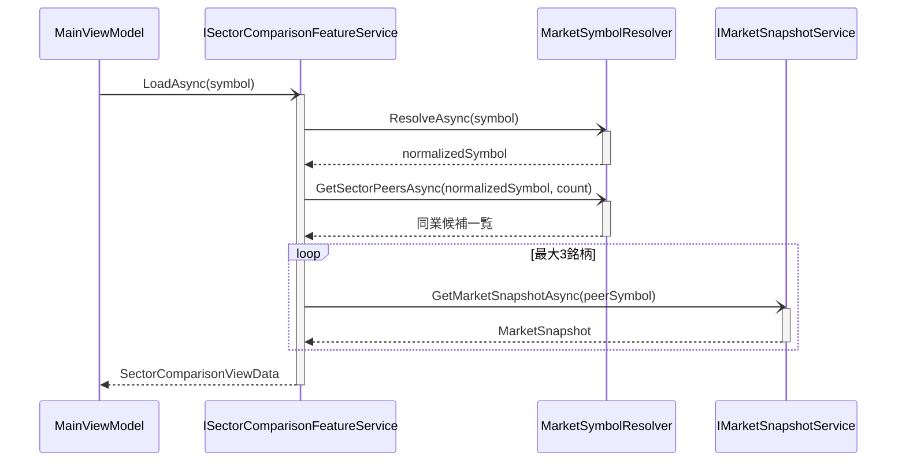

### 4.8 FR-13 市場区分表示と設定
#### 4.8.1 責務
- 補助ペイン用サマリーへ市場区分表示を供給する。
- 市場区分設定ファイルから対象市場のポリシーを生成する。
- 設定読込失敗時は既定ポリシーへフォールバックする。

#### 4.8.2 設計要素
| 種別 | 実装 |
| --- | --- |
| 共通設定抽象 | Shared/MarketData/ITokyoMarketSegmentSettingsProvider |
| 共通設定実装 | Shared/MarketData/JsonTokyoMarketSegmentSettingsProvider |
| 共通ポリシー | Shared/MarketData/ConfigurableTokyoMarketSegmentPolicy |
| Composition | Composition/AppBootstrapper |

#### 4.8.3 クラス図
本図は、市場区分設定機能における設定プロバイダ、ポリシー、Composition の関連を表す。
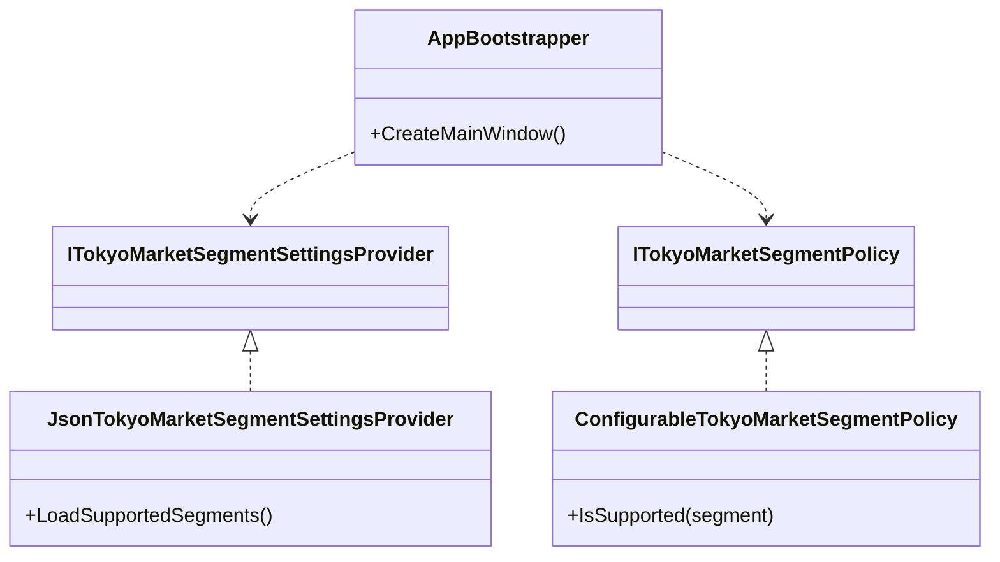

#### 4.8.4 シーケンス図
本図は、起動時に市場区分設定を読み込み、対象ポリシーを決定する処理シーケンスを表す。
```mermaid
sequenceDiagram
    participant App as AppBootstrapper
    participant Provider as ITokyoMarketSegmentSettingsProvider
    participant Policy as ITokyoMarketSegmentPolicy
    participant Resolver as TokyoListedSymbolResolver

    App->>Provider: LoadSupportedSegments()
    activate Provider
    alt 設定読込成功
        Provider-->>App: supportedSegments
        deactivate Provider
        App->>Policy: ConfigurableTokyoMarketSegmentPolicy(supportedSegments)
        activate Policy
        Policy-->>App: policy 生成完了
        deactivate Policy
    else 設定読込失敗
        deactivate Provider
        App->>Policy: TokyoMainMarketSegmentPolicy()
        activate Policy
        Policy-->>App: policy 生成完了
        deactivate Policy
    end
    App-->>Resolver: policy を注入
```

### 4.9 FR-10 ログ出力

#### 4.9.1 責務
- ファイルログを日次ローテーションで出力する。
- 機能横断ログを抽象化する。

#### 4.9.2 設計要素
| 種別 | 実装 |
| --- | --- |
| Composition | Composition/AppLoggingConfigurator |
| 抽象 | Shared/Logging/IAppLogger |
| 実装 | Shared/Logging/SerilogAppLogger |

#### 4.9.3 クラス図
本図は、ログ出力機能に関与するロガー抽象と利用側クラスの関連を表す。
```mermaid
classDiagram
    class AppLoggingConfigurator {
        +Configure()
    }
    class SerilogAppLogger {
        +Info(message)
        +LogError(exception, message)
    }
    class MainViewModel
    class MarketSnapshotService
    class JapaneseCandleService

    IAppLogger <|.. SerilogAppLogger
    AppLoggingConfigurator ..> SerilogAppLogger
    MainViewModel --> IAppLogger
    MarketSnapshotService --> IAppLogger
    JapaneseCandleService --> IAppLogger
```

#### 4.9.4 シーケンス図
本図は、アプリ起動時のロガー初期化と各機能からのログ呼び出しの流れを表す。
```mermaid
sequenceDiagram
    participant App as App.xaml.cs
    participant Config as AppLoggingConfigurator
    participant Logger as IAppLogger
    participant Feature as MainViewModel / FeatureService

    App->>Config: Configure()
    activate Config
    Config-->>App: Serilog初期化
    deactivate Config
    Feature->>Logger: Info(message)
    activate Logger
    alt 例外発生
        Feature->>Logger: LogError(exception, message)
    end
    Logger-->>Feature: 記録完了
    deactivate Logger
```

---

## 5. 画面設計

### 5.1 MainWindow
- 上段: タイトル、説明文
- 条件入力領域: 銘柄入力、表示ボタン、Enter 操作ガイド
- 左ペイン: 画面の主領域としてチャート、固定表示の縦軸株価ラベル、間引きした横軸日付ラベル、日足/週足、表示期間切替、チャート指標表示切替、下段指標パネル、補助ペイン開閉ボタンを単一の分析面として表示
- 右ペイン: 補助領域として銘柄名、業種、株価、更新時刻、価格通知設定、同業比較。GridSplitter により幅を調整可能で、画面全体から折りたたみ可能
- 下段: ステータス

### 5.2 表示ルール
- 為替表示領域は持たない。
- 銘柄入力欄の例示は日本株入力例のみを表示する。
- 余白はチャートの可視領域を優先して抑制し、閲覧専用情報は入力部品ではなくテキスト主体で表示する。
- チャート領域は常時表示し、データ 0 件時は空コレクションを表示する。
- メイン分析対象は左ペインの価格チャートとし、右ペインは補助情報として幅を抑えた構成とする。
- 補助ペインは必要時のみ開く設計とし、既定では開いた状態から利用者が任意に折りたためること。
- 補助ペインの既定幅は左ペインより小さく保ちつつ、株価や更新時刻が欠けない最小幅を確保したうえでウィンドウの拡大・縮小に追従させる。
- 補助ペインを閉じた場合は左ペインが横幅全体を使用し、チャート可視領域を最大化する。
- 横軸ラベルは表示件数に応じて間引いて可読性を優先する。
- 各足にマウスオーバーした場合は日付、始値、終値、高値、安値のツールチップを表示する。
- 指標切替 UI は ItemsControl 上の個別 CheckBox で構成し、将来の出来高や MACD も同じ枠組みに追加できるようにする。
- 現在の価格チャートオーバーレイ指標は MA5、MA25、MA75 とする。
- 現在の下段指標は出来高、MACD / シグナル、RSI とする。
- MACD とシグナルは同一トグルで管理する。
- 下段指標パネルは Expander で折りたたみ可能とし、ヘッダー上の Slider で表示高さを個別調整できるようにする。
- 下段指標パネルは価格チャートと同一カード内に連続表示し、左ペイン全体の縦スクロールで到達できる構成とする。
- オフにした指標は描画対象と凡例の双方から除外する。
- 価格通知は追加の市場データ取得を行わず、現在値更新結果の閾値跨ぎで判定する。
- 価格通知と同業比較は補助操作として右ペイン内で折りたたみ可能とし、初期視線をチャートへ誘導する。
- セクター比較は右ペインで最大 3 銘柄を表示する。
- 補助ペインを閉じた場合も、テクニカル分析に必要なチャート、指標切替、下段パネル操作は左ペインだけで完結すること。

### 5.3 MainWindow クラス図
本図は、MainWindow を構成する画面要素と ViewModel の関連を表す。
```mermaid
classDiagram
    class MainWindow {
        +DataContext
        +OnLoaded()
        +OnSourceInitialized()
    }
    class MainViewModel
    class InputArea
    class AnalysisPane
    class SidebarPane
    class StatusBarArea

    MainWindow *-- "1" InputArea
    MainWindow *-- "1" AnalysisPane
    MainWindow *-- "1" SidebarPane
    MainWindow *-- "1" StatusBarArea
    MainWindow --> IMainWindowViewModel
    IMainWindowViewModel <|.. MainViewModel
```

### 5.4 MainWindow シーケンス図
本図は、ウィンドウ起動から初期化、表示操作までの画面側処理シーケンスを表す。
```mermaid
sequenceDiagram
    participant User as 利用者
    participant Window as MainWindow
    participant VM as IMainWindowViewModel

    User->>Window: ウィンドウを開く
    activate Window
    Window->>Window: OnSourceInitialized()
    Window->>Window: WindowStartupPlacementService.Apply(...)
    Window->>Window: OnLoaded()
    Window-)VM: InitializeAsync()
    activate VM
    VM-->>Window: 初期表示状態
    deactivate VM
    User->>Window: 表示ボタン押下
    Window-->>VM: ApplySymbolCommand.Execute() は Binding 経由で実行
    activate VM
    VM-->>Window: 表示プロパティ更新
    deactivate VM
    deactivate Window
```

---

## 6. Composition 設計

### 6.1 AppBootstrapper
- ServiceCollection を構成し、共通基盤、Feature サービス、画面サービスを登録する。
- 市場区分ポリシーは設定ファイル読込結果から factory 登録で生成する。
- MainWindow と MainViewModel は DI コンテナから解決する。

### 6.2 App.xaml.cs
- 起動時に AppLoggingConfigurator を実行する。
- AppBootstrapper から MainWindow を生成して表示する。

### 6.3 Composition クラス図
本図は、起動構成を担う Composition 層の主要クラス間の関連を表す。
```mermaid
classDiagram
    class App {
        +OnStartup(e)
        +OnExit(e)
    }
    class AppBootstrapper {
        +CreateMainWindow()
        +CreateMainViewModel()
    }
    class ServiceCollection
    class ServiceProvider
    class AppLifecycleService {
        +Start(createMainWindow)
        +Stop(mainWindow)
    }
    class MainWindow
    class MainViewModel

    App ..> AppBootstrapper
    App ..> AppLifecycleService
    AppBootstrapper ..> ServiceCollection
    ServiceCollection ..> ServiceProvider
    ServiceProvider ..> MainWindow
    ServiceProvider ..> MainViewModel
```

### 6.4 Composition シーケンス図
本図は、アプリ起動時に DI コンテナを構築して MainWindow を解決・表示する処理シーケンスを表す。
```mermaid
sequenceDiagram
    participant App as App.xaml.cs
    participant LogConfig as AppLoggingConfigurator
    participant Bootstrapper as AppBootstrapper
    participant Provider as ServiceProvider
    participant Lifecycle as AppLifecycleService
    participant Window as MainWindow

    App->>LogConfig: Configure()
    activate LogConfig
    LogConfig-->>App: ログ設定完了
    deactivate LogConfig
    App->>Lifecycle: Start(AppBootstrapper.CreateMainWindow)
    activate Lifecycle
    Lifecycle->>Bootstrapper: CreateMainWindow()
    activate Bootstrapper
    Bootstrapper->>Bootstrapper: ServiceCollection を構成
    Bootstrapper->>Provider: BuildServiceProvider()
    activate Provider
    Provider->>Window: Resolve MainWindow
    activate Window
    Window-->>Lifecycle: MainWindow
    deactivate Provider
    deactivate Bootstrapper
    Lifecycle->>Window: Show()
    Window-->>App: 起動完了
    deactivate Window
    deactivate Lifecycle
```

---

## 7. 永続化設計

### 7.1 データベース概要
本アプリケーションはローカルファイルシステム上の SQLite データベースを使用して、価格履歴と分析ラインメタデータを永続化する。

```mermaid
flowchart LR
    App[Tokyo Market Technical] --> PriceDB[(data/market_history.db)]
    App --> LineDB[(data/analysis_lines.db)]
    PriceDB --> PriceHistory["price_history テーブル<br/>- 日本株の価格スナップショット履歴"]
    LineDB --> AnalysisLines["analysis_lines テーブル<br/>- チャート分析ラインのメタデータ"]
```

### 7.2 price_history テーブル設計

#### 7.2.1 テーブル定義
```sql
CREATE TABLE IF NOT EXISTS price_history (
    id INTEGER PRIMARY KEY AUTOINCREMENT,
    symbol TEXT NOT NULL,
    stock_price REAL NOT NULL,
    recorded_at TEXT NOT NULL
);
```

#### 7.2.2 カラム仕様
| カラム | 型 | NULL | 説明 |
| --- | --- | --- | --- |
| id | INTEGER | 不可 | 自動採番される履歴 ID |
| symbol | TEXT | 不可 | 正規化済みシンボル（例: 7203.T） |
| stock_price | REAL | 不可 | 保存時点での日本株株価 |
| recorded_at | TEXT | 不可 | ISO 8601 形式の保存時刻 |

#### 7.2.3 目的
- FR-05 で MarketSnapshotService.GetSnapshotAsync() 実行時にスナップショットを即座に保存
- FR-06 で PriceHistoryFeatureService.RecordAndLoadAsync() 呼び出し時に直近 20 件を復元
- レート制限時にキャッシュから価格を参照（FR-02）

#### 7.2.4 書込パターン
- **単一行挿入**: `INSERT INTO price_history(symbol, stock_price, recorded_at) VALUES(?, ?, ?);`
- **読込**: `SELECT id, symbol, stock_price, recorded_at FROM price_history WHERE symbol = ? ORDER BY recorded_at DESC LIMIT ?;`

#### 7.2.5 スキーマ移行
旧実装で exchange_rate カラムが存在する場合、以下の移行ロジックを実行：
```sql
BEGIN TRANSACTION;
CREATE TABLE price_history_new (
    id INTEGER PRIMARY KEY AUTOINCREMENT,
    symbol TEXT NOT NULL,
    stock_price REAL NOT NULL,
    recorded_at TEXT NOT NULL
);
INSERT INTO price_history_new(id, symbol, stock_price, recorded_at)
SELECT id, symbol, stock_price, recorded_at FROM price_history;
DROP TABLE price_history;
ALTER TABLE price_history_new RENAME TO price_history;
COMMIT;
```

### 7.3 analysis_lines テーブル設計

#### 7.3.1 テーブル定義
```sql
CREATE TABLE IF NOT EXISTS analysis_lines (
    symbol TEXT NOT NULL,
    timeframe INTEGER NOT NULL,
    display_period INTEGER NOT NULL,
    line_id TEXT NOT NULL,
    line_type INTEGER NOT NULL,
    start_x_ratio REAL NOT NULL,
    start_y_ratio REAL NOT NULL,
    end_x_ratio REAL NOT NULL,
    end_y_ratio REAL NOT NULL,
    sort_order INTEGER NOT NULL,
    PRIMARY KEY(symbol, timeframe, display_period, line_id)
);
```

#### 7.3.2 カラム仕様
| カラム | 型 | NULL | 説明 |
| --- | --- | --- | --- |
| symbol | TEXT | 不可 | 正規化済みシンボル |
| timeframe | INTEGER | 不可 | 足種別：0=日足、1=週足 |
| display_period | INTEGER | 不可 | 表示期間：0=1か月、1=3か月、2=6か月、3=1年 |
| line_id | TEXT | 不可 | 分析ラインの一意識別子（GUID） |
| line_type | INTEGER | 不可 | 線種別：0=トレンドライン、1=支持線、2=抵抗線 |
| start_x_ratio | REAL | 不可 | 始点 X 座標比率（0.0 ～ 1.0） |
| start_y_ratio | REAL | 不可 | 始点 Y 座標比率（0.0 ～ 1.0） |
| end_x_ratio | REAL | 不可 | 終点 X 座標比率（0.0 ～ 1.0） |
| end_y_ratio | REAL | 不可 | 終点 Y 座標比率（0.0 ～ 1.0） |
| sort_order | INTEGER | 不可 | 描画順序（昇順）、複数行时は連番を逐次割り当て |

#### 7.3.3 複合主キー
```
PRIMARY KEY (symbol, timeframe, display_period, line_id)
```
- 4 つのカラムの組み合わせが一意となる
- 同一銘柄・足・期間内で複数のラインを保持可能

#### 7.3.4 目的
- FR-08C で手動描画による分析ラインをセッション間で復元
- チャート再表示時に銘柄、足種別、表示期間に応じたラインを再配置
- ドラッグ移動後の座標を永続化

#### 7.3.5 座標正規化
- X 座標比率: チャート幅に対する比率（0.0 ～ 1.0）
- Y 座標比率: チャート高さに対する逆転比率（0.0=上端、1.0=下端）
- 画面幅の変更時に比率から座標を再計算して描画
- 比率による保存のため、ウィンドウリサイズ後もラインの相対位置を復元

#### 7.3.6 読み書きパターン
- **挿入**: `INSERT INTO analysis_lines(...) VALUES(...);` （複数行を一括挿入）
- **読込**: `SELECT line_id, line_type, start_x_ratio, start_y_ratio, end_x_ratio, end_y_ratio FROM analysis_lines WHERE symbol = ? AND timeframe = ? AND display_period = ? ORDER BY sort_order;`
- **更新**: `UPDATE analysis_lines SET start_x_ratio = ?, start_y_ratio = ?, end_x_ratio = ?, end_y_ratio = ? WHERE symbol = ? AND timeframe = ? AND display_period = ? AND line_id = ?;`
- **削除**: 行単位の削除と全削除

### 7.4 リポジトリパターン

#### 7.4.1 SqlitePriceHistoryRepository
```mermaid
classDiagram
    class IPriceHistoryRepository {
        <<interface>>
        +SaveAsync(snapshot, cancellationToken)
        +GetRecentAsync(symbol, limit, cancellationToken)
    }
    class SqlitePriceHistoryRepository {
        -_connectionString: string
        -_logger: IAppLogger
        +SaveAsync(snapshot, cancellationToken)
        +GetRecentAsync(symbol, limit, cancellationToken)
        -EnsureTableAsync(cancellationToken)
        -MigrateSchemaAsync(connection, cancellationToken)
    }

    IPriceHistoryRepository <|.. SqlitePriceHistoryRepository
```

#### 7.4.2 SqliteChartAnalysisLineRepository
```mermaid
classDiagram
    class IChartAnalysisLineRepository {
        <<interface>>
        +GetAsync(symbol, timeframe, displayPeriod, cancellationToken)
        +SaveAsync(symbol, timeframe, displayPeriod, lines, cancellationToken)
    }
    class SqliteChartAnalysisLineRepository {
        -_connectionString: string
        -_logger: IAppLogger
        +GetAsync(symbol, timeframe, displayPeriod, cancellationToken)
        +SaveAsync(symbol, timeframe, displayPeriod, lines, cancellationToken)
        -EnsureTableAsync(cancellationToken)
    }

    IChartAnalysisLineRepository <|.. SqliteChartAnalysisLineRepository
```

### 7.5 永続化ポリシー

#### 7.5.1 トランザクション管理
- テーブル作成、スキーマ移行は `BEGIN TRANSACTION` で共有する
- 複数ラインの一括書込は個別トランザクションで実行

#### 7.5.2 タイムスタンプ形式
- ISO 8601 形式（`"yyyy-MM-ddTHH:mm:ss.fff+00:00"`）で保存
- `DateTimeOffset.ToString("O", CultureInfo.InvariantCulture)` で正規化
- 読込時に `DateTimeOffset.Parse()` で復元

#### 7.5.3 エラーハンドリング
- テーブル作成失敗時はアプリケーションを停止しない
- スキーマ移行失敗時はログを記録して既定ポリシーへフォールバック
- 読込クエリが 0 行を返す場合は空コレクションを返す

#### 7.5.4 ファイル配置
- **レポジトリ DB**: `AppContext.BaseDirectory/data/market_history.db`
- **分析ラインDB**: `AppContext.BaseDirectory/data/analysis_lines.db`
- **ログファイル**: `AppContext.BaseDirectory/logs/app-.log`（日次ローテーション）

#### 7.5.5 キャッシュ戦略
- GetStockPriceAsync 実行時に price_history の直近レコードをメモリキャッシュ
- レート制限時のフォールバック時にキャッシュ利用
- 銘柄切替で前銘柄のキャッシュをクリア

---

## 8. テスト設計

### 8.1 単体テスト対象
| 要求 ID | テスト対象 |
| --- | --- |
| FR-01 | MarketSymbolResolver, TokyoListedSymbolResolver |
| FR-02 | MarketSnapshotService |
| FR-03, FR-09 | Features/Dashboard/ViewModels/MainViewModel, Features/Dashboard/Services/ChartIndicatorSelectionService |
| FR-05, FR-06 | SqlitePriceHistoryRepository, PriceHistoryFeatureService |
| FR-07, FR-08 | JapaneseCandleService, JapaneseStockChartFeatureService |

### 7.2 テスト観点
- 4 桁コードの .T 補完
- 東証対象外入力の拒否
- Yahoo Finance JSON の現在値解析
- Stooq CSV の現在値解析
- 手動更新時の画面反映
- 履歴保存とバー生成
- 旧 DB スキーマの移行
- ローソク足の期間切替と色指定

---

## 8. 整合維持ルール
- 仕様変更時は、仕様書の要求 ID 単位で設計書の該当節を更新する。
- 設計変更時は、対応する実装クラス、インターフェース、テストを同一変更で更新する。
- 実装に新しい public 型を追加する場合は、設計書へ対応責務を追加する。
- 実装から public 型を削除する場合は、設計書と仕様書のトレーサビリティ表からも削除する。

---

## 9. 実装マッピング
| 要求 ID | 実装 |
| --- | --- |
| FR-01 | Shared/MarketData/MarketSymbolResolver, Shared/MarketData/TokyoListedSymbolResolver |
| FR-02 | Features/MarketSnapshot/Services/MarketSnapshotService |
| FR-03 | Features/Dashboard/ViewModels/MainViewModel.LoadAnalysisAsync |
| FR-05 | Features/PriceHistory/Services/SqlitePriceHistoryRepository.SaveAsync |
| FR-06 | Features/PriceHistory/Services/PriceHistoryFeatureService.RecordAndLoadAsync |
| FR-07 | Features/JapaneseStockChart/Services/JapaneseCandleService |
| FR-08 | Features/Dashboard/ViewModels/MainViewModel.ChangeCandlesAsync, ChangeCandlePeriodAsync |
| FR-08A | Features/Dashboard/ViewModels/MainViewModel.RefreshVisibleJapaneseChartIndicators |
| FR-08B | Features/JapaneseStockChart/Services/CandlestickRenderService |
| FR-08C | Features/Dashboard/ViewModels/MainViewModel.RegisterJapaneseChartClick, BeginJapaneseChartPointerInteraction, UpdateJapaneseChartPointerInteraction, CompleteJapaneseChartPointerInteraction, Features/JapaneseStockChart/Services/ChartAnalysisLineService, Features/JapaneseStockChart/Services/SqliteChartAnalysisLineRepository |
| FR-09 | Features/Dashboard/ViewModels/MainViewModel.StatusMessage |
| FR-10 | Composition/AppLoggingConfigurator, Shared/Logging/SerilogAppLogger |
| FR-11 | Shared/Infrastructure/IDesktopNotificationService, Shared/Infrastructure/WindowsDesktopNotificationService |
| FR-12 | Features/SectorComparison/Services/ISectorComparisonFeatureService, Features/SectorComparison/Services/SectorComparisonFeatureService |
| FR-13 | Shared/MarketData/ITokyoMarketSegmentSettingsProvider, Shared/MarketData/JsonTokyoMarketSegmentSettingsProvider, Shared/MarketData/ITokyoMarketSegmentPolicy, Shared/MarketData/ConfigurableTokyoMarketSegmentPolicy |

以上により、本設計書は [SPECIFICATION.md](SPECIFICATION.md) から再生成可能であり、かつ実装を一意に導ける粒度を維持する。

---

