# Tokyo Market Technical 機能別実装教材

仕様書（FR）と設計書に対応づけて、実装済み機能を全て学べる教材です。各機能は図と具体コードをセットで掲載します。

## 0. この資料の読み方

この資料は、各機能を次の順で読めるように整理しています。

1. 役割: その機能が画面全体で何を担当するかを掴む
2. クラス図: 静的な依存関係と責務分割を見る
3. シーケンス図または補助図: 実行順序や状態遷移を見る
4. 実装例: 実際のメソッドで図との対応を確認する

まずは FR-03、FR-02、FR-07 の順に読むと、画面全体の司令塔、データ取得、チャート表示の流れを掴みやすくなります。

## 0.5 クイック目次

- [1. 機能網羅マップ](#1-機能網羅マップ)
- [1.5 設計背景](#15-設計背景)
- [2. FR-01 銘柄入力解決](#2-fr-01-銘柄入力解決)
- [3. FR-02 現在値取得](#3-fr-02-現在値取得)
- [4. FR-03 銘柄分析表示](#4-fr-03-銘柄分析表示)
- [5. FR-05 / FR-06 履歴保存・履歴読込](#5-fr-05--fr-06-履歴保存履歴読込)
- [6. FR-07 日本株ローソク足表示](#6-fr-07-日本株ローソク足表示)
- [7. FR-08 足種別/表示期間切替](#7-fr-08-足種別表示期間切替)
- [8. FR-08A チャート指標表示切替](#8-fr-08a-チャート指標表示切替)
- [9. FR-08B 出来高/MACD/RSI](#9-fr-08b-出来高macdrsi)
- [10. FR-08C 分析ライン描画](#10-fr-08c-分析ライン描画)
- [11. FR-09 ステータス表示](#11-fr-09-ステータス表示)
- [12. FR-10 ログ出力](#12-fr-10-ログ出力)
- [13. FR-11 価格到達通知](#13-fr-11-価格到達通知)
- [14. FR-12 セクター比較表示](#14-fr-12-セクター比較表示)
- [15. FR-13 市場区分表示と設定](#15-fr-13-市場区分表示と設定)
- [16. FR-04（廃止）](#16-fr-04廃止)
- [17. 演習（全機能版）](#17-演習全機能版)

## 1. 機能網羅マップ

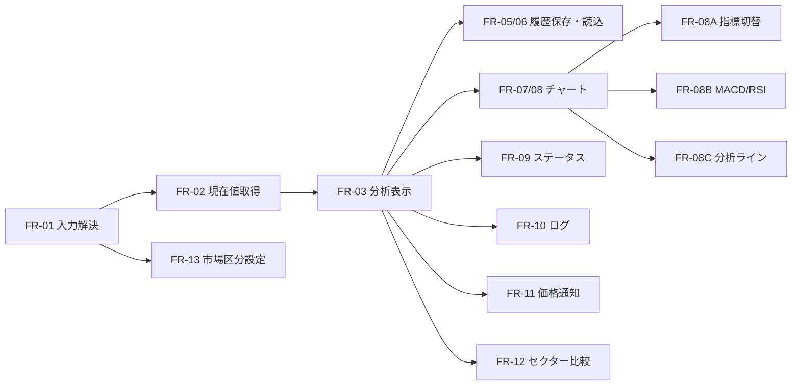

| FR | 機能名 | 主実装クラス |
| --- | --- | --- |
| FR-01 | 銘柄入力解決 | MarketSymbolResolver, TokyoListedSymbolResolver |
| FR-02 | 現在値取得 | MarketSnapshotService |
| FR-03 | 銘柄分析表示 | MainViewModel |
| FR-05/06 | 履歴保存・履歴読込 | PriceHistoryFeatureService, SqlitePriceHistoryRepository |
| FR-07 | 日本株ローソク足表示 | JapaneseStockChartFeatureService, JapaneseCandleService |
| FR-08 | 足種別/表示期間切替 | MainViewModel |
| FR-08A | チャート指標表示切替 | ChartIndicatorSelectionService |
| FR-08B | 出来高/MACD/RSI | CandlestickRenderService |
| FR-08C | 分析ライン描画 | MainViewModel, SqliteChartAnalysisLineRepository |
| FR-09 | ステータス表示 | MainViewModel |
| FR-10 | ログ出力 | AppLoggingConfigurator, SerilogAppLogger |
| FR-11 | 価格到達通知 | WindowsDesktopNotificationService |
| FR-12 | セクター比較表示 | SectorComparisonFeatureService |
| FR-13 | 市場区分表示と設定 | JsonTokyoMarketSegmentSettingsProvider, ConfigurableTokyoMarketSegmentPolicy |

## 1.5 設計背景

このプロジェクトは、単純な 1 画面フォームではなく、銘柄入力解決、API 通信、チャート描画、SQLite 永続化、通知、補助ペイン表示を 1 画面で連動させます。そのため、code-behind に処理を集約するのではなく、責務ごとに View、ViewModel、Feature、Shared、Composition へ分割しています。

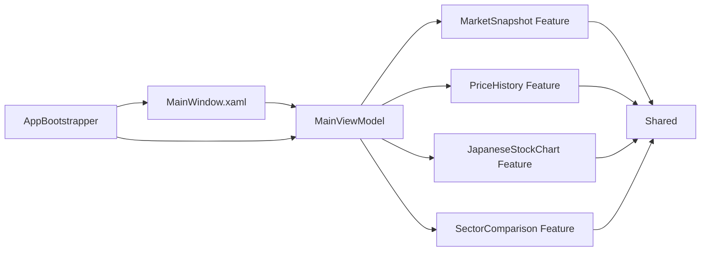

```csharp
services.AddSingleton<IMarketSnapshotService, MarketSnapshotService>();
services.AddSingleton<IPriceHistoryFeatureService, PriceHistoryFeatureService>();
services.AddSingleton<IJapaneseStockChartFeatureService, JapaneseStockChartFeatureService>();
services.AddSingleton<ISectorComparisonFeatureService, SectorComparisonFeatureService>();
services.AddTransient<MainViewModel>();
```

| 設計判断 | 理由 | メリット | デメリット |
| --- | --- | --- | --- |
| MVVM | XAML と画面状態を分離するため | テストしやすい、Binding を活かせる | 初学者には流れが見えにくい |
| MainViewModel 集約 | 1 画面の複数機能を統合するため | 表示更新順序をまとめやすい | 肥大化しやすい |
| Service 分離 | API、DB、計算の変更理由を分離するため | 再利用しやすい、影響範囲が狭い | 型数が増える |
| DI 採用 | 差し替え可能にするため | Fake を使ったテストがしやすい | 配線を追う学習コストがある |

本教材では VS Code プレビュー互換性を優先し、呼び出し矢印は `->>`、戻り値は `-->>` を使います。非同期処理は `Async` を含むメソッド名で読み取ります。

ライフラインは `activate` / `deactivate` で表現し、入れ子呼び出しでは内側の参加者も activation します。

以降の機能説明では、静的な責務関係はクラス図、実行時の呼び出し順はシーケンス図として分けて記載します。

## 2. FR-01 銘柄入力解決

### クラス図

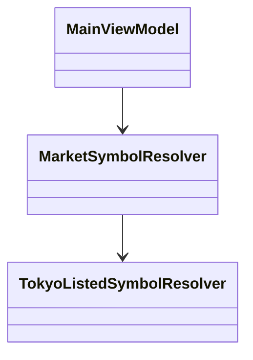

### シーケンス図

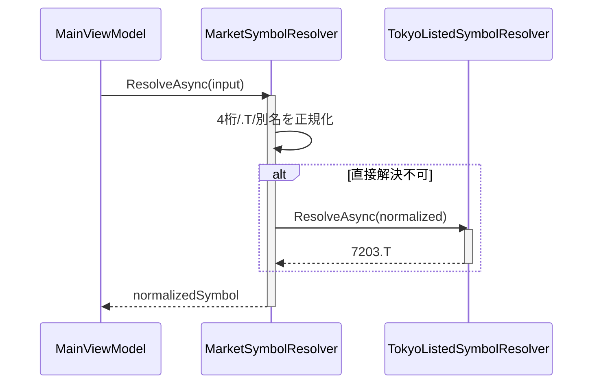

```csharp
public async Task<string> ResolveAsync(string symbol, CancellationToken cancellationToken)
{
    var normalized = NormalizeSymbolInput(symbol);
    if (normalized.EndsWith(".T", StringComparison.OrdinalIgnoreCase))
    {
        return normalized;
    }

    var resolvedTokyoListedSymbol = await _tokyoListedSymbolResolver.ResolveAsync(normalized, cancellationToken);
    if (!string.IsNullOrWhiteSpace(resolvedTokyoListedSymbol))
    {
        _logger?.Info($"TokyoListedSymbolResolved: Input={symbol}, Resolved={resolvedTokyoListedSymbol}");
        return resolvedTokyoListedSymbol;
    }

    throw new InvalidOperationException(ApiErrorMessages.TokyoListedOnlyMessage);
}
```

## 3. FR-02 現在値取得

### クラス図

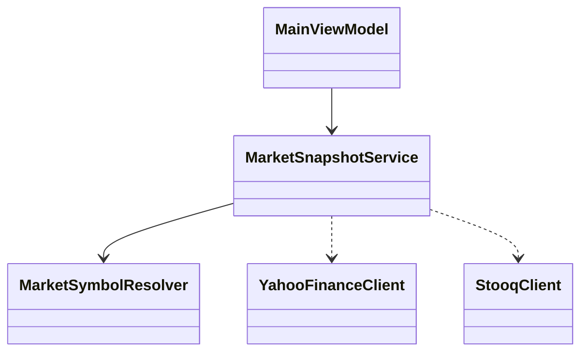

### シーケンス図

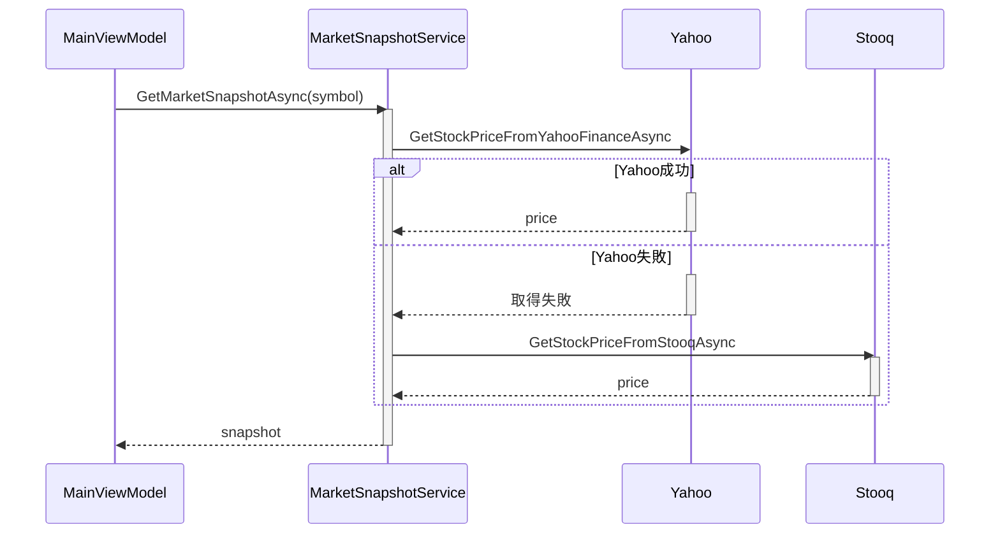

```csharp
public async Task<MarketSnapshotModel> GetMarketSnapshotAsync(string symbol, CancellationToken cancellationToken)
{
    var normalizedSymbol = await _symbolResolver.ResolveAsync(symbol, cancellationToken);
    var companyName = await _symbolResolver.ResolveCompanyNameAsync(normalizedSymbol, cancellationToken) ?? string.Empty;
    var stockPrice = await GetStockPriceAsync(normalizedSymbol, cancellationToken);

    return new MarketSnapshotModel
    {
        Symbol = normalizedSymbol,
        CompanyName = companyName,
        StockPrice = stockPrice,
        StockUpdatedAt = DateTimeOffset.Now
    };
}
```

## 4. FR-03 銘柄分析表示

### クラス図

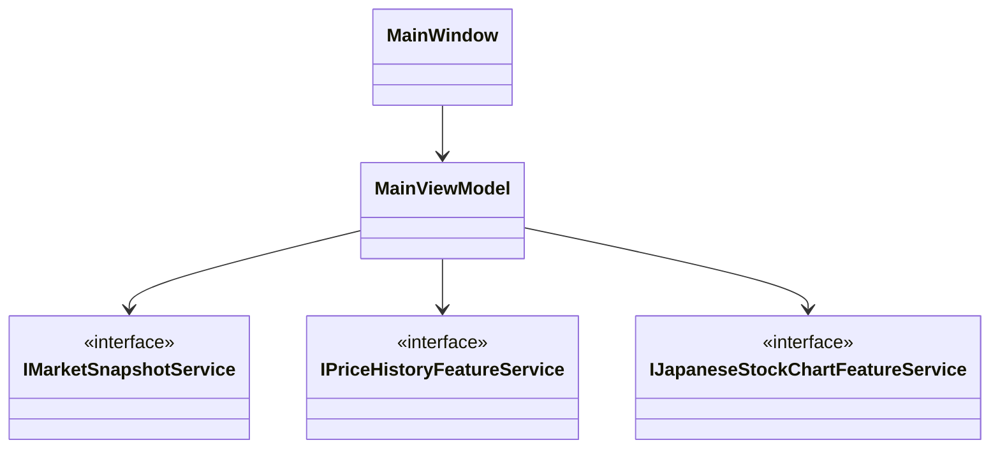

### シーケンス図

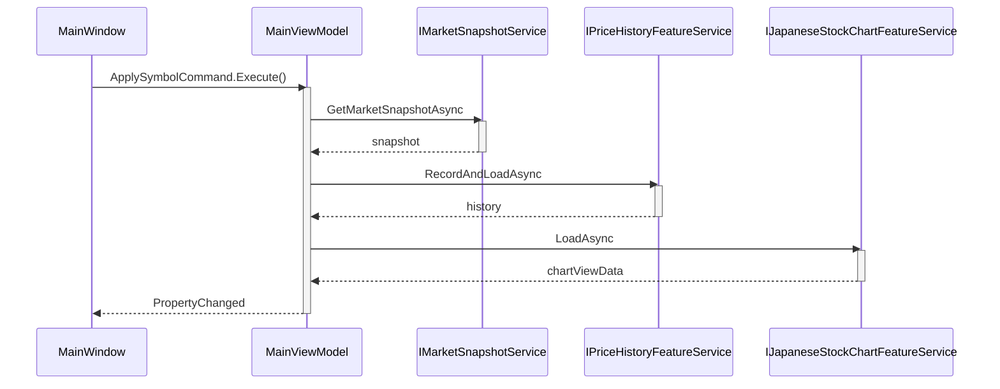

```csharp
private async Task LoadAnalysisAsync()
{
    try
    {
        StartAnalysisLoad();
        var snapshot = await LoadSnapshotAsync();
        await RefreshAnalysisWorkspaceAsync(snapshot);
        CompleteAnalysisLoad(snapshot);
    }
    catch (HttpRequestException ex)
    {
        HandleAnalysisFailure(ex);
    }
    catch (InvalidOperationException ex)
    {
        HandleAnalysisFailure(ex);
    }
}
```

## 5. FR-05 / FR-06 履歴保存・履歴読込

### 役割

現在値取得の結果を SQLite へ保存し、表示用の履歴データへ変換する機能です。保存と読込を同じ Feature にまとめることで、表示順序と整形責務を一箇所へ集約しています。

### クラス図

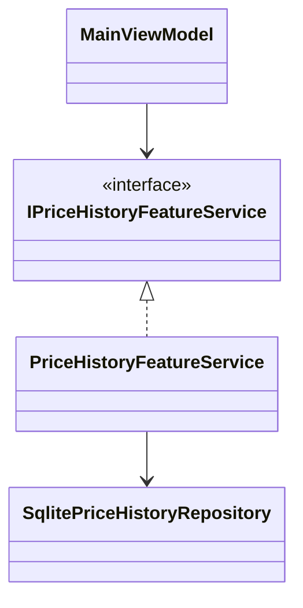

### 処理フロー図

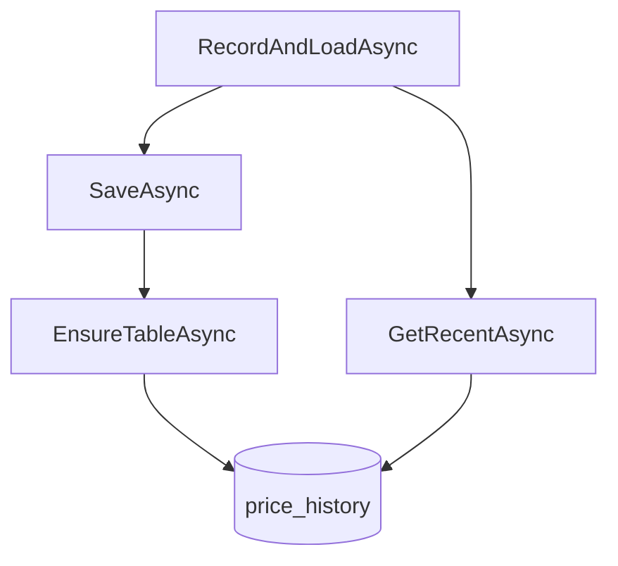

```csharp
public async Task<PriceHistoryViewData> RecordAndLoadAsync(MarketSnapshotModel snapshot, int limit, CancellationToken cancellationToken)
{
    await _repository.SaveAsync(snapshot, cancellationToken);
    var history = await _repository.GetRecentAsync(snapshot.Symbol, limit, cancellationToken);
    var orderedHistory = history.OrderBy(x => x.RecordedAt).ToList();
    var bars = PriceHistoryBarBuilder.Build(orderedHistory);

    _logger.Info($"PriceHistoryFeatureCompleted: Symbol={snapshot.Symbol}, Count={orderedHistory.Count}");
    return new PriceHistoryViewData(orderedHistory, bars);
}
```

```csharp
public async Task SaveAsync(MarketSnapshotModel snapshot, CancellationToken cancellationToken)
{
    await EnsureTableAsync(cancellationToken);

    await using var connection = new SqliteConnection(_connectionString);
    await connection.OpenAsync(cancellationToken);

    await using var command = connection.CreateCommand();
    command.CommandText = "INSERT INTO price_history(symbol, stock_price, recorded_at) VALUES($symbol, $stockPrice, $recordedAt);";
    command.Parameters.AddWithValue("$symbol", snapshot.Symbol);
    command.Parameters.AddWithValue("$stockPrice", snapshot.StockPrice);
    command.Parameters.AddWithValue("$recordedAt", snapshot.StockUpdatedAt.ToString("O", CultureInfo.InvariantCulture));

    await command.ExecuteNonQueryAsync(cancellationToken);
}
```

## 6. FR-07 日本株ローソク足表示

### クラス図

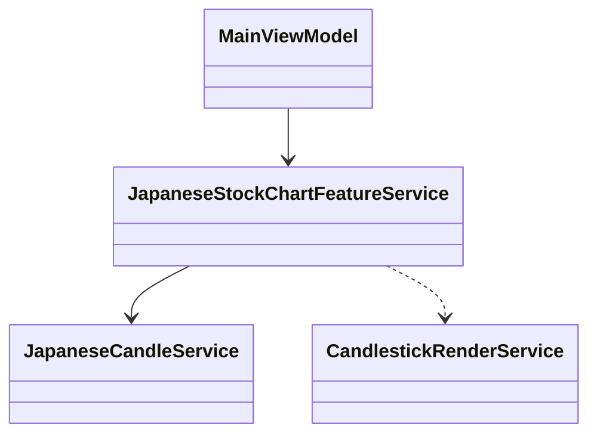

### シーケンス図

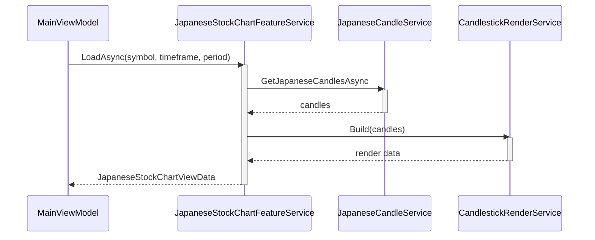

```csharp
public async Task<JapaneseStockChartViewData> LoadAsync(
    string symbol,
    CandleTimeframe timeframe,
    CandleDisplayPeriod displayPeriod,
    int fetchLimit,
    CancellationToken cancellationToken)
{
    if (!IsTokyoSymbol(symbol))
    {
        return new JapaneseStockChartViewData(false, Array.Empty<CandlestickRenderItem>(), Array.Empty<ChartIndicatorDefinition>(), Array.Empty<ChartIndicatorRenderSeries>(), Array.Empty<ChartAnalysisLine>(), Array.Empty<IndicatorPanelRenderData>(), 0m, 0m, 320d);
    }

    var candles = await _japaneseCandleService.GetJapaneseCandlesAsync(symbol, timeframe, fetchLimit, cancellationToken);
    var filtered = FilterCandlesBySelectedPeriod(candles, displayPeriod);
    var rendered = CandlestickRenderService.Build(candles, filtered.Count == 0 ? (DateTime?)null : filtered[0].Date);
    return new JapaneseStockChartViewData(true, rendered.Candlesticks, rendered.IndicatorDefinitions, rendered.OverlayIndicatorSeries, _autoChartAnalysisLineService.Generate(filtered), rendered.IndicatorPanels, filtered.Count == 0 ? 0m : filtered.Min(x => x.Low), filtered.Count == 0 ? 0m : filtered.Max(x => x.High), rendered.CanvasWidth);
}
```

## 7. FR-08 足種別/表示期間切替

### 役割

ユーザーが選んだ足種別と表示期間を MainViewModel が保持し、チャートの再読込コマンドへ接続する機能です。

### クラス図

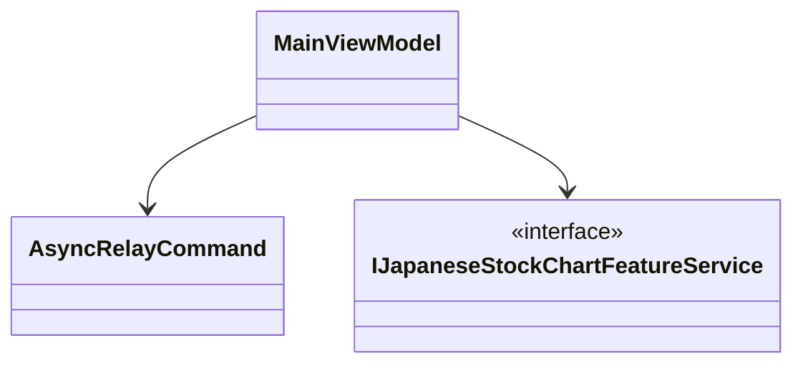

### 処理フロー図

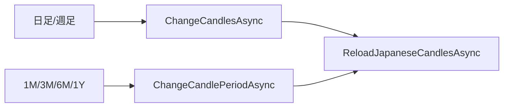

```csharp
private async Task ChangeCandlesAsync(CandleTimeframe timeframe)
{
    SetSelectedCandleTimeframe(timeframe);
    await ReloadJapaneseCandlesAsync();
}

private async Task ChangeCandlePeriodAsync(CandleDisplayPeriod period)
{
    SetSelectedCandleDisplayPeriod(period);
    await ReloadJapaneseCandlesAsync();
}
```

## 8. FR-08A チャート指標表示切替

### クラス図

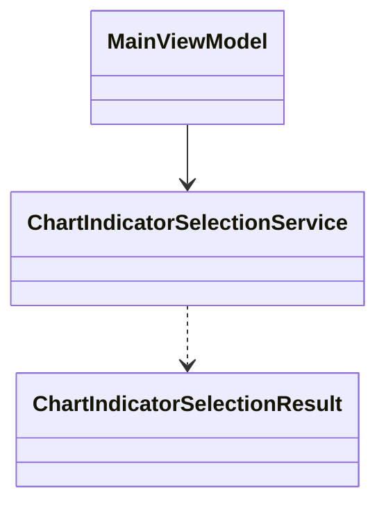

### シーケンス図

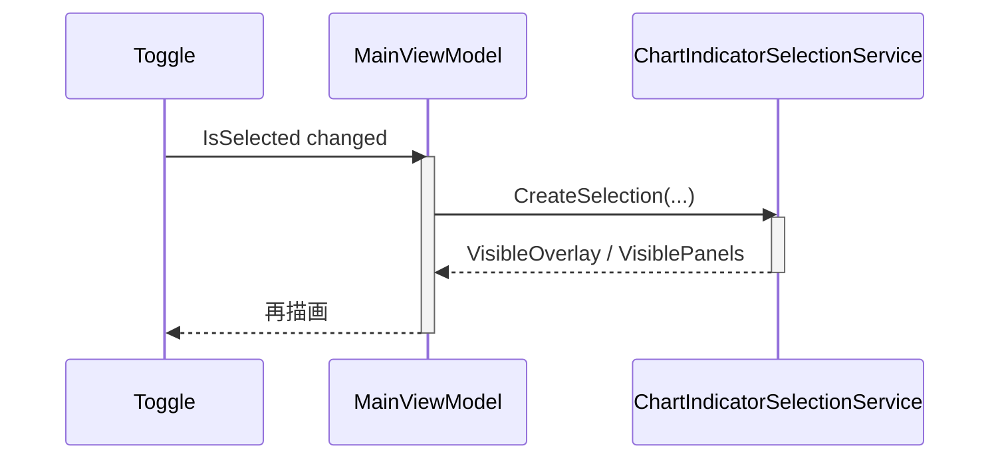

```csharp
public ChartIndicatorSelectionResult CreateSelection(
    IReadOnlyList<ChartIndicatorToggleItem> toggleItems,
    IReadOnlyList<ChartIndicatorRenderSeries> overlaySeries,
    IReadOnlyList<IndicatorPanelRenderData> indicatorPanels,
    IReadOnlyList<IndicatorPanelRenderData> currentVisiblePanels)
{
    var selectedIndicatorKeys = toggleItems.Where(item => item.IsSelected).Select(item => item.IndicatorKey).ToHashSet(StringComparer.Ordinal);
    var visibleOverlaySeries = overlaySeries.Where(item => selectedIndicatorKeys.Contains(item.IndicatorKey)).OrderBy(item => item.DisplayOrder).ToList();
    var visibleIndicatorPanels = indicatorPanels.Where(item => selectedIndicatorKeys.Contains(item.PanelKey)).OrderBy(item => item.DisplayOrder).ToList();
    return new ChartIndicatorSelectionResult(visibleOverlaySeries, visibleIndicatorPanels);
}
```

## 9. FR-08B 出来高/MACD/RSI

### 役割

ローソク足配列から補助指標パネルを計算し、価格チャートとは別の下段表示へ整形する機能です。

### クラス図

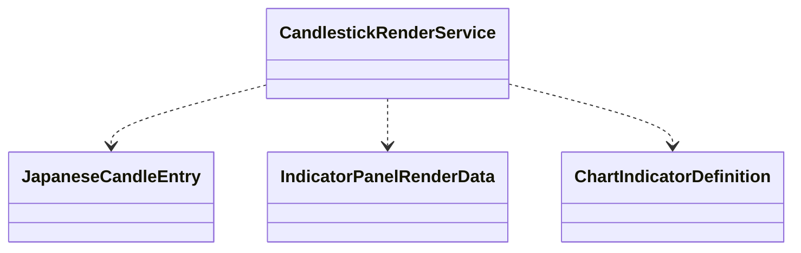

### 処理フロー図

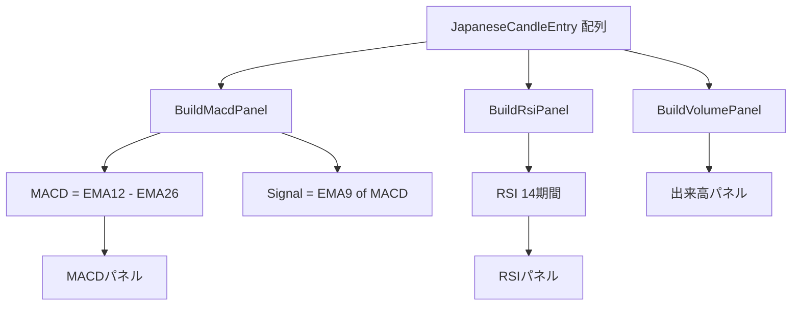

FR-08B は「入力データ（ローソク足配列）」から 3 種類の下段指標パネルを組み立てる処理です。上図は計算式と表示先の対応を先に把握できるように簡略化しています。

```csharp
private static readonly IReadOnlyList<ChartIndicatorDefinition> SupportedIndicatorDefinitions =
[
    new ChartIndicatorDefinition("ma5", "MA5", ChartIndicatorPlacement.OverlayPriceChart, "#F59E0B", true, 10),
    new ChartIndicatorDefinition("ma25", "MA25", ChartIndicatorPlacement.OverlayPriceChart, "#10B981", true, 20),
    new ChartIndicatorDefinition("ma75", "MA75", ChartIndicatorPlacement.OverlayPriceChart, "#0EA5E9", true, 30),
    new ChartIndicatorDefinition("volume", "出来高", ChartIndicatorPlacement.SecondaryPanel, "#64748B", true, 40),
    new ChartIndicatorDefinition("macd", "MACD", ChartIndicatorPlacement.SecondaryPanel, "#B91C1C", true, 50),
    new ChartIndicatorDefinition("rsi", "RSI", ChartIndicatorPlacement.SecondaryPanel, "#7C3AED", true, 60)
];
```

```csharp
private static IndicatorPanelRenderData? BuildMacdPanel(IReadOnlyList<JapaneseCandleEntry> candles, int visibleStartIndex)
{
    if (candles.Count < 26)
    {
        return null;
    }

    var closes = candles.Select(candle => candle.Close).ToArray();
    var ema12 = CalculateExponentialMovingAverage(closes, 12);
    var ema26 = CalculateExponentialMovingAverage(closes, 26);
    var macdValues = new decimal?[closes.Length];
    for (var index = 0; index < closes.Length; index++)
    {
        if (ema12[index].HasValue && ema26[index].HasValue)
        {
            macdValues[index] = ema12[index]!.Value - ema26[index]!.Value;
        }
    }
    var signalValues = CalculateExponentialMovingAverage(macdValues, 9);
    return signalValues.Length == 0 ? null : new IndicatorPanelRenderData("macd", "MACD", 50, "N2", null, new List<ChartIndicatorRenderSeries>(), Array.Empty<ChartIndicatorBarItem>(), Array.Empty<IndicatorReferenceLine>(), 0m, 0m, new List<IndicatorPanelHoverItem>());
}
```

## 10. FR-08C 分析ライン描画

### クラス図

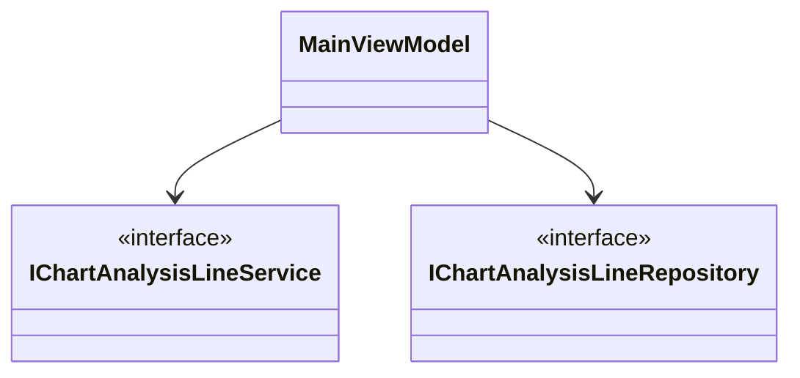

### シーケンス図

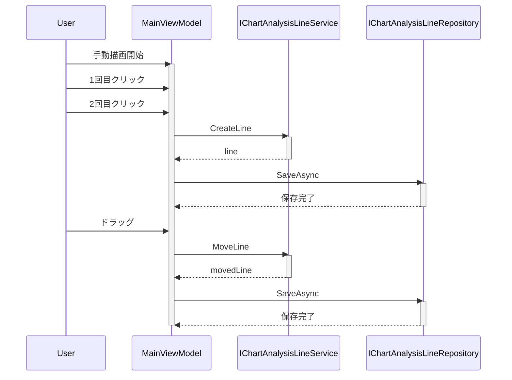

```csharp
public void RegisterJapaneseChartClick(double chartX, double chartY)
{
    if (!IsAnalysisLineDrawingEnabled || JapaneseCandlestickCanvasWidth <= 0d)
    {
        return;
    }

    var normalizedXRatio = NormalizeCoordinate(chartX, JapaneseCandlestickCanvasWidth);
    var normalizedYRatio = NormalizeCoordinate(chartY, AnalysisLineCanvasHeight);

    if (!_hasPendingAnalysisLinePoint)
    {
        _pendingAnalysisLinePointXRatio = normalizedXRatio;
        _pendingAnalysisLinePointYRatio = normalizedYRatio;
        _hasPendingAnalysisLinePoint = true;
        return;
    }

    var line = _chartAnalysisLineService.CreateLine(SelectedJapaneseAnalysisLineType, _pendingAnalysisLinePointXRatio, _pendingAnalysisLinePointYRatio, normalizedXRatio, normalizedYRatio);
    if (line is not null)
    {
        _japaneseAnalysisLineDefinitions.Add(line);
        PersistJapaneseAnalysisLinesInBackground(GetSymbolForCandles(), SelectedCandleTimeframe, SelectedCandleDisplayPeriod, _japaneseAnalysisLineDefinitions.ToArray());
    }
}
```

```csharp
public async Task SaveAsync(string symbol, CandleTimeframe timeframe, CandleDisplayPeriod displayPeriod, IReadOnlyList<ChartAnalysisLine> lines, CancellationToken cancellationToken)
{
    await EnsureTableAsync(cancellationToken);
    await using var connection = new SqliteConnection(_connectionString);
    await connection.OpenAsync(cancellationToken);
    await using var transaction = (SqliteTransaction)await connection.BeginTransactionAsync(cancellationToken);

    await using var deleteCommand = connection.CreateCommand();
    deleteCommand.Transaction = transaction;
    deleteCommand.CommandText = "DELETE FROM analysis_lines WHERE symbol = $symbol AND timeframe = $timeframe AND display_period = $displayPeriod;";
    await deleteCommand.ExecuteNonQueryAsync(cancellationToken);

    await transaction.CommitAsync(cancellationToken);
}
```

## 11. FR-09 ステータス表示

### 役割

分析開始、成功、失敗の各状態を MainViewModel が画面向け文言へ変換して保持する機能です。

### クラス図

```mermaid
classDiagram
    class MainViewModel
    class IAppLogger {
        <<interface>>
    }

    MainViewModel --> IAppLogger
```

### 状態遷移図

```mermaid
stateDiagram-v2
    [*] --> 準備完了
    準備完了 --> 分析データ取得中
    分析データ取得中 --> 表示完了
    分析データ取得中 --> 表示失敗
```

```csharp
private void StartAnalysisLoad()
{
    _logger.Info($"分析データ読込を開始します。Symbol={Symbol}");
    ResetSidebarAnalysisState();
    StatusMessage = "分析データ取得中...";
}

private void CompleteAnalysisLoad(MarketSnapshotModel snapshot)
{
    StatusMessage = $"表示完了: {snapshot.Symbol} (履歴 {PriceHistoryItems.Count} 件)";
}

private void HandleAnalysisFailure(Exception exception)
{
    StatusMessage = $"表示失敗: {CreateFailureMessage(exception)}";
    _logger.LogError(exception, $"分析データ読込失敗。Symbol={Symbol}");
}
```

## 12. FR-10 ログ出力

### クラス図

```mermaid
classDiagram
    class App
    class AppLoggingConfigurator
    class IAppLogger {
        <<interface>>
    }
    class SerilogAppLogger

    App ..> AppLoggingConfigurator
    IAppLogger <|.. SerilogAppLogger
```

### シーケンス図

```mermaid
sequenceDiagram
    participant App as App.xaml.cs
    participant Cfg as AppLoggingConfigurator
    participant Feature as FeatureService
    participant L as IAppLogger
    participant File as logs/app-.log

    App->>Cfg: Configure()
    activate Cfg
    Cfg-->>App: 初期化完了
    deactivate Cfg
    Feature->>L: Info()
    activate L
    Feature->>L: LogError()
    L-->>File: logs/app-.log
    deactivate L
```

```csharp
public static void Configure()
{
    Log.Logger = new LoggerConfiguration()
        .MinimumLevel.Information()
        .WriteTo.File(
            "logs/app-.log",
            rollingInterval: RollingInterval.Day,
            formatProvider: CultureInfo.InvariantCulture,
            encoding: Encoding.UTF8)
        .CreateLogger();
}
```

```csharp
public void LogError(Exception exception, string message)
{
    ArgumentNullException.ThrowIfNull(exception);
    Log.Error(exception, string.IsNullOrWhiteSpace(message) ? "アプリケーションエラーが発生しました。" : message);
}
```

## 13. FR-11 価格到達通知

### クラス図

```mermaid
classDiagram
    class MainViewModel
    class IDesktopNotificationService {
        <<interface>>
    }
    class WindowsDesktopNotificationService

    MainViewModel --> IDesktopNotificationService
    IDesktopNotificationService <|.. WindowsDesktopNotificationService
```

### シーケンス図

```mermaid
sequenceDiagram
    participant VM as MainViewModel
    participant N as IDesktopNotificationService

    VM->>VM: EvaluatePriceAlert(snapshot)
    activate VM
    alt 閾値跨ぎ
        VM->>N: ShowNotification(title, message)
        activate N
        N-->>VM: 表示完了
        deactivate N
    end
    deactivate VM
```

```csharp
private void EvaluatePriceAlert(MarketSnapshotModel snapshot)
{
    if (!IsPriceAlertEnabled
        || !decimal.TryParse(AlertThresholdText, NumberStyles.Float, CultureInfo.CurrentCulture, out var threshold)
        || threshold <= 0m)
    {
        _hasPriceAlertBaseline = false;
        return;
    }

    var isAtOrAboveThreshold = snapshot.StockPrice >= threshold;
    if (_hasPriceAlertBaseline && isAtOrAboveThreshold != _wasAlertAtOrAboveThreshold)
    {
        _desktopNotificationService.ShowNotification($"株価通知: {snapshot.Symbol}", "通知価格を跨ぎました。");
    }
}

public void ShowNotification(string title, string message)
{
    _notifyIcon.BalloonTipTitle = title;
    _notifyIcon.BalloonTipText = message;
    _notifyIcon.BalloonTipIcon = ToolTipIcon.Info;
    _notifyIcon.ShowBalloonTip(5000);
}
```

## 14. FR-12 セクター比較表示

### クラス図

```mermaid
classDiagram
    class MainViewModel
    class SectorComparisonFeatureService
    class MarketSymbolResolver
    class IMarketSnapshotService {
        <<interface>>
    }

    MainViewModel --> SectorComparisonFeatureService
    SectorComparisonFeatureService --> MarketSymbolResolver
    SectorComparisonFeatureService --> IMarketSnapshotService
```

### シーケンス図

```mermaid
sequenceDiagram
    participant VM as MainViewModel
    participant S as SectorComparisonFeatureService
    participant R as MarketSymbolResolver
    participant M as IMarketSnapshotService

    VM->>S: LoadAsync(symbol)
    activate S
    S->>R: ResolveAsync
    activate R
    R-->>S: normalizedSymbol
    deactivate R
    S->>R: GetSectorPeersAsync
    activate R
    R-->>S: peers
    deactivate R
    loop peer
        S->>M: GetMarketSnapshotAsync(peer)
        activate M
        M-->>S: snapshot
        deactivate M
    end
    S-->>VM: SectorComparisonViewData
    deactivate S
```

```csharp
public async Task<SectorComparisonViewData> LoadAsync(string symbol, CancellationToken cancellationToken)
{
    var normalizedSymbol = await _marketSymbolResolver.ResolveAsync(symbol, cancellationToken);
    var sectorName = await _marketSymbolResolver.ResolveSectorNameAsync(normalizedSymbol, cancellationToken) ?? "-";
    var marketSegment = await _marketSymbolResolver.ResolveMarketSegmentAsync(normalizedSymbol, cancellationToken);
    var peers = await _marketSymbolResolver.GetSectorPeersAsync(normalizedSymbol, 3, cancellationToken);
    var items = new List<SectorComparisonPeerItem>();

    foreach (var peer in peers)
    {
        var snapshot = await _marketSnapshotService.GetMarketSnapshotAsync(peer.Symbol, cancellationToken);
        items.Add(new SectorComparisonPeerItem
        {
            Symbol = peer.Symbol,
            CompanyName = snapshot.CompanyName,
            StockPriceDisplay = snapshot.StockPrice.ToString("N2", CultureInfo.CurrentCulture),
            MarketSegmentDisplay = TokyoMarketSegmentParser.ToDisplayName(peer.MarketSegment)
        });
    }

    return new SectorComparisonViewData(sectorName, TokyoMarketSegmentParser.ToDisplayName(marketSegment), items);
}
```

## 15. FR-13 市場区分表示と設定

### 役割

設定ファイルから対応市場区分を読み込み、読込失敗時は既定ポリシーへフォールバックする機能です。

### クラス図

```mermaid
classDiagram
    class AppBootstrapper
    class JsonTokyoMarketSegmentSettingsProvider
    class ConfigurableTokyoMarketSegmentPolicy
    class TokyoMainMarketSegmentPolicy
    class ITokyoMarketSegmentPolicy {
        <<interface>>
    }

    AppBootstrapper ..> JsonTokyoMarketSegmentSettingsProvider
    ITokyoMarketSegmentPolicy <|.. ConfigurableTokyoMarketSegmentPolicy
    ITokyoMarketSegmentPolicy <|.. TokyoMainMarketSegmentPolicy
```

### 処理フロー図

```mermaid
flowchart TD
    A[market-settings.json] --> B[LoadSupportedSegments]
    B --> C{成功?}
    C -- Yes --> D[ConfigurableTokyoMarketSegmentPolicy]
    C -- No --> E[TokyoMainMarketSegmentPolicy]
    D --> F[Resolverへ注入]
    E --> F
```

```csharp
private static ITokyoMarketSegmentPolicy CreateMarketSegmentPolicy(IAppLogger logger)
{
    var settingsPath = Path.Combine(AppContext.BaseDirectory, "market-settings.json");

    try
    {
        var settingsProvider = new JsonTokyoMarketSegmentSettingsProvider(settingsPath);
        var supportedSegments = settingsProvider.LoadSupportedSegments();
        logger.Info($"市場区分設定を読み込みました。Segments={string.Join(",", supportedSegments)}");
        return new ConfigurableTokyoMarketSegmentPolicy(supportedSegments);
    }
    catch (Exception ex) when (ex is IOException or UnauthorizedAccessException or InvalidDataException or System.Text.Json.JsonException)
    {
        logger.LogError(ex, $"市場区分設定の読込に失敗したため既定設定を使用します。Path={settingsPath}");
        return new TokyoMainMarketSegmentPolicy();
    }
}
```

```csharp
public IReadOnlyCollection<TokyoMarketSegment> LoadSupportedSegments()
{
    if (!File.Exists(_settingsFilePath))
    {
        throw new FileNotFoundException("市場区分設定ファイルが見つかりません。", _settingsFilePath);
    }

    using var stream = File.OpenRead(_settingsFilePath);
    using var document = JsonDocument.Parse(stream);

    if (!document.RootElement.TryGetProperty("supportedSegments", out var supportedSegmentsElement)
        || supportedSegmentsElement.ValueKind != JsonValueKind.Array)
    {
        throw new InvalidDataException("supportedSegments 配列が定義されていません。");
    }

    return supportedSegmentsElement.EnumerateArray()
        .Select(x => TokyoMarketSegmentParser.ParseValue(x.GetString()))
        .ToArray();
}
```

## 16. FR-04（廃止）

### 役割

自動更新を廃止し、ユーザー操作を起点とする明示的な分析読込へ移行したことを示す整理用セクションです。

```mermaid
flowchart LR
    A[旧: 自動更新] --> B[仕様で廃止]
    B --> C[現行: 手動更新のみ]
```

```csharp
// 現行は手動実行コマンドのみ
ApplySymbolCommand = new AsyncRelayCommand(LoadAnalysisAsync);

private void StartAnalysisLoad()
{
    StatusMessage = "分析データ取得中...";
}
```

## 17. 演習（全機能版）

1. FR-01 入力正規化をテストで再現する（7203 / トヨタ / 無効値）
2. FR-02 で Yahoo 失敗時の Stooq フォールバックをログで確認する
3. FR-03 実行時にステータスが「取得中 → 完了/失敗」へ遷移するか確認する
4. FR-05/06 で SQLite の履歴件数増加と並び順を確認する
5. FR-07/08/08A/08B で表示条件・指標トグル・MACD/RSI描画を確認する
6. FR-08C で分析ラインの追加・ドラッグ・再読込復元を確認する
7. FR-11, FR-12, FR-13 で通知・同業比較・市場区分設定反映を確認する

この教材は仕様書の機能一覧を基準に、設計書の責務分割と実装クラスへ対応づけています。新機能を追加する場合は、同じ形式で FR を増やし、図と実コードをペアで追記してください。