# Tokyo Market Technical で学ぶ WPF 入門ガイド

この資料は、WPF をこれから学ぶ人が、本プロジェクトの実装を題材にして UI、MVVM、Binding、Command、DI、非同期処理、テストの流れを具体的に理解するための学習用ドキュメントです。

対象読者は、C# の基本文法は少し分かるが、WPF はまだよく分からない人を想定しています。

---

## 1. この資料で学べること

- WPF アプリが何でできているか
- XAML と C# の役割分担
- MVVM がなぜ必要か
- Binding と Command がどうつながるか
- このプロジェクトで画面表示がどの順番で動くか
- テストで ViewModel をどう検証するか

学習のゴールは、次の 3 点です。

1. MainWindow.xaml を見て、画面の定義を読めるようになる。
2. MainViewModel.cs を見て、画面状態と操作の流れを追えるようになる。
3. サービス層とテストコードを見て、WPF アプリを安全に拡張する考え方をつかむ。

---

## 2. まず理解したい WPF 全体像

WPF は、Windows デスクトップアプリを作るための UI フレームワークです。大きく分けると、次の 4 つで動きます。

- XAML: 画面の見た目を定義する
- ViewModel: 画面に表示する値と、ボタン操作などの命令を持つ
- Model / Service: 業務ロジックやデータ取得を担当する
- Binding: XAML と ViewModel をつなぐ

このプロジェクトでは、さらに DI によって依存関係を組み立てています。

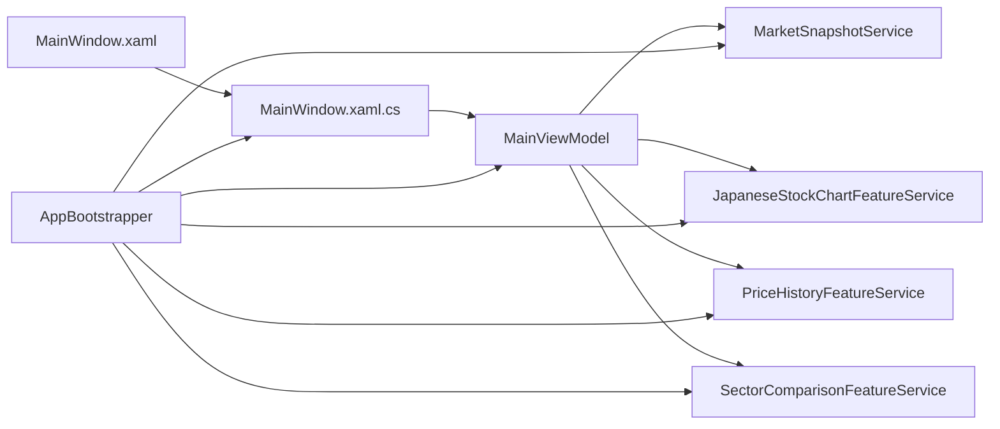

```csharp
services.AddSingleton<IMarketSnapshotService, MarketSnapshotService>();
services.AddSingleton<IPriceHistoryFeatureService, PriceHistoryFeatureService>();
services.AddSingleton<IJapaneseStockChartFeatureService, JapaneseStockChartFeatureService>();
services.AddSingleton<ISectorComparisonFeatureService, SectorComparisonFeatureService>();
services.AddTransient<MainViewModel>();
services.AddTransient<MainWindow>(serviceProvider =>
    new MainWindow(serviceProvider.GetRequiredService<IMainWindowViewModel>()));
```

上の図とコードが示しているのは、画面が直接 API を呼ぶのではなく、ViewModel と Service を間に挟んで責務分離していることです。これが、WPF アプリを保守しやすくする基本です。

---

## 3. このプロジェクトの設計背景

このプロジェクトは、単なる入力フォームではなく、次のような責務を同時に持っています。

- 銘柄入力の解決
- 外部 API からの株価取得
- チャート生成
- SQLite への保存
- 通知表示
- 画面状態の更新

もしこれらを MainWindow.xaml.cs にまとめて書くと、イベント処理、HTTP 通信、例外処理、画面更新が 1 か所に混ざります。すると、初心者には「どこが UI で、どこが業務ロジックか」が見えにくくなり、修正時も影響範囲が読みにくくなります。

そこで本プロジェクトでは、責務を次のように分けています。

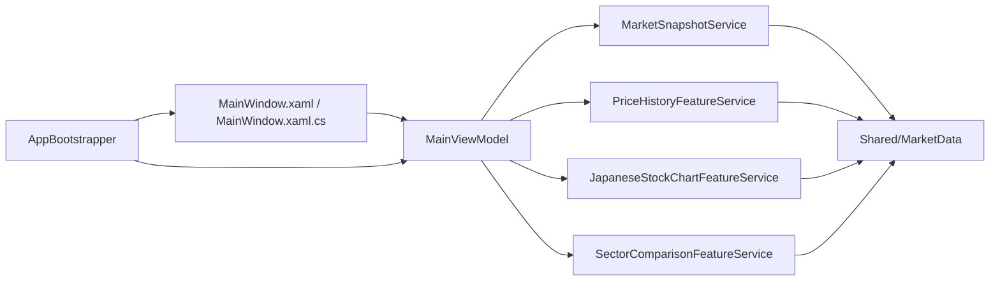

```csharp
services.AddSingleton<IMarketSnapshotService, MarketSnapshotService>();
services.AddSingleton<IPriceHistoryFeatureService, PriceHistoryFeatureService>();
services.AddSingleton<IJapaneseStockChartFeatureService, JapaneseStockChartFeatureService>();
services.AddSingleton<ISectorComparisonFeatureService, SectorComparisonFeatureService>();
services.AddTransient<MainViewModel>();
services.AddTransient<MainWindow>(serviceProvider =>
    new MainWindow(serviceProvider.GetRequiredService<IMainWindowViewModel>()));
```

この設計は、設計書で定義されている feature-sliced 構成と MVVM をそのまま実装へ落としたものです。画面は表示に集中し、MainViewModel は画面統合に集中し、各 Service は個別機能に集中します。

### 3.1 なぜ MVVM を採用しているのか

WPF は XAML と Binding が強いため、MVVM と相性が良いです。特にこのプロジェクトのように、画面上の表示項目が多く、状態更新が多い画面では、MVVM にすると見通しが良くなります。

| 項目 | 内容 |
| --- | --- |
| 採用理由 | 画面の見た目と画面状態を分け、Binding を中心に UI を組み立てやすいから |
| メリット | XAML とロジックの分離が明確になる、ViewModel 単体でテストしやすい、ボタンや入力欄を Command と Binding で統一できる |
| デメリット | ファイル数が増える、初学者には DataContext や Binding の流れが最初わかりにくい、単純画面でも構成がやや重く見える |

### 3.2 なぜ MainViewModel を画面統合入口にしているのか

このプロジェクトでは、株価、チャート、通知、履歴、セクター比較が 1 画面に集まっています。各 UI 部品がそれぞれ直接 Service を呼ぶと、依存関係が散らばって画面全体の流れが追いにくくなります。

そのため、MainViewModel を「画面の司令塔」にしています。

| 項目 | 内容 |
| --- | --- |
| 採用理由 | 1 画面内の複数機能を 1 か所で調停し、表示更新の順序を統一するため |
| メリット | 初期表示や再読込の流れを 1 か所で追える、状態の整合性を保ちやすい、テスト観点を MainViewModel に集約しやすい |
| デメリット | 機能追加を続けると MainViewModel が大きくなりやすい、責務の境界を意識しないと肥大化しやすい |

### 3.3 なぜ Service を分けているのか

例えば株価取得と履歴保存は、どちらも画面から見れば「表示に必要な処理」ですが、実際には責務が異なります。株価取得は外部 API との通信、履歴保存は SQLite への永続化です。

| 項目 | 内容 |
| --- | --- |
| 採用理由 | 外部 I/O の種類ごとに責務を分け、変更理由を分離するため |
| メリット | API 変更と DB 変更の影響範囲を分けやすい、テスト用 Fake を作りやすい、再利用しやすい |
| デメリット | 小規模サンプルとしてはクラスが多く見える、依存関係を把握するまで時間がかかる |

### 3.4 なぜ code-behind を最小限にしているのか

WPF はイベント駆動なので、慣れないうちは code-behind に何でも書きたくなります。ただし、そのやり方を続けると UI ロジックと業務ロジックが分離できません。

本プロジェクトでは、code-behind に残してよいものを次に限定しています。

- WPF のイベント引数を受け取る処理
- 画面座標やマウス位置など、View に依存する値の取得
- ダイアログ表示や Window 固有制御

| 項目 | 内容 |
| --- | --- |
| 採用理由 | WPF 固有情報だけを View に閉じ込め、業務ロジックを ViewModel へ寄せるため |
| メリット | テストしやすい、画面変更の影響が View に閉じる、MainWindow.xaml.cs が肥大化しにくい |
| デメリット | マウス操作のような複雑な UI は完全分離が難しく、橋渡しコードが少し残る |

### 3.5 なぜ DI を使っているのか

DI を使わず MainViewModel の中で new MarketSnapshotService() のように直接生成すると、実行時は動いても、テスト時に Fake へ差し替えにくくなります。

| 項目 | 内容 |
| --- | --- |
| 採用理由 | 実装の生成と利用を分離し、差し替え可能にするため |
| メリット | テストしやすい、起動時構成を AppBootstrapper に集約できる、依存関係が見える |
| デメリット | 初学者には「どこで new されているか」が見えにくい、DI コンテナの設定を読める必要がある |

### 3.6 この設計は初心者にとって難しすぎないか

正直に言うと、最初の学習コストはあります。特に次の点は最初に難しく見えます。

- XAML と ViewModel が別ファイルであること
- Binding の参照元が DataContext で決まること
- 依存関係が AppBootstrapper で配線されること

ただし、いったん分かると「どこに何を書くべきか」が非常に明確になります。初心者が中規模以上の WPF を学ぶなら、最初から責務分離された実装を読む価値は大きいです。

### 3.7 この資料の Mermaid 記法

この資料では、現在の実装に合わせて Mermaid の矢印を使い分けます。

| 記法 | 意味 | このプロジェクトでの読み方 |
| --- | --- | --- |
| `->>` | 呼び出し | VS Code プレビュー互換のため、同期・非同期ともこの矢印で表現する |
| `-->>` | 戻り値 | 処理結果の返却 |
| `activate` / `deactivate` | ライフライン | どの参加者が処理中かを示す |
| `-->` | 関連 | constructor 注入や field 保持による参照 |
| `..>` | 依存 | メソッド内だけで使う型、生成・解決のみ行う型 |
| `o--` | 集約 | 子要素を参照するが寿命は完全所有しない |
| `*--` | コンポジション | 親が子要素の寿命を所有する |

VS Code の Mermaid プレビュー互換性を優先し、sequenceDiagram の呼び出し矢印は `->>` に統一しています。非同期処理かどうかは `Async` を含むメソッド名と説明文で読み取ってください。

---

## 4. このリポジトリの見方

初心者が最初に追うべきファイルは、次の順です。

1. MarketMonitor/MainWindow.xaml
2. MarketMonitor/MainWindow.xaml.cs
3. MarketMonitor/Features/Dashboard/ViewModels/MainViewModel.cs
4. MarketMonitor/Composition/AppBootstrapper.cs
5. MarketMonitor/Features/MarketSnapshot/Services/MarketSnapshotService.cs
6. MarketMonitorTest/MainViewModelTest.cs

役割は次のように分かれています。

| 置き場所 | 役割 | 初学者の見どころ |
| --- | --- | --- |
| MarketMonitor/MainWindow.xaml | 画面レイアウト | TextBox、Button、Binding |
| MarketMonitor/MainWindow.xaml.cs | 画面イベントの橋渡し | code-behind で何をしてよいか |
| MarketMonitor/Features/Dashboard/ViewModels | 画面状態管理 | MVVM の中心 |
| MarketMonitor/Shared/Infrastructure | 共通基盤 | ObservableObject、Command |
| MarketMonitor/Composition | DI 設定 | 依存関係の組み立て |
| MarketMonitorTest | テスト | ViewModel の検証方法 |

---

## 5. 起動から画面表示までの流れ

WPF 初心者がつまずきやすいのは、どこで MainWindow と MainViewModel がつながるのかが見えにくいことです。このプロジェクトでは DI でつないでいます。

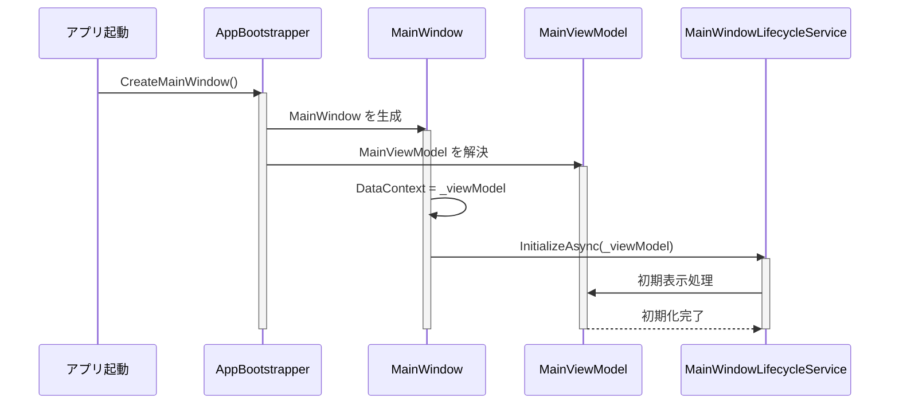

```csharp
public static MainWindow CreateMainWindow()
{
    return RootServiceProvider.Value.GetRequiredService<MainWindow>();
}

internal MainWindow(IMainWindowViewModel viewModel)
{
    InitializeComponent();
    _viewModel = viewModel;
    DataContext = _viewModel;

    SourceInitialized += OnSourceInitialized;
    Loaded += OnLoaded;
    Closed += OnClosed;
}
```

ここで重要なのは DataContext です。WPF の Binding は、通常この DataContext に入っているオブジェクトを基準に解決されます。このプロジェクトでは MainViewModel が画面の Binding 元です。

---

## 6. XAML の基本を MainWindow.xaml で学ぶ

### 6.1 XAML は「見た目」と「Binding の宣言」を書く場所

次の例では、TextBox が Symbol プロパティにバインドされ、Button が ApplySymbolCommand を実行しています。

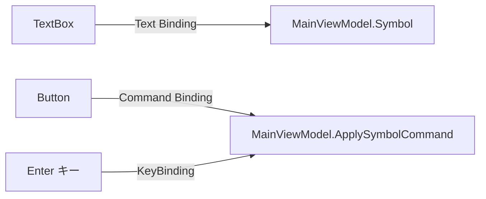

```xml
<TextBox Grid.Column="1"
         Text="{Binding Symbol, UpdateSourceTrigger=PropertyChanged}"
         Padding="8,4"
         ToolTip="例: 7203 / トヨタ / 三菱商事">
    <TextBox.InputBindings>
        <KeyBinding Key="Enter" Command="{Binding ApplySymbolCommand}" />
    </TextBox.InputBindings>
</TextBox>

<Button Grid.Column="2"
        Content="表示"
        Command="{Binding ApplySymbolCommand}"
        Padding="16,6" />
```

ポイントは次の通りです。

- Text に Binding を書くと、TextBox の表示値と ViewModel の値がつながる
- UpdateSourceTrigger=PropertyChanged にすると、文字入力のたびに ViewModel 側へ反映される
- Button の Command に Binding を書くと、Click イベントを code-behind に書かずに操作できる
- KeyBinding を使うと Enter キーでも同じコマンドを実行できる

### 6.2 レイアウトは Grid が基本

WPF のレイアウトでは Grid をよく使います。このプロジェクトでも、行と列を細かく分けて画面を構成しています。

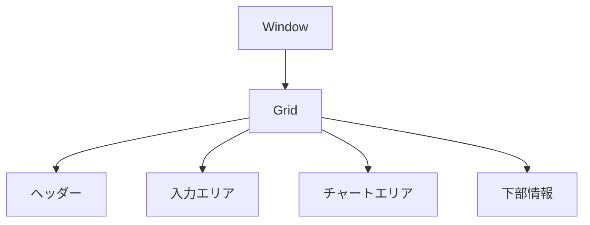

```xml
<Grid Margin="8">
    <Grid.RowDefinitions>
        <RowDefinition Height="Auto" />
        <RowDefinition Height="Auto" />
        <RowDefinition Height="*" />
        <RowDefinition Height="Auto" />
    </Grid.RowDefinitions>
</Grid>
```

Auto は中身に合わせたサイズ、* は残り領域を意味します。最初は「上は固定、中央は広く使う」という感覚で覚えると十分です。

---

## 7. ViewModel の基本を MainViewModel.cs で学ぶ

### 7.1 ViewModel は「画面状態」と「画面操作」を持つ

MainViewModel は、銘柄コード、株価表示、チャート、通知状態、コマンドをまとめて持っています。

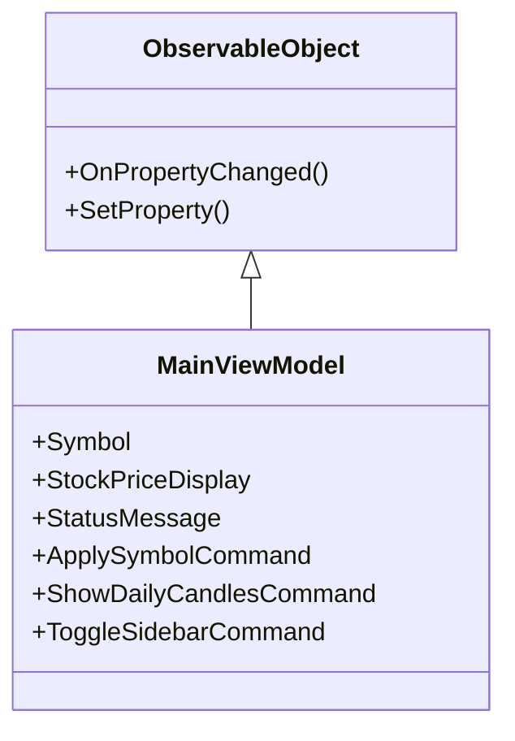

```csharp
public sealed class MainViewModel : ObservableObject, IDisposable, IMainWindowViewModel
{
    private string _symbol = "7203";
    private string _statusMessage = "準備完了";

    public string Symbol
    {
        get => _symbol;
        set => SetProperty(ref _symbol, value);
    }

    public string StatusMessage
    {
        get => _statusMessage;
        private set => SetProperty(ref _statusMessage, value);
    }
}
```

ViewModel は画面部品そのものではありません。画面に表示する値と、画面から呼ばれる処理を持つだけです。これにより、画面を起動しなくてもロジックだけをテストしやすくなります。

### 7.2 INotifyPropertyChanged は Binding 更新の土台

WPF では、ViewModel の値が変わったことを画面に知らせる必要があります。そのために使うのが INotifyPropertyChanged です。このプロジェクトでは ObservableObject に共通化しています。

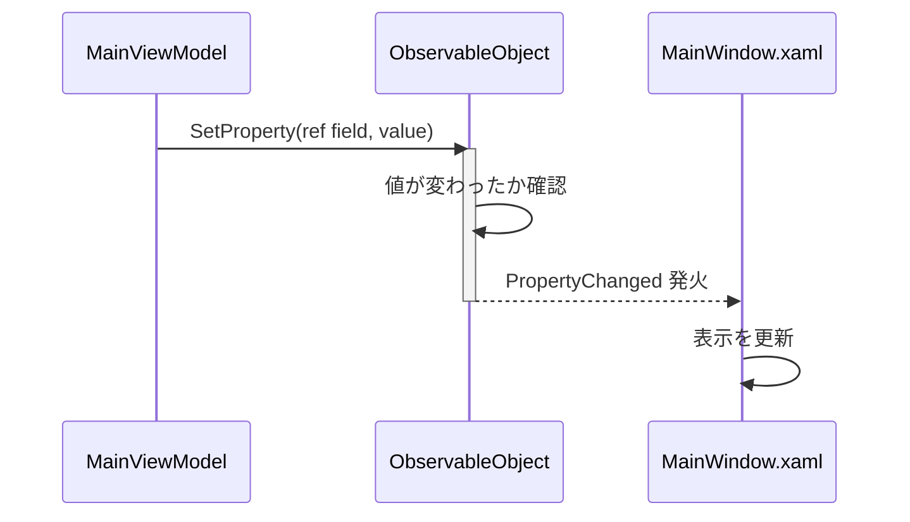

```csharp
public abstract class ObservableObject : INotifyPropertyChanged
{
    public event PropertyChangedEventHandler? PropertyChanged;

    protected void OnPropertyChanged([CallerMemberName] string? propertyName = null)
    {
        PropertyChanged?.Invoke(this, new PropertyChangedEventArgs(propertyName));
    }

    protected bool SetProperty<T>(ref T storage, T value, [CallerMemberName] string? propertyName = null)
    {
        if (EqualityComparer<T>.Default.Equals(storage, value))
        {
            return false;
        }

        storage = value;
        OnPropertyChanged(propertyName);
        return true;
    }
}
```

初心者向けの理解としては、「プロパティを書き換えたときに、画面へ再描画してよいと通知する仕組み」と覚えれば十分です。

---

## 8. Command の基本を AsyncRelayCommand で学ぶ

WPF では、ボタン押下を Click イベントで直接処理することもできますが、MVVM では Command を使うことが多いです。このプロジェクトでも AsyncRelayCommand を使って、非同期処理を ViewModel から実行しています。

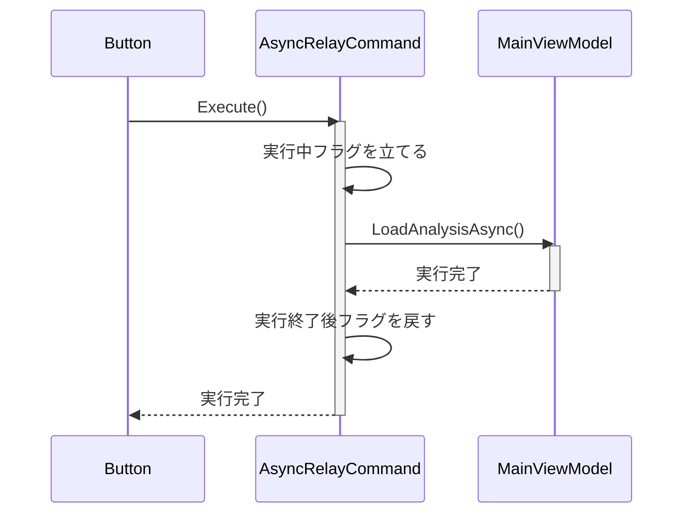

```csharp
public AsyncRelayCommand(Func<Task> executeAsync, Func<bool>? canExecute = null)
{
    _executeAsync = executeAsync ?? throw new ArgumentNullException(nameof(executeAsync));
    _canExecute = canExecute;
}

public async void Execute(object? parameter)
{
    if (!CanExecute(parameter))
    {
        return;
    }

    _isExecuting = true;
    RaiseCanExecuteChanged();
    try
    {
        await _executeAsync();
    }
    finally
    {
        _isExecuting = false;
        RaiseCanExecuteChanged();
    }
}
```

この設計の利点は、同じコマンドを Button、KeyBinding、メニューなどから再利用できることです。また、実行中は二重実行を防ぎやすくなります。

---

## 9. code-behind はどこまで書いてよいか

WPF 初心者は「code-behind は全部悪いのか」と迷いがちですが、このプロジェクトはルールが明確です。業務ロジックは書かず、UI 固有のイベント橋渡しだけを置いています。

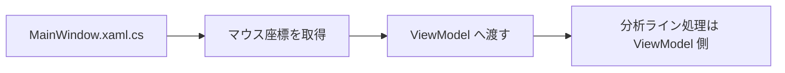

```csharp
private void OnChartPreviewMouseLeftButtonDown(object sender, MouseButtonEventArgs e)
{
    if (!TryGetChartPosition(e, out var chartX, out var chartY))
    {
        return;
    }

    if (!_viewModel.BeginJapaneseChartPointerInteraction(chartX, chartY))
    {
        return;
    }

    MainCandlestickPlotViewport.CaptureMouse();
    _isChartPointerCaptured = true;
    e.Handled = true;
}
```

このコードは、マウスイベントという WPF 固有情報を受け取り、ViewModel に座標を渡しているだけです。ここで株価計算や API 呼び出しをしていない点が重要です。

---

## 10. DI の基本を AppBootstrapper.cs で学ぶ

DI は、必要なオブジェクトを自分で new せず、外から受け取る考え方です。WPF 初学者には少し難しく見えますが、「差し替えやすくする仕組み」と考えると分かりやすいです。

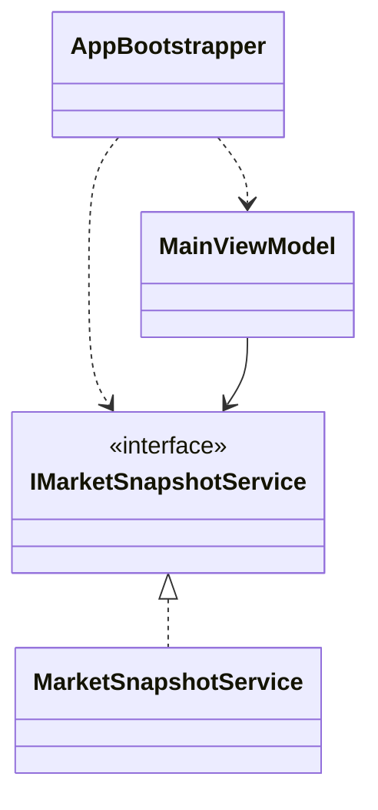

```csharp
services.AddSingleton<IMarketSnapshotService, MarketSnapshotService>();
services.AddTransient<MainViewModel>();

public MainViewModel(
    IMarketSnapshotService marketSnapshotService,
    IPriceHistoryFeatureService priceHistoryFeatureService,
    IJapaneseStockChartFeatureService japaneseStockChartFeatureService,
    ISectorComparisonFeatureService sectorComparisonFeatureService,
    IAppLogger logger,
    IDesktopNotificationService desktopNotificationService,
    IChartIndicatorSelectionService? chartIndicatorSelectionService = null,
    IChartAnalysisLineRepository? chartAnalysisLineRepository = null,
    IChartAnalysisLineService? chartAnalysisLineService = null)
{
    _marketSnapshotService = marketSnapshotService ?? throw new ArgumentNullException(nameof(marketSnapshotService));
    _priceHistoryFeatureService = priceHistoryFeatureService ?? throw new ArgumentNullException(nameof(priceHistoryFeatureService));
    _japaneseStockChartFeatureService = japaneseStockChartFeatureService ?? throw new ArgumentNullException(nameof(japaneseStockChartFeatureService));
}
```

この形にしておくと、テスト時に本物のサービスではなく Fake を渡せます。これがテストしやすさに直結します。

---

## 11. サービス層の基本を MarketSnapshotService.cs で学ぶ

ViewModel が直接 HTTP を触ると、画面ロジックと通信ロジックが混ざってしまいます。このプロジェクトでは、株価取得はサービスへ分離しています。

```mermaid
sequenceDiagram
    participant VM as MainViewModel
    participant Svc as MarketSnapshotService
    participant Resolver as MarketSymbolResolver
    participant Yahoo as Yahoo Finance
    participant Stooq as Stooq

    VM->>Svc: GetMarketSnapshotAsync(symbol)
    activate Svc
    Svc->>Resolver: ResolveAsync(symbol)
    activate Resolver
    Resolver-->>Svc: normalizedSymbol
    deactivate Resolver
    Svc->>Yahoo: 株価取得
    activate Yahoo
    alt Yahoo 失敗
        deactivate Yahoo
        Svc->>Stooq: フォールバック取得
        activate Stooq
        Stooq-->>Svc: price
        deactivate Stooq
    else Yahoo 成功
        Yahoo-->>Svc: price
        deactivate Yahoo
    end
    Svc-->>VM: MarketSnapshot を返す
    deactivate Svc
```

```csharp
public async Task<MarketSnapshotModel> GetMarketSnapshotAsync(string symbol, CancellationToken cancellationToken)
{
    var normalizedSymbol = await _symbolResolver.ResolveAsync(symbol, cancellationToken);
    var companyName = await _symbolResolver.ResolveCompanyNameAsync(normalizedSymbol, cancellationToken) ?? string.Empty;
    var stockPrice = await GetStockPriceAsync(normalizedSymbol, cancellationToken);

    return new MarketSnapshotModel
    {
        Symbol = normalizedSymbol,
        CompanyName = companyName,
        StockPrice = stockPrice,
        StockUpdatedAt = DateTimeOffset.Now
    };
}
```

初心者向けの見方としては、ViewModel は「何を表示するか」を決め、Service は「どう取得するか」を担当していると整理すると理解しやすいです。

---

## 12. テストの基本を MainViewModelTest.cs で学ぶ

WPF では画面を手で操作して確認するだけでは不十分です。このプロジェクトでは、ViewModel に Fake を注入して、表示状態が正しく変わるかをテストしています。

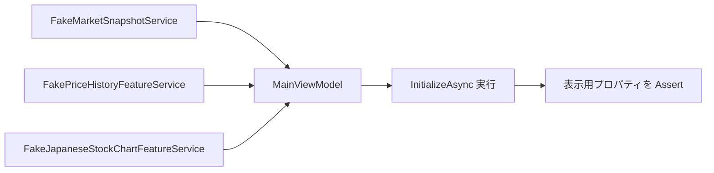

```csharp
var viewModel = new MainViewModel(
    marketSnapshotService,
    priceHistoryFeatureService,
    japaneseStockChartFeatureService,
    new FakeSectorComparisonFeatureService(),
    new FakeLogger(),
    new FakeDesktopNotificationService(),
    chartAnalysisLineRepository: new FakeChartAnalysisLineRepository());

await viewModel.InitializeAsync();

Assert.Equal("210.50", viewModel.StockPriceDisplay);
Assert.Equal("銘柄: トヨタ自動車 (7203.T)", viewModel.CompanyDisplay);
Assert.Single(viewModel.JapaneseCandlesticks);
```

ここで見てほしいのは、「MainWindow を起動せずに MainViewModel だけをテストしている」点です。MVVM と DI を採用すると、このようなテストがしやすくなります。

---

## 13. このプロジェクトで学ぶべき WPF の重要ポイント

### 13.1 Binding は画面と状態をつなぐ

- TextBox の Text は Symbol に結びつく
- TextBlock の Text は表示用プロパティに結びつく
- Button の Command は ViewModel の処理に結びつく

### 13.2 ViewModel は画面の司令塔

- 画面が必要とする状態を持つ
- 複数サービスを呼び出して結果をまとめる
- 画面に直接依存しないのでテストしやすい

### 13.3 code-behind は UI 固有処理だけ

- マウス座標取得
- ダイアログ表示
- WPF のイベントを ViewModel へ渡す処理

### 13.4 Service は業務ロジックと外部 I/O を担当する

- 株価取得
- 銘柄解決
- チャートデータ生成
- SQLite 永続化

---

## 14. 設計の悪い例と良い例

この章では、設計背景で説明した内容を「何が悪くて、どう直すべきか」という形で整理します。初心者は抽象論だけだと理解しづらいため、対比で読むのが有効です。

### 14.1 悪い例: code-behind に全部書く

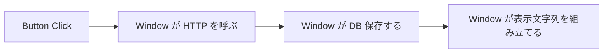

```csharp
private async void OnClick(object sender, RoutedEventArgs e)
{
    var json = await _httpClient.GetStringAsync("https://example.com");
    var price = ParsePrice(json);
    SaveToDatabase(price);
    StockPriceTextBlock.Text = price.ToString("N2");
    StatusTextBlock.Text = "更新完了";
}
```

この書き方の問題は、UI、通信、保存、表示更新が 1 メソッドに混ざることです。テストしにくく、画面変更と通信変更が同時に壊れやすくなります。

### 14.2 良い例: ViewModel と Service に分ける

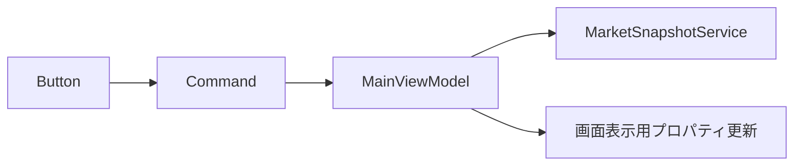

```csharp
public AsyncRelayCommand ApplySymbolCommand { get; }

public MainViewModel(IMarketSnapshotService marketSnapshotService, ...)
{
    _marketSnapshotService = marketSnapshotService;
    ApplySymbolCommand = new AsyncRelayCommand(LoadAnalysisAsync);
}

private async Task LoadAnalysisAsync()
{
    var snapshot = await _marketSnapshotService.GetMarketSnapshotAsync(Symbol, CancellationToken.None);
    _stockPrice = snapshot.StockPrice;
    StatusMessage = "表示完了";
}
```

この形なら、UI 操作の入口は Command、表示状態は ViewModel、取得処理は Service と分離されます。

### 14.3 悪い例: ViewModel の中で依存を直接 new する

```mermaid
flowchart LR
    A[MainViewModel] --> B[new MarketSnapshotService()]
    A --> C[new SqlitePriceHistoryRepository()]
```

```csharp
public MainViewModel()
{
    _marketSnapshotService = new MarketSnapshotService(...);
    _priceHistoryRepository = new SqlitePriceHistoryRepository(...);
}
```

この書き方では、テスト時に Fake へ差し替えにくくなります。依存先が増えるほど、ViewModel が生成しにくくなります。

### 14.4 良い例: DI で依存を受け取る

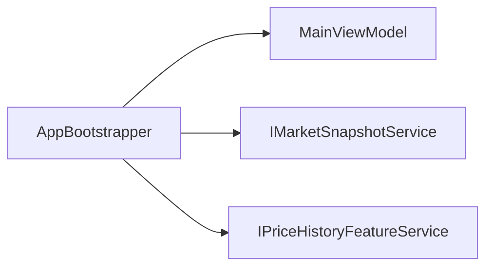

```csharp
public MainViewModel(
    IMarketSnapshotService marketSnapshotService,
    IPriceHistoryFeatureService priceHistoryFeatureService,
    IJapaneseStockChartFeatureService japaneseStockChartFeatureService,
    ISectorComparisonFeatureService sectorComparisonFeatureService,
    IAppLogger logger,
    IDesktopNotificationService desktopNotificationService)
{
    _marketSnapshotService = marketSnapshotService;
    _priceHistoryFeatureService = priceHistoryFeatureService;
    _japaneseStockChartFeatureService = japaneseStockChartFeatureService;
    _sectorComparisonFeatureService = sectorComparisonFeatureService;
    _logger = logger;
    _desktopNotificationService = desktopNotificationService;
}
```

依存を受け取る形にすると、実アプリでは本物、テストでは Fake を渡せます。これが設計の柔軟性につながります。

### 14.5 悪い例: プロパティ変更通知を出さない

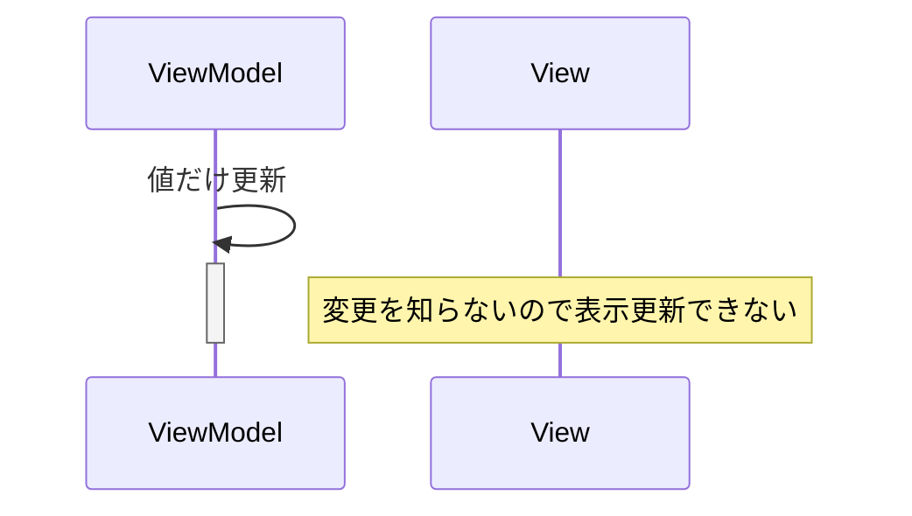

```csharp
public string Symbol
{
    get => _symbol;
    set => _symbol = value;
}
```

これでは Binding が更新されないことがあります。WPF の画面更新では、変更通知が重要です。

### 14.6 良い例: SetProperty を使う

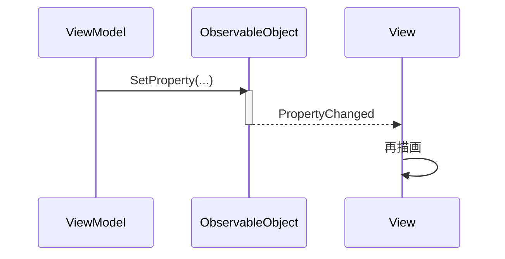

```csharp
public string Symbol
{
    get => _symbol;
    set => SetProperty(ref _symbol, value);
}
```

---

## 15. 用語集

| 用語 | 意味 | このプロジェクトでの例 |
| --- | --- | --- |
| XAML | WPF の画面定義を書くためのマークアップ | MainWindow.xaml |
| View | 画面そのもの | MainWindow.xaml |
| ViewModel | 画面状態と画面操作を持つクラス | MainViewModel |
| Binding | View と ViewModel をつなぐ仕組み | Text="{Binding Symbol}" |
| DataContext | Binding の参照元になるオブジェクト | MainWindow で設定する _viewModel |
| Command | ボタン操作などを ViewModel に渡す仕組み | ApplySymbolCommand |
| code-behind | XAML に対応する C# ファイル | MainWindow.xaml.cs |
| DI | 依存オブジェクトを外から受け取る設計 | AppBootstrapper で登録した Service |
| Service | 業務ロジックや外部 I/O を担当する型 | MarketSnapshotService |
| ObservableObject | 変更通知の共通基盤 | SetProperty を提供する基底クラス |
| INotifyPropertyChanged | プロパティ変更を画面へ通知する仕組み | ObservableObject が実装 |
| Feature | 機能単位のまとまり | MarketSnapshot、PriceHistory |
| Shared | 複数機能で使う共通部 | Shared/Infrastructure、Shared/MarketData |
| Composition | 依存関係の配線を行う層 | AppBootstrapper |

---

## 16. 初心者向けの読み進め方

おすすめの順番は次の通りです。

1. MainWindow.xaml の TextBox、Button、TextBlock の Binding を読む。
2. MainViewModel.cs の public プロパティと Command 定義だけ先に読む。
3. ObservableObject.cs を読んで、なぜ画面が自動更新されるかを理解する。
4. AsyncRelayCommand.cs を読んで、なぜボタン押下で非同期処理できるかを理解する。
5. AppBootstrapper.cs を読んで、画面と ViewModel がどう生成されるかを確認する。
6. MainViewModelTest.cs を読んで、どの状態が重要かを逆算する。

この順番で読むと、細かい業務仕様に入る前に、WPF アプリ全体の骨格をつかみやすくなります。

---

## 17. 手を動かす練習課題

### 課題 1: ステータス文言を変える

目標は、ViewModel のプロパティ変更が画面へ反映される感覚をつかむことです。

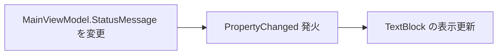

```csharp
private string _statusMessage = "準備完了";

public string StatusMessage
{
    get => _statusMessage;
    private set => SetProperty(ref _statusMessage, value);
}
```

試す内容:

- 初期値を別の日本語文言へ変える
- どこに表示されるか画面で確認する
- テストで影響があるか確認する

### 課題 2: 新しい表示専用プロパティを追加する

例として、現在の足種別を文字列で表示する読み取り専用プロパティを MainViewModel に追加してみます。

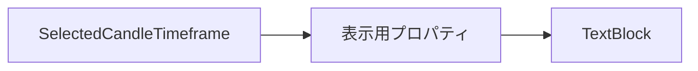

```csharp
public string SelectedTimeframeDisplay =>
    _selectedCandleTimeframe == CandleTimeframe.Daily ? "日足" : "週足";
```

試す内容:

- XAML に TextBlock を追加する
- 足種別切替時に表示が更新されるようにする
- 必要なら OnPropertyChanged を追加する

### 課題 3: ViewModel テストを 1 件追加する

```mermaid
flowchart LR
    A[ViewModel 作成] --> B[操作実行]
    B --> C[表示用プロパティを検証]
```

```csharp
[Fact]
public void ToggleSidebarCommand_TogglesCollapsedState()
{
    var viewModel = CreateViewModel();

    viewModel.ToggleSidebarCommand.Execute(null);

    Assert.True(viewModel.IsSidebarCollapsed);
    Assert.Equal("詳細情報を表示", viewModel.SidebarToggleText);
}
```

練習では、「画面を触って確かめる」のではなく、「状態を Assert する」に意識を切り替えることが重要です。

---

## 18. WPF 初学者がよく詰まる点

| 詰まりやすい点 | 原因 | このプロジェクトでの見方 |
| --- | --- | --- |
| 画面が更新されない | PropertyChanged が飛んでいない | ObservableObject と SetProperty を確認する |
| ボタンを押しても処理されない | Command の Binding 先が違う | XAML の Command と ViewModel の public プロパティを確認する |
| ViewModel が長くて読みにくい | 役割ごとのまとまりを見ていない | プロパティ、コマンド、初期化処理の順で区切って読む |
| code-behind の役割が分からない | MVVM と UI 固有処理が混ざって見える | MainWindow.xaml.cs でイベント橋渡しだけを探す |
| テストの書き方が分からない | 本物の依存を使おうとしている | Fake を注入して状態だけを検証する |

---

## 19. まとめ

このプロジェクトは、WPF の学習題材として次の点が分かりやすい構成になっています。

- XAML と ViewModel の役割が比較的はっきり分かれている
- ObservableObject と AsyncRelayCommand により、WPF の基本機構を小さく理解できる
- AppBootstrapper により、DI の考え方まで追える
- MainViewModelTest により、UI ロジックをテストする発想を学べる

WPF 初学者は、まず MainWindow.xaml と MainViewModel.cs の往復から始めてください。そのうえで、ObservableObject、AsyncRelayCommand、AppBootstrapper、テストコードへ進むと、WPF アプリの全体像がかなり明確になります。

---

## 20. 参照ファイル

- MarketMonitor/MainWindow.xaml
- MarketMonitor/MainWindow.xaml.cs
- MarketMonitor/Composition/AppBootstrapper.cs
- MarketMonitor/Features/Dashboard/ViewModels/MainViewModel.cs
- MarketMonitor/Shared/Infrastructure/ObservableObject.cs
- MarketMonitor/Shared/Infrastructure/AsyncRelayCommand.cs
- MarketMonitor/Features/MarketSnapshot/Services/MarketSnapshotService.cs
- MarketMonitorTest/MainViewModelTest.cs